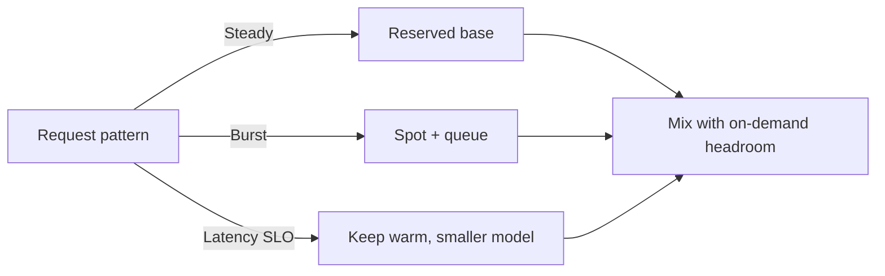

# GPU costs

> **Learning Path:** AI Cost Architecture
> **Section:** 16.1.12 — Learn to reason about

**GPU costs: 16.1.12 — Learn to reason about**

### 1. The problem

You can build a great AI service and still fail because the bill is uncontrollable. GPU capacity is the dominant cost in training and inference, and it is expensive, lumpy, and billed whether you use it or not.

The problem isn't just "GPUs are expensive". It's that cost is decoupled from value:
* You provision for peak latency, then pay for idle.
* You pay per minute of reserved hardware, not per token processed.
* Small architectural choices — batch size, model size, concurrency — change cost by 10x with no change in user-visible quality.

An AI Solution Architect needs to reason about cost as a first-class constraint, not as an afterthought.

### 2. Mental model

Think of a GPU as a rented machine, not a utility meter.

You pay for time the instance is alive. Utilization is your efficiency. Two services can process the same number of tokens per day, one costs 3x more because it keeps GPUs warm for low traffic or runs a model that is too big for the request.

Core drivers:
* **Provisioned capacity x time** = base cost
* **Throughput per GPU** = tokens/sec, determined by model size, precision, batching, and software
* **Utilization** = actual work / provisioned capacity

Cost per useful output = Price per GPU-hour / [Throughput per GPU * Utilization]

Improve denominator, not just hope price drops.

### 3. How it works

Cloud GPU pricing is a set of options that trade cost for availability and predictability:

* **On-demand:** highest price, instant start, no commitment. Good for spikes and experiments.
* **Spot / preemptible:** 50-90% discount, can be reclaimed. Good for fault-tolerant batch work.
* **Reserved / Savings Plans / Committed Use:** 30-60% discount for 1-3 year commitment. Good for steady baseline load.
* **Instance family:** A100 vs H100 vs L4 vs T4. Not just FLOPS, but memory bandwidth and VRAM change what model you can fit and how you can batch.

Cost is also shaped by software choices:
* Model size and precision: FP16 vs INT8 vs INT4 quantization
* Batching: larger batches = higher throughput/GPU but higher latency
* Caching: KV-cache reuse, prompt caching, and response caching avoid GPU work entirely
* Serving framework: continuous batching vs static batching

### 4. Architectural reasoning

When does GPU cost dominate the design?

**High-QPS inference with strict latency:** You need low-latency, always-on capacity. You pay for provisioned replicas. Right-sizing the model and maximizing batching within SLO is the lever. Often a smaller, quantized model with good caching beats a larger model on cost per request.

**Bursty or batch inference:** Traffic is spiky or offline. Use autoscaling with warm pools + spot for the burst. Decouple request ingress from GPU workers with a queue so you can scale down to zero.

**Training / fine-tuning:** Work is long-running and fault tolerant. Use spot instances with checkpointing, or reserved capacity for steady pipelines. Shard data and models to fit cheaper GPUs.

Decision flow:

### 5. Trade-offs and failure modes

* **Latency vs throughput vs cost.** Larger batch = cheaper per token, higher p99 latency. You must pick an SLO and design batching to it.
* **Spot savings vs reliability.** Spot is great until a preemption kills a long inference. Architect for checkpointing and idempotent jobs, or keep a small on-demand safety net.
* **Model quality vs model size.** A 70B model may be 2x better on benchmarks but 10x more expensive per request than a 7B model with RAG. Cost per task is the metric, not benchmark score.
* **Over-provisioning for safety.** Autoscaling policies that scale up fast and down slow create cost leaks. Idle GPUs are pure loss.

Common failure modes:
* Autoscaling on CPU, not GPU utilization.
* No request coalescing, so GPUs process 1 token batches.
* Keeping training GPUs warm between jobs.
* No cost guardrails: a runaway experiment or a bad prompt loop can burn thousands in hours.

### 6. Example

Enterprise customer support chatbot, 10k requests/day, peak 10x daytime.

Naive design: 2x A100 on-demand 24/7 for p99 < 500ms. Cost ~ $12k/month, utilization ~ 20%.

Reasoned design:
* Baseline: 1x L4 reserved for steady traffic, quantized 8B model with continuous batching.
* Burst: queue + spot H100s that scale up during peak, scale to zero at night.
* Caching: 40% of prompts hit prompt cache; 15% of queries are exact repeats, cached for 1 hour.
* Routing: simple queries to small model, complex queries to larger model.

Result: same SLO, ~60% cost reduction. Cost is now driven by actual work, not peak capacity.

### 7. Reasoning challenge

You have a real-time code assistant with SLO p95 < 800ms. Current setup uses on-demand H100s, $45k/month, 35% GPU utilization. Traffic is 9-5 weekdays, near zero nights/weekends.

What is the first architectural change you would evaluate, and what metric would you track to prove it works? What risk does it introduce?

### 8. Key takeaway

* GPU cost = provisioned time, not compute used. Optimize utilization and throughput per GPU.
* Design for the request pattern: steady = commit, bursty = queue + spot, latency-sensitive = keep warm with smaller models.
* Batching, quantization, and caching reduce cost more than cheaper hardware alone.
* Put cost guardrails in the architecture: budgets, autoscaling down, and per-request cost observability from day one.

You should be able to reason about cost per useful output, not just instance price.
