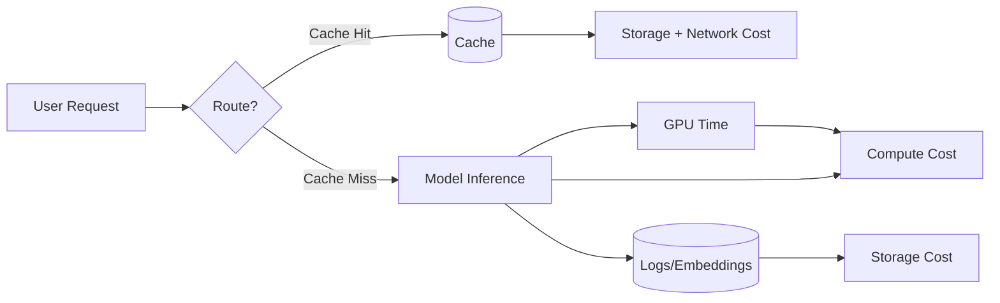

# Infrastructure costs

> **Learning Path:** AI Cost Architecture
> **Section:** 16.1.13 — Learn to reason about

### The problem

You ship an AI feature. It works in dev. In production, usage grows, latency spikes, and the cloud bill arrives. The problem is not "cost is high". The problem is **cost is non-linear and invisible until it is too late**.

With traditional services, cost scales roughly with traffic. With AI, cost scales with traffic * model size * tokens * concurrency * retention. A single design choice — always-on GPU, uncached embeddings, cross-region egress — can turn a useful feature into an unprofitable one.

Architects need to reason about cost the same way they reason about latency and reliability: as a first-class constraint.

### Mental model

Think of infrastructure cost as: **Cost = Units consumed × Price per unit × Time held**

For AI systems the units are not just CPU hours. They are:
* **Compute units:** GPU/TPU seconds for training and inference
* **Data units:** tokens processed, vectors stored, requests per minute
* **Holding units:** storage GB-month for data, embeddings, logs, checkpoints
* **Movement units:** egress GB, cross-AZ traffic

The mental model that matters: **AI makes the unit price variable and the consumption unpredictable.** A 1B parameter model is cheap at 10 QPS, expensive at 10k QPS. Caching a response saves inference cost but adds storage cost. Batching saves compute but adds latency.

Cost is generated at every edge, not just the model.

### How it works

Cost accodes in three phases:

**Build:** Training and fine-tuning. Dominated by GPU-hours and storage for datasets/checkpoints. Cost is lumpy and spiky.

**Serve:** Inference. Dominated by provisioned capacity and token throughput. For serverless it's per-token, for self-managed it's per-instance-hour regardless of utilization.

**Retain:** Data, vectors, features, logs. Dominated by GB-month and egress. This is the silent grower.

The key mechanism is **utilization vs provisioning**. Provisioned GPUs give low latency but you pay for idle time. Serverless gives pay-per-use but higher per-unit price and cold starts. The architect chooses where on that curve the system lives.

### Architectural reasoning

When does cost reasoning change decisions?

* **Traffic pattern:** Steady vs bursty. Steady favors reserved instances or dedicated pools. Bursty favors autoscaling or serverless inference.
* **Latency SLO:** <100ms requires warm, colocated inference. >1s allows queueing, batching, or cheaper spot capacity.
* **Data access pattern:** Hot embeddings need fast vector DB, cold embeddings can live in object storage with on-demand loading.
* **Model tiering:** Not every query needs the 70B model. Route simple queries to small model, complex to large.

Alternatives are always trade-offs:
* Cache vs recompute
* Batch inference vs streaming
* Centralized model service vs edge deployment
* On-demand vs reserved vs spot

Choose based on cost per useful output, not cost per request.

### Trade-offs and failure modes

The 2-4 trade-offs architects must remember:

* **Latency vs cost.** Lower latency = more provisioned capacity = higher idle cost. Batching and caching cut cost but add latency and staleness.
* **Accuracy vs cost.** Larger models and more retrieval steps improve quality but increase tokens and compute per request linearly.
* **Consistency vs cost.** Strong consistency across regions costs egress and replication. Eventual consistency saves money.
* **Observability vs cost.** Detailed tracing and logging are essential for cost attribution, but they themselves generate storage and ingest cost.

Common failure modes:
* **Runaway inference:** No rate limits, no prompt validation, users sending huge documents. Cost spikes in hours.
* **Egress surprise:** Model and data in us-east-1, app in eu-west-1. Cross-region egress dominates bill.
* **Idle fleet:** Autoscaling never scales down, or minimum replicas set too high for off-peak.
* **Unbounded retention:** Storing every embedding, every raw log, every failed attempt forever.

### Example

Enterprise RAG chatbot for support.

Naive architecture: every user question → retrieve from vector DB → call 70B model → stream answer. No cache, vector DB in different region, logs stored raw.

Cost-aware architecture:
* Route intent first with a tiny classifier. 40% of queries are FAQs → answer from cache.
* Cache embeddings for top 10k documents, store in same region as inference.
* Use small model for first pass, fallback to large model only on low confidence.
* Batch off-peak embedding refresh, use spot instances.
* Sample logs, store embeddings in tiered storage: hot SSD for 7 days, then object storage.

Result: same user experience for 80% of queries, 3-5x reduction in inference cost.

### Reasoning challenge

You have a customer-facing AI agent with 10M monthly active users. Peak traffic is 10x off-peak. p95 latency SLO is 800ms. Current bill is $180k/month, 70% inference, 20% vector storage, 10% egress.

You can: A) Move to reserved GPU instances with 30% discount but must keep minimum 50 instances, B) Add a 24h response cache estimated to hit 35% of requests, or C) Shard vector DB to reduce cross-AZ traffic.

Which do you evaluate first and what data do you need to decide?

### Key takeaway

* Cost is a system property, not a billing detail. Design for units consumed, not just features shipped.
* Provisioning model determines cost shape: pay for idle vs pay per use. Match it to traffic pattern and SLO.
* Cache, batch, and model tiering are the primary cost levers for AI systems.
* Measure cost per useful output, not cost per request, and attribute it by feature, user segment, and model.
