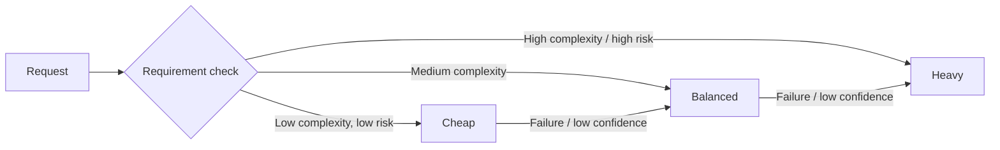

# Model selection

> **Learning Path:** AI Cost Architecture
> **Section:** 16.1.3 — Learn to reason about

**Model selection is not about picking the best model. It's about picking the cheapest model that still meets the requirement.**

### 1. The problem

You have a production AI workload with a real budget. A single LLM call can vary 10-100x in cost and latency. If you default to the largest model for everything, you burn cost and latency budget on tasks that need far less capability. If you default to the cheapest model, you get failures, retries, and bad user outcomes that are more expensive than the compute you saved.

The problem is a mismatch: requirements are heterogeneous, models are not.

### 2. Mental model

Think of a model as a service with four axes:
* **Capability:** accuracy, reasoning, tool use, long-context understanding
* **Cost:** $ / input+output token, fine-tuning cost
* **Latency / Throughput:** time to first token, tokens/s, concurrency
* **Compliance:** data residency, privacy, auditability, open-weight vs API

Model selection is routing a requirement to the smallest viable point in that 4D space.

### 3. How it works

Selection is done before architecture, not after.

**Problem → Constraints → Options → Reasoning → Decision**

Constraints come first:
* Functional: What does the task actually need? Classification vs reasoning vs summarization vs code generation
* Non-functional: P95 latency < 800ms, cost per request < $0.01, must not send PII to third party
* Operational: Can you evaluate, monitor, and roll back?

Options are tiers, not one model:
* **Fast cheap tier:** small distilled models, e.g. 1-3B for intent classification, extraction, simple rewrite
* **Balanced tier:** mid-size models for summarization, customer support, moderate reasoning
* **Heavy tier:** large reasoning models for complex planning, multi-step synthesis, few-shot learning

Architecture then becomes routing + fallback.

### 4. Architectural reasoning

When it helps:
* You have a mix of tasks in one product, e.g. chatbot with greetings, FAQ, and troubleshooting
* You have a cost/latency SLA that cannot be met by a single model
* You need to isolate sensitive data to self-hosted models

Alternatives:
* One-size-fits-all large model: simple to operate, expensive, slow
* Static tiering per feature: cheaper, requires upfront mapping
* Dynamic routing with confidence scoring: most efficient, more complexity

Choose tiering when cost is a first-class constraint. Choose dynamic routing when task difficulty is unpredictable.

### 5. Trade-offs and failure modes

* **Capability vs cost:** Over-provisioning is the default failure. Teams pick GPT-4 class for extraction that a 7B model does fine. Measure accuracy on a real eval set, not a demo.
* **Latency vs quality:** Larger models need more tokens and more decode time. For real-time UX, a smaller model that answers in 400ms beats a better model in 2s.
* **API vs open-weight:** API is cheap to start, expensive at scale, and data leaves your perimeter. Open-weight adds infra cost and ops burden but gives cost control and compliance.
* **Context length:** Long context is expensive. If you need 200k tokens, you pay for it on every call. Architectural choice is to compress, retrieve, or chunk before you up-size the model.

Common failures:
* No evaluation harness. You cannot reason about selection without measured accuracy, latency, and cost per task.
* No fallback. Cheap model fails silently, user sees bad output.
* No cost observability. You see API bill, not cost per user journey.

### 6. Example

Enterprise support bot.

* Intent routing: 3B distilled classifier, <10ms, $0.00002/request
* FAQ retrieval + short answer: 8B model with RAG, 400ms, $0.002/request
* Complex troubleshooting: 70B reasoning model, 2s, $0.08/request

Router uses confidence + keywords. 78% of requests hit tier 1, 19% tier 2, 3% tier 3. Average cost per conversation drops 12x vs using the 70B model everywhere, with no measurable drop in CSAT because the hard cases still get the heavy model.

### 7. Reasoning challenge

You have a document classification pipeline processing 2M pages/month. Current model: large API model, $0.015/page, P95 latency 1.2s. Business requires < $0.003/page and P95 < 600ms. Accuracy must stay >95% on the 20-class taxonomy.

What do you measure first, and what architectural options do you consider before changing the model?

### 8. Key takeaway

* Model selection is cost architecture. Start with requirements, not model catalog.
* Match capability to task, not to marketing. Measure accuracy, latency, and cost on your data.
* Design for tiering and fallback. The cheapest correct answer is the right answer.
* Observability is mandatory: cost per request, accuracy per tier, and fallback rate drive the decision.

You should be able to reason: *For this requirement, what is the minimum viable capability, and what is the cheapest model that reliably provides it?*
