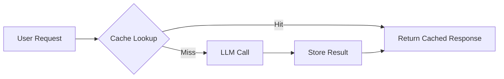

# Caching

> **Learning Path:** AI Cost Architecture
> **Section:** 16.1.4 — Learn to reason about

### The problem

An AI system that calls an LLM on every user request hits three constraints at once: cost per token, latency per request, and rate limits. In production, the same prompts repeat. Users rephrase the same question. Conversations loop back to prior topics. The model is deterministic for a given prompt, yet you pay to recompute it.

Without a cache, you pay for work you already paid for. With a cache, you trade storage and complexity for fewer LLM calls.

### Mental model

Caching is a fast, cheaper copy of an expensive result.

Think of it as a short-term memory layer in front of the model. The first time a request is seen, you compute and store it. The next time a similar request arrives, you return the stored result.

For AI, there are two levels:
* **Exact cache**: same prompt -> same response. Cheap, safe.
* **Semantic cache**: meaningfully similar prompt -> reuse or adapt response. More powerful, more risky.

### How it works

Request flow is simple:

The cache key must capture what makes the output change. For exact caching that is normalized prompt + system prompt + model version + temperature. For semantic caching you embed the prompt and compare vector similarity against cached queries.

On a hit you skip the LLM entirely. On a miss you compute, store with a TTL and eviction policy, then return.

Prompt caching / KV-cache reuse is a different mechanism inside the provider. If the prefix of a prompt is identical, the provider reuses the precomputed key-value tensors. That is free and automatic, but only helps when the conversation prefix repeats.

### Architectural reasoning

Caching helps when:
* **High repeat rate.** Support bots, internal tools, and customer-facing FAQs see the same questions.
* **Cost dominates.** LLM inference is 10-100x more expensive than a cache lookup.
* **Latency matters.** Cache hits are milliseconds vs seconds.
* **Rate limits bind you.** Cache reduces peak QPS to the model.

It hurts when:
* **Freshness is critical.** Prices, stock, personal data, or real-time context must not be stale.
* **Outputs must be non-deterministic.** Creative writing, brainstorming, or anything where variation is desired.
* **Context is huge and unique.** Long personalized sessions rarely repeat exactly.

Alternatives to full caching:
* **Batching and async pre-generation** for known workloads.
* **Model distillation / smaller model** for simple queries.
* **Prompt compression and reuse** via KV-cache.

The decision is not cache or not cache, it is what to cache, at what granularity, and for how long.

### Trade-offs and failure modes

* **Correctness vs cost.** A cache hit saves money but risks returning stale or contextually wrong answers. In RAG, cached answers become invalid when the knowledge base updates.
* **Hit rate vs key complexity.** Normalizing prompts increases hits but loses nuance. Over-normalization causes false hits.
* **Thundering herd.** A popular miss triggers many parallel LLM calls. Use request coalescing or single-flight.
* **Cache poisoning.** Bad outputs get cached and amplified. You need output validation before store.
* **Semantic drift.** Similarity thresholds are a trade-off: too low = misses, too high = wrong answers. Embeddings drift over time and model versions change output style.

Eviction policy matters. LRU works for most workloads. TTL is essential for time-sensitive data. Version your cache keys with model name and system prompt hash so a model upgrade invalidates old entries.

### Example

Enterprise support chatbot over a product knowledge base.

Architecture: API Gateway -> Cache layer -> RAG retriever -> LLM.

The cache key is `hash(normalized user question + retriever version + model version)`. Frequently asked questions like "How do I reset my password?" hit at ~60% rate.

Semantic cache is used for paraphrases: embed the incoming question, find nearest cached query with cosine > 0.92, and return the cached answer with a light re-ranking step. When the knowledge base is updated, the retriever version bumps and the cache is logically invalidated.

Result: 40% reduction in LLM calls, p95 latency drops from 2.1s to 180ms for cached hits, and cost per conversation falls proportionally.

### Reasoning challenge

You are designing a medical triage assistant. It must use the latest clinical guidelines and patient-specific history. Responses must be personalized and auditable. Where would you cache, and where would you explicitly not cache? What would you use as a cache key and what TTL would you choose?

### Key takeaway

* Cache exists to avoid paying to recompute identical or near-identical work. In AI, that work is LLM inference.
* Exact caching is safe and high-value; semantic caching is powerful but introduces correctness risk.
* Design the cache key around what changes the output: prompt, context, model, and data version.
* The real cost is not storage, it is stale or wrong answers. Invalidate explicitly and measure hit rate vs error rate, not just savings.
