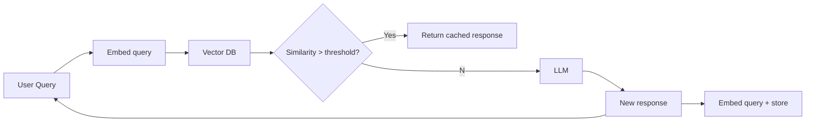

# Semantic caching

> **Learning Path:** AI Cost Architecture
> **Section:** 16.1.5 — Learn to reason about

**Semantic caching**

### 1. The problem

LLM inference is expensive and slow. In production you see the same intent repeated with different wording: "reset my password", "how do I change my password?", "I forgot my login credentials". 

Exact-match caching fails here. Hit rate stays low because natural language has infinite paraphrases. You pay for the same reasoning over and over, and latency stays high for users.

The constraint is not storage, it's semantic equivalence. You need a cache keyed by *meaning*, not string.

### 2. Mental model

Think of it as a cache for intent, not text.

Exact cache: `query string -> response`
Semantic cache: `meaning vector -> response`

Two queries that are close in embedding space are treated as the same. You trade perfect fidelity for cost and latency savings.

### 3. How it works

Request flow is embedding -> similarity search -> decision.

1. Embed the incoming prompt with a small embedding model.
2. Search a vector store for the nearest cached query embedding.
3. If cosine similarity > threshold, return the cached response. Optionally re-rank with the LLM.
4. On miss, call the LLM, then store the query embedding + response for future hits.

The cache is warm by usage. Threshold controls aggressiveness.

### 4. Architectural reasoning

When it helps:
* High QPS with repetitive user intent: support bots, internal tools, code assistants.
* Cost-sensitive workloads where ~95% answer quality is acceptable.
* Latency-sensitive paths where a cache hit is 10-50ms vs 1-3s LLM.

What it solves: reduces LLM calls, tokens, and p95 latency without changing the model.

Alternatives:
* Exact match cache. Cheaper, perfect fidelity, low hit rate for NL.
* Prompt caching / KV cache reuse. Saves compute for same long context, not semantic reuse.
* Smaller distilled model for common intents. More engineering, better fidelity than cache.

Choose semantic caching when query variation is high but intent distribution is narrow, and freshness tolerance is minutes to hours.

### 5. Trade-offs and failure modes

* **False positives.** Similar meaning can hide critical differences. "Cancel my order" vs "Cancel my order and refund to original card". High threshold reduces this but kills hit rate.
* **Staleness.** Cached answers do not expire with world knowledge. Needs TTL or invalidation tied to data freshness.
* **Context leakage.** Embedding the raw prompt can cache answers that contain user-specific data. You must mask PII before embedding or scope cache per user/tenant.
* **Cost shift.** Embedding + vector search is cheap vs LLM, but not free. At very low QPS it can be net negative.
* **Threshold tuning is operational.** Too low = hallucinations by proxy. Too high = no hits. You need monitoring of hit rate, similarity distribution, and downstream user satisfaction.

### 6. Example

Enterprise support chatbot.

90% of traffic is 200 common intents: password reset, refund policy, shipping status. Users phrase them differently.

Architecture: API gateway -> semantic cache layer with Qdrant + small embedding model -> LLM fallback. Cache key = embedding of normalized prompt, scoped per tenant.

Result: ~60-70% of requests served from cache. LLM cost drops proportionally, p95 latency falls from 2.1s to 120ms on hits. Freshness handled by 1 hour TTL for policy intents, no cache for account-specific lookups.

### 7. Reasoning challenge

You are designing a semantic cache for a financial advisory assistant.

Two query types arrive:
A. "What is the general risk of index funds?" - stable, repetitive
B. "What is AAPL stock price now?" - time sensitive

Where would you apply semantic caching, and what guardrails would you add? What threshold and TTL would you consider for A vs why you would never cache B?

### 8. Key takeaway

* Semantic caching exists to capture intent repetition that exact caching misses, at the cost of fidelity.
* It is an economic decision: save LLM spend and latency in exchange for similarity risk and operational tuning.
* Use it for high-volume, low-freshness, intent-dense workloads with strict scoping and invalidation.
* Monitor hit rate, similarity scores, and user corrections. The threshold is a business risk knob, not a config constant.
