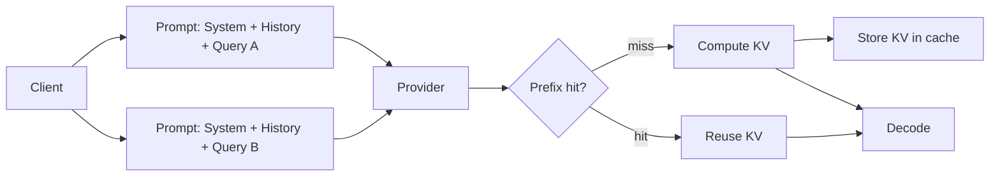

# Prompt caching

> **Learning Path:** AI Cost Architecture
> **Section:** 16.1.6 — Learn to reason about

### 1. The problem

LLM inference cost and latency are not flat. The prefill phase — turning the prompt into KV cache — is expensive and grows with prompt length. The decode phase is cheap per token.

In production you pay this cost repeatedly for the same work:
* System instructions, tool schemas, and safety policies are identical for every request
* Multi-turn conversations repeat the whole history
* RAG agents prepend the same retrieved documents to every query
* Batch jobs share a large static context

Without caching, you re-run the prefill for the prefix on every call. That is pure waste.

Prompt caching exists to avoid recomputing the prefix.

### 2. Mental model

Think of it as a CDN for pre-computation.

The provider hashes the prompt prefix and stores the KV cache for it. On a subsequent request with the same prefix, the model skips prefill and starts decoding from the cached state.

You pay once for the prefix, then only for the new suffix.

### 3. How it works

Essentially three things happen at the provider:

* **Prefix identification.** The request is split into a cacheable prefix and a non-cacheable suffix. Providers define the boundary, e.g., first N tokens or up to a delimiter.
* **KV cache storage.** On a miss, the prefix is prefilling and the resulting KV tensors are stored keyed by a hash of the prefix content. This is server-side, not client-side.
* **Hit path.** On a hit, prefill is skipped, decode starts from the cached KV state. You get lower latency and a lower price for the cached portion.

Cache hits are typically priced at a fraction of normal input tokens, e.g., 10-50% of standard input cost. TTLs are short, usually minutes to hours, and are provider-controlled.

### 4. Architectural reasoning

Prompt caching helps when:

* **High prefix reuse.** Same system prompt, same retrieved context, same conversation history across many users or requests.
* **Long static prefix.** The prefix is large relative to the suffix. Saving prefill on a 20k token system prompt is meaningful.
* **Low latency sensitivity on first request.** First request pays full cost to warm the cache; subsequent requests benefit.

It does not help when:

* Prefixes are unique per request, e.g., user-generated long free-form prompts with no overlap.
* Privacy or compliance forbids provider-side caching of your content.
* You need immediate consistency; cache eviction is non-deterministic.

Alternatives to consider:
* **Client-side prompt engineering:** Shorten system prompts, move static content to tools.
* **Application-level caching:** Cache entire responses for identical queries. Different problem, higher hit rate but less flexible.
* **Context compression / summarization:** Reduce prefix size instead of caching it.

Decision rule: If you can make the first ~1k-32k tokens identical across a high volume of requests, caching is likely cost effective.

### 5. Trade-offs and failure modes

* **Hit rate is everything.** Caching a 30k token prefix that is used once costs more than not caching. Design for reuse: stable system prompts, canonicalize retrieved chunks, avoid per-request timestamps in the prefix.
* **Cache invalidation is opaque.** You do not control eviction. TTL, memory pressure, and hash collisions can cause unexpected misses. Do not assume 100% hit rate.
* **Prefix boundary sensitivity.** Adding one token at the end of the prefix invalidates the whole cache. Keep the variable part strictly at the end. Format prompts with a clear delimiter.
* **Security and data leakage risk.** Provider caches your prompt content. If your prefix contains PII or secrets, evaluate provider guarantees. Most providers claim no training use, but data still resides in cache.
* **Cost model coupling.** Pricing changes. A design optimized for today’s cache discount may be suboptimal if discounts shrink. Abstract the caching benefit, don’t hard-code assumptions.

### 6. Example

Customer support agent.

System prompt: 8k tokens of brand voice, policies, tool specs.
Knowledge base: 12k tokens of retrieved articles per ticket category.
User query: ~100 tokens.

Without caching: ~20k input tokens per request.
With caching: System + knowledge base cached once per category. Each new user message only pays for the suffix and cache read.

Architecture impact: You move to a canonical system prompt versioned per release, and you batch-retrieve documents into a stable block before the user query. You also warm the cache with a dummy request after deploying a new prompt version.

### 7. Reasoning challenge

You are designing a multi-agent research workflow. Each agent receives a 15k token briefing with the same project charter, then a 2k token agent-specific instruction, then a user question.

Should you put the project charter in the prompt cache and keep agent instructions in the suffix? What changes if you need strict per-user data isolation and the provider cache is shared?

*Think about prefix stability, cache hit probability, and privacy boundaries before deciding.*

### 8. Key takeaway

* Prompt caching saves prefill compute for repeated prefixes; it is a cost and latency optimization, not a new capability.
* Design prompts for reuse: stable system content first, variable content last, canonicalize formatting.
* Hit rate, TTL, and provider pricing drive ROI. Measure real hit rate, not theoretical.
* Treat cached content as provider-managed, non-deterministic state with privacy implications.
