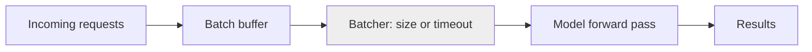

# Batch inference

> **Learning Path:** AI Cost Architecture
> **Section:** 16.1.7 — Learn to reason about

### The problem

You have a large model and a steady stream of inference requests. Each request alone leaves a GPU starved.

A single forward pass has fixed overhead: kernel launch, memory moves, attention setup. With one request at a time the GPU utilization is low and cost per inference is high. At the same time you have an SLO: real-time features need <100ms, nightly jobs have minutes to hours.

The conflict is **latency vs unit cost**. Real-time inference pays for idle silicon. Batching pays for latency.

### Mental model

Online inference is a taxi: one passenger, one trip, immediate.
Batch inference is a bus: wait until the bus is full enough, then move everyone together.

You trade a little wait time for much better throughput and lower cost per item.

### How it works

Requests are collected into a buffer and released as a batch.

The batcher decides on two knobs:
* **max_batch_size** - how many requests to pack
* **max_wait_time** - how long to wait for the batch to fill

If the buffer fills quickly you get large batches. If traffic is sparse you hit the timeout and process a partial batch. Dynamic batching does this continuously.

The model runs once per batch instead of N times. Padding and masking handle variable lengths.

### Architectural reasoning

**When it helps**
* Latency-tolerant workloads: nightly scoring, email classification, recommendation pre-computation, report generation
* Bursty or spiky traffic where you can smooth it
* Cost-sensitive high volume where GPU amortization matters

**What it solves**
* Raises GPU utilization from ~30-50% to 80-90%+
* Reduces cost per inference via amortization of fixed overhead
* Increases throughput per instance

**Alternatives**
* Online inference with autoscaling: low latency, high cost per request
* Model distillation / smaller model: lower cost, may lose quality
* Caching: avoids inference entirely for repeats

You choose batching when the business value of immediate response is less than the savings from higher utilization.

### Trade-offs and failure modes

* **Latency vs cost.** Batching adds waiting time + processing time. Tail latency grows with max_wait_time. For SLO-bound paths this is unacceptable.
* **Head-of-line blocking.** One slow request holds the batch. Mitigate with timeout and size caps.
* **Staleness.** Results are generated on old data if you batch too aggressively.
* **Memory pressure.** Large batches need large KV cache and activation memory. OOM risk increases with batch size.
* **Complexity.** You now have a queue, backpressure, and batching policy to operate. Observability must track batch size, wait time, and effective throughput.

Failure mode to watch: low traffic + aggressive max_wait_time = requests pile up, latency spikes, and timeouts cascade.

### Example

Enterprise churn prediction for 2M users nightly.

Online scoring would need 2M individual calls, ~$1.20 per 1k inferences, with GPUs idling between calls.

Batch architecture:
* Event producer writes user snapshots to a queue at 22:00
* Batcher accumulates 512 records or 250ms whichever comes first
* Model runs on GPU with tensor parallelism
* Results written to feature store for next day

Cost drops ~3-5x. Latency budget is hours, so 250ms wait is irrelevant. The same model cannot be used for real-time signup risk scoring where decision must be <200ms.

### Reasoning challenge

You run a product recommendation API. p95 latency SLO is 80ms. Peak traffic is 5k RPS, trough is 200 RPS at night.

Would you batch on the critical path? If not, how would you still use batching to cut cost?

Think about where latency tolerance exists and where it doesn't.

### Key takeaway

* Batching exists to amortize fixed model overhead across many requests by trading latency for throughput.
* Use it when latency SLO allows waiting, and GPU utilization is the cost driver.
* Control it with max_batch_size and max_wait_time; both are business decisions.
* Never batch on a latency-critical path without measuring tail latency impact.
