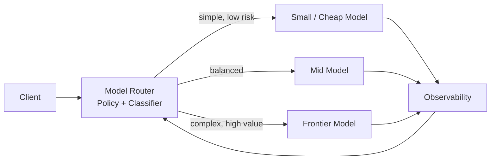

# Model routing

> **Learning Path:** AI Cost Architecture
> **Section:** 16.1.8 — Learn to reason about

### 1. The problem

You are running production LLM workloads. You have 3+ models available: a cheap small model, a balanced mid-tier model, and an expensive frontier model.

The same prompt workload is not uniform. Some requests are trivial classification. Some need deep reasoning. Some are latency-sensitive. Some are cost-sensitive.

If you send everything to the frontier model you burn budget. If you send everything to the cheap model you get bad quality and user churn. If you manually pick models per use-case you end up with a brittle matrix of hard-coded rules that breaks as models improve.

You need a way to match *request characteristics* to *model capabilities* dynamically, without the caller having to know which model to use.

### 2. Mental model

Model routing is a traffic controller for inference.

The router sits in front of your model fleet and decides *which model should handle this request right now* based on policy. It is not a load balancer for health, it is a decision layer for cost-quality-latency trade-offs.

Think of it like a tiered support desk: Level 1 handles routine queries, escalations go to Level 2, and only the hairy edge cases go to a senior architect.

### 3. How it works

The essential mechanism is small:

**Request → Classify → Route → Execute → Observe → Learn**

Classify can be static or dynamic. Static: route by user tier, endpoint, or prompt tag. Dynamic: a lightweight classifier model or heuristic scores the request for complexity, toxicity, length, or intent, then picks a model.

The router holds a policy: e.g., `if cost_budget < X and complexity < 0.4 → small model`, `else if latency_sla < 500ms → fast model`, `else → frontier model`.

Most implementations add two safety nets:
* **Fallback:** if the chosen model fails, times out, or quality score is low, retry on a stronger model.
* **Shadow / canary:** duplicate a sample of traffic to a different model to measure delta quality vs cost.

### 4. Architectural reasoning

Model routing solves the cost-quality mismatch in heterogeneous LLM fleets.

When it helps:
* You have multiple models with materially different price/performance curves
* Workload is heterogeneous and you can predict quality needs from request features
* You need to enforce SLAs or cost caps per tenant/feature
* You want to safely adopt new cheaper models without a big-bang migration

Alternatives:
* **Single model:** simple, consistent, expensive.
* **Client-side selection:** pushes routing logic to every caller, leads to duplication and drift.
* **Always route up:** guarantees quality, guarantees budget overrun.

Choose routing when the cost savings from downgrading a meaningful fraction of traffic outweighs the added complexity of the router.

### 5. Trade-offs and failure modes

* **Classification error.** Mis-routing a complex prompt to a small model creates silent quality degradation. You need quality signals, not just latency and cost.
* **Latency overhead.** Router inference + policy evaluation adds 10-100ms. For sub-second SLAs this matters.
* **Non-determinism and consistency.** Same prompt may hit different models over time, making debugging harder. You must log model choice with request id.
* **Policy drift.** Models improve. A policy tuned 3 months ago is stale. Without continuous evaluation, you overpay.
* **Observability tax.** You now have to track cost, latency, and quality per model per route. Without it you are flying blind.

### 6. Example

Enterprise support chatbot with 3 tiers.

* Tier Free users → route to `small-model` for FAQ and intent classification. Budget cap $0.001 per request.
* Tier Pro users → default to `mid-model`. If request contains multi-step reasoning or code generation, promote to frontier.
* Tier Enterprise + high-value transactions → default to frontier, with fallback to mid if latency > 800ms.

Router also uses a tiny classifier to detect "refund / legal / security" keywords and forces frontier regardless of tier. Cost drops ~40% vs frontier-only, with <2% measured quality regression on user satisfaction.

### 7. Reasoning challenge

You have a RAG assistant for internal docs. p95 latency SLA is 600ms. Small model = 250ms, $0.0002 / token, quality score 0.78. Mid model = 500ms, $0.001 / token, quality 0.90. Frontier = 1200ms, $0.015 / token, quality 0.94.

Traffic is 70% simple lookups, 30% complex synthesis. Routing classifier is 95% accurate.

Do you route by classifier, or add a latency guard that forces small model when p95 is at risk? What metric would you watch to know if routing is hurting quality?

### 8. Key takeaway

* Model routing exists to align request requirements with model economics, not to make models faster.
* The router is a policy engine + classifier + fallback, not just a switch.
* Savings come from correctly identifying the *minimum sufficient model* for each request.
* You pay for it with complexity, observability, and risk of mis-routing. Measure quality per route, not just cost.

You should be able to reason about: when routing creates net value, how to define routing features, and what failure signals to alert on.
