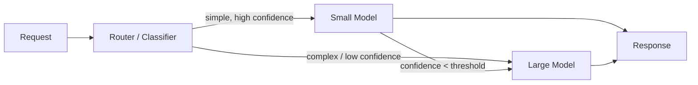

# Small vs large models

> **Learning Path:** AI Cost Architecture
> **Section:** 16.1.9 — Learn to reason about

**Small vs large models**

### 1. The problem

AI cost scales with usage. Once you put a model in production, every request costs tokens, latency, and GPU time. The problem isn't capability, it's *overpaying for capability you don't need*.

Most real workloads are a mix: 70-90% of requests are simple classification, extraction, rewriting, or pattern matching. 10-30% need real reasoning, multi-step planning, or broad knowledge. Using a frontier large model for everything gives you great quality and terrible unit economics, latency, and privacy.

The architectural question is not "which model is better". It's: *how do you match compute budget to task complexity under cost, latency, and reliability constraints?*

### 2. Mental model

Think of models as compute budget per decision.

A large model is a generalist with high reasoning bandwidth. It is expensive per token, high latency, needs accelerators, and is better at ambiguous, open-ended tasks.

A small model is a specialist with low reasoning bandwidth. It is cheap per token, low latency, can run on CPU/edge, and is brittle outside its distribution.

Capability is not linear with size. There is a cliff where tasks go from "memorization + pattern" to "multi-step reasoning + synthesis". Small models live left of the cliff, large models live right of it.

### 3. How it works

The difference is capacity and generalization.

Large models have more parameters and training compute, so they hold more world knowledge and can perform in-context learning on novel tasks. They also have larger context windows and better tool use.

Small models are distilled or trained on narrower data. They are fast and cheap because they need less FLOPs per token and fit in smaller memory. They work best when the input-output mapping is constrained, the prompt can be engineered, and you can tolerate occasional failures.

In practice you rarely pick one model forever. You pick a routing policy: first try cheap, escalate when needed.

This is a cascade. Cost is dominated by the small model path; quality is preserved by the large model fallback.

### 4. Architectural reasoning

Use small when:
* Latency budget is tight, e.g., <100ms for real-time UI
* Data is sensitive and must stay on-prem/edge
* Task is narrow and repetitive: intent classification, PII redaction, SQL extraction, summarization of fixed schema
* Volume is high and cost per request matters

Use large when:
* Task requires multi-step reasoning, planning, or synthesis across long context
* Accuracy on edge cases is business critical
* You need broad generalization without extensive prompt engineering
* Volume is low enough that cost is acceptable

Alternatives to a single large model are not just a small model. You can also: fine-tune a small model on your domain, use retrieval to augment a small model, or decompose the task so the large model only does the hard part.

The decision is driven by constraints: cost per 1M requests, p95 latency, error budget, and data residency.

### 5. Trade-offs and failure modes

* **Cost vs quality.** Small is 5-20x cheaper per token and often 2-5x faster. The cost saving disappears if you need heavy guardrails, retries, or frequent escalation to large.
* **Latency vs robustness.** Small models fail silently with overconfidence. Large models are slower but more calibrated on novel inputs.
* **Operational complexity.** Routing adds a classifier, monitoring, and fallback logic. Simpler to just use large, more expensive to operate correctly.
* **Data privacy.** Small models can run locally. Large models usually require cloud GPUs and external API calls.
* **Failure mode:** over-provisioning large models creates cost blow-ups at scale. Under-provisioning small models creates silent quality degradation and user churn. The worst case is a small model that confidently hallucinates because it lacks the capacity to know it doesn't know.

### 6. Example

Enterprise support triage.

Inbound tickets arrive via chat and email. 80% are FAQ, password reset, or status lookups. 20% are multi-system investigations requiring reasoning.

Architecture: Router classifies intent with a tiny classifier. Simple intents go to a 3B parameter SLM running on CPU with a RAG index of KB articles. If confidence <0.85 or intent = investigation, escalate to a large model with tool access to ticketing and CRM.

Result: p95 latency drops from 2.1s to 180ms for the majority path, cost per ticket falls ~12x, and large model usage is reserved for cases where it actually adds value. Monitoring tracks escalation rate and fallback quality.

### 7. Reasoning challenge

You run a real-time product search re-ranker that processes 500k queries/day. The re-ranker needs to explain why an item matches. Current latency budget is 300ms p95. Cost target is <$0.001 per query.

Would you use one large model, one small model, or a cascade? What signals would you use to route, and what metric would tell you the router is failing?

### 8. Key takeaway

* Match capability to task complexity, not to ego. Most production traffic is simple.
* Cost architecture is about routing, not just model selection. A cascade gives you cheap common case + safe fallback.
* Small models win on latency, cost, and privacy. Large models win on generalization and hard reasoning.
* Monitor escalation rate, confidence calibration, and cost per correct answer, not just accuracy.

You should be able to reason: *given volume, latency, accuracy requirement, and data constraints, what fraction of traffic can I safely serve with a small model and what guardrails do I need for the rest?*
