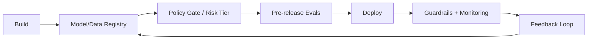

# AI governance

> **Learning Path:** Responsible AI & Governance
> **Section:** 18.1.1 — Learn

**AI Governance**

### 1. The problem

You ship an LLM-powered feature. Three months later it starts giving different answers, leaking internal data in edge cases, and failing compliance audits. Traditional software governance — code review, unit tests, CI/CD — doesn't catch it.

AI systems change behavior without a code change. They depend on data, prompts, retrieval sources, and model versions. Risk is not just bugs, it is bias, drift, hallucination, privacy leakage, cost blow-ups, and regulatory exposure.

Without a control plane, you get shadow AI, inconsistent safety bars, and no way to prove what was used for a decision.

### 2. Mental model

Think of AI governance as a risk control plane for AI systems, not a policy document.

Like a service mesh for models: it sits alongside development and production and enforces who can use what model, on what data, with what safeguards, and with what audit trail.

Core idea: **Risk tiering**. Not all AI use needs the same controls. A low-risk internal summarizer and a high-risk credit decision need different gates.

### 3. How it works

Governance is implemented as policy + evidence, not just rules.

**Risk tiering and policy gate.** Classify use cases by impact: Low, Medium, High/Critical. Policy as code decides required controls: data masking, evals, human review, monitoring.

**Model and data registry.** A single source of truth for models, prompts, datasets, retrieval indexes, and lineage. Model cards capture intended use, limitations, metrics, and owners.

**Evaluation before release.** Unit tests for software. Evals for AI: safety/red-teaming, bias, factuality, latency, cost. Evals are versioned with the model.

**Runtime guardrails and monitoring.** Input/output filters, PII detection, retrieval provenance, and drift detection in production. Alerts on distribution shift, error rate, and policy violations.

**Auditability.** Immutable logs of model version, prompt, data sources, and decision. Required for explainability and compliance.

### 4. Architectural reasoning

Governance helps when you have multiple teams, shared models, or regulated outputs.

It solves: *who is responsible when an AI decision harms a customer?* and *how do you prevent unsafe models from reaching production?*

Alternatives:
* **Ad-hoc reviews.** Fast initially, breaks at scale, no reproducibility.
* **Central AI team bottleneck.** Safe but slows innovation.
* **Governance as control plane.** Decentralized development with centralized policy enforcement. Teams self-serve within guardrails.

Choose it when model risk is non-trivial, data is sensitive, or you need auditability. Don't over-govern low-risk internal tools.

### 5. Trade-offs and failure modes

* **Speed vs safety.** Strict gates slow shipping. Mitigate with tiered controls, not one-size-fits-all.
* **Centralization vs autonomy.** Too centralized = bottleneck. Too loose = shadow AI. Use policy as code and self-service registries.
* **Observability cost.** Logging prompts and outputs is expensive and privacy-sensitive. Sample and redact by risk tier.
* **Governance theater.** Checklists without automated enforcement drift. Policy must be enforced in CI/CD and runtime, not in Confluence.

Common failure: monitoring only accuracy. You need business metrics, safety metrics, and cost metrics together.

### 6. Example

Enterprise bank wants AI for loan pre-screening.

High-risk tier triggers: data minimization, bias evals on protected attributes, human-in-the-loop for rejections, and full audit log.

Architecture: Request → Policy Gate checks risk tier → Model Registry returns approved model version + prompt → Guardrails mask PII → Retrieval from approved knowledge base → Output logged with lineage → Monitoring alerts on drift in approval rate by demographic.

A low-risk internal email summarizer uses the same platform but skips bias evals and human review. One control plane, different policies.

### 7. Reasoning challenge

Your team wants to deploy a customer support chatbot with a third-party LLM and web retrieval. Compliance requires you can prove no customer PII was used for training and you can reproduce any answer given in the last 90 days.

What minimum governance components would you require before production, and what would you defer?

### 8. Key takeaway

* AI governance is a control plane for risk, not a checklist.
* Tier controls by impact; enforce policy as code in CI/CD and runtime.
* Registry + evals + monitoring + audit trail are the four pillars.
* Design for speed and safety together: automate gates, don't rely on manual review.
