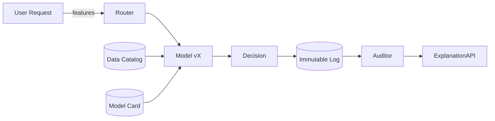

# Transparency

> **Learning Path:** Responsible AI & Governance
> **Section:** 18.1.10 — Learn

**Transparency**

### 1. The problem

You ship a model that approves loans, triages support tickets, or flags content. It works in tests. In production it makes a decision that costs money, denies service, or triggers compliance scrutiny.

Then someone asks: *Why did it do that? Can we prove it was fair? Can we reproduce it? Can we audit it?*

A black box is fine for a recommendation. It is not fine for high-stakes decisions where you must defend the decision, debug drift, and prove compliance.

Transparency is not about making every neural net interpretable. It is about making the AI system observable and accountable.

### 2. Mental model

Think flight data recorder, not open source code.

Transparency = the ability for a qualified reviewer to reconstruct *what inputs were used, what model version ran, what logic fired, and what data shaped it* — at a point in time.

It has three layers:
* **Data transparency:** where data came from, how it was cleaned, what bias it carries
* **Model transparency:** what model was used, with what parameters, trained on what data slice, and when
* **Decision transparency:** what input produced what output, with enough context to explain and audit

You rarely need full mechanistic interpretability. You need verifiable lineage.

### 3. How it works

Transparency is an architecture concern, not a model feature.

Core mechanisms:
* **Provenance and lineage:** Every training and inference artifact is tagged: dataset version, preprocessing code hash, feature schema, model version, hyperparameters. Tools like MLflow, TFX, or lakehouse lineage store this.
* **Model cards / datasheets:** Human-readable record of intended use, performance by subgroup, limitations, and training data distribution.
* **Decision logging:** For each production inference store input features, model version ID, raw output, post-processing rules, and timestamp. This is the audit trail.
* **Explanation surfaces:** Local explanations for a decision, e.g., SHAP/LIME or rule-based surrogates, generated on demand and stored with the decision. Not for training, for accountability.

The system must be append-only and tamper-evident. Logs go to an immutable store, not a mutable DB.

### 4. Architectural reasoning

When it helps:
* Regulated domains: finance, hiring, healthcare, credit, EU AI Act high-risk systems
* Customer-facing decisions where you must provide a reason on request
* Systems where drift, bias, or data quality incidents need root cause

What it solves:
* Compliance: GDPR right to explanation, auditability
* Trust: stakeholders can verify fairness and performance
* Operations: faster incident response and model rollback

Alternatives:
* Full interpretability: glass-box models like decision trees. Often too weak for performance.
* Post-hoc explanations only: cheap, but not auditable and can be misleading.
* No transparency: fastest to ship, fails at scale in risk.

Choose transparency when the cost of an unexplained wrong decision exceeds the cost of logging, storage, and governance overhead.

### 5. Trade-offs and failure modes

* **Transparency vs performance and IP.** Detailed model cards and feature logs can leak training data or model logic. Mitigate with access controls and redacted public cards.
* **Explanation fidelity.** Local explainers approximate. An explanation can be plausible but wrong. Don’t treat SHAP as ground truth; treat it as a debugging aid.
* **Log completeness vs cost.** Storing every raw feature for every inference is expensive. Architect a tiered policy: full retention for high-risk decisions, sampled for low-risk.
* **Process decay.** Transparency is only as good as the pipeline that enforces it. If data scientists can promote a model without a card, or if feature stores drift without versioning, the audit trail is fiction.

Failure mode: *transparency theater*. Beautiful dashboards with no immutable lineage. Auditors can’t reproduce a decision from 6 months ago.

### 6. Example

Enterprise loan approval.

Decision is high-risk, regulated, and revenue-impacting.

Architecture:
* Training pipeline writes dataset version, preprocessing hash, and fairness metrics to a Model Card stored in artifact registry.
* Inference service loads model by version from a model registry and logs every request to an immutable audit log: applicant features hashed for privacy, model version, score, rule overrides, timestamp.
* Explanation API returns top contributing features for that applicant, pulled from pre-computed SHAP values stored with the decision.
* Quarterly audit job recomputes performance by protected group using the logged decisions and the lineage metadata.

Result: compliance team can answer regulator queries, ops can replay a specific denial, and product can detect drift by subgroup.

### 7. Reasoning challenge

You are building a resume screening model for a large employer. Legal requires you to provide candidates an explanation when rejected. The model is a fine-tuned LLM reranker with strong performance.

Do you:
A) Log only final score and generate a generic explanation on demand
B) Log full resume text, prompt, model version, and a local explanation, with retention and access controls
C) Replace the LLM with a linear model for full transparency

What do you choose and what do you store, and what do you not store?

### 8. Key takeaway

* Transparency is about verifiable lineage and auditability, not just human-readable explanations.
* Build it as a first-class system concern: immutable logs, versioned artifacts, and model cards enforced in CI/CD.
* Trade-off is cost, latency, and IP exposure vs risk, compliance, and trust.
* If you cannot reconstruct a decision from 12 months ago, you are not transparent.
