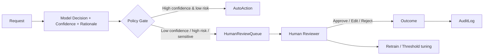

# Human oversight

> **Learning Path:** Responsible AI & Governance
> **Section:** 18.1.11 — Learn

### The problem

Autonomous AI can scale decisions to millions per second, but it cannot be held legally or ethically accountable for them. When a model denies a loan, flags a patient, or removes content, the organization is responsible — not the model.

Scale creates three specific risks: automation bias where teams defer to the model, error amplification where a subtle bias is applied consistently, and unexplainable failures where the model is confident but wrong.

Human oversight exists to put a bounded, accountable decision point in the system before irreversible harm occurs, and to create an audit trail of who decided what and why.

### Mental model

Think of oversight as a control surface, not a replacement for automation.

**Human-in-the-loop:** Human is part of the decision path. AI proposes, human approves.
**Human-on-the-loop:** Human monitors and can intervene, but AI runs autonomously by default.
**Human-in-command:** Human sets goals, constraints and stop conditions; AI operates within them.

The choice is about *where* you want latency, cost, and accountability to live.

### How it works

Oversight is implemented as a policy gate in the decision flow:

The gate is driven by risk signals, not just accuracy: confidence score, input novelty, domain risk tier, and business impact. The review interface must show *why* the model decided, what data it used, and what the alternative outcomes are. Every action is logged with model version, reviewer id, and timestamp for non-repudiation.

### Architectural reasoning

Use oversight when:
* Decisions are high-stakes and irreversible: credit, hiring, medical triage, safety-critical control
* Regulatory requirements demand it: EU AI Act high-risk systems require human oversight with ability to override
* Model performance is good but not sufficient on the tail: 99% accuracy is 1% catastrophic failures at scale
* You need a feedback channel for concept drift and edge cases

Alternatives are full automation or manual process. Full automation optimizes for latency and cost but removes accountability. Manual process is safe but does not scale. Oversight is the architectural compromise: automate the bulk, inspect the risk.

Design decisions that matter:
* **Thresholds:** Where to route to human. Static thresholds drift; use risk-adjusted thresholds per segment.
* **Latency budget:** Synchronous review adds seconds-minutes; asynchronous review adds hours. Choose per SLA.
* **Reviewer capacity:** Queue depth, SLA, and escalation paths must be modeled as a service with its own SLOs.
* **Override authority:** Can a human change the decision, or only veto? Who can override the human?

### Trade-offs and failure modes

* **Latency vs safety.** Every human gate adds delay and cost. Over-gating kills value; under-gating creates risk.
* **Rubber stamping.** Reviewers under time pressure approve AI suggestions without scrutiny. Mitigate with disagreement sampling and reviewer calibration.
* **Bottleneck and fatigue.** Human review does not scale linearly. Without load shedding, queues grow and quality drops.
* **Oversight drift.** The model changes, the risk profile changes, but thresholds and review criteria stay static. Needs continuous monitoring.
* **Responsibility ambiguity.** If human approves a bad model output, who is liable? Clear RACI and audit logs are required.

### Example

Enterprise loan decisioning. Model scores applications in <100ms. Policy: auto-approve if score > 0.85 and debt-to-income < 0.35. Auto-decline if score < 0.3. Everything else goes to human underwriter.

The underwriter sees model score, top 3 features, similar approved/declined cases, and can approve, request docs, or override. Overrides feed a review queue for model error analysis. High-value or protected-class applications are forced to human-on-the-loop even with high confidence.

Result: 78% of applications automated, average latency 120ms, human review handles 22% with 4-hour SLA, audit trail satisfies compliance.

### Reasoning challenge

You have a fraud detection model with 99.5% precision and 92% recall. False positives freeze customer accounts. Each human review costs $4 and takes 5 minutes. At 10M transactions/day, even 0.5% false positives = 50k reviews/day.

Where do you place the human gate? What signals besides model score would you use to reduce review volume without increasing missed fraud? What metric tells you oversight is failing?

### Key takeaway

* Human oversight is an accountability and risk control surface, not a quality patch.
* Design the gate by risk, not by accuracy alone: confidence, novelty, impact, and regulatory tier.
* Human-in-the-loop adds latency and cost; human-on-the-loop preserves speed with intervention capability. Choose deliberately.
* Oversight fails via rubber stamping, bottlenecks, and drift. Measure reviewer agreement, override rate, and queue health, not just model metrics.
