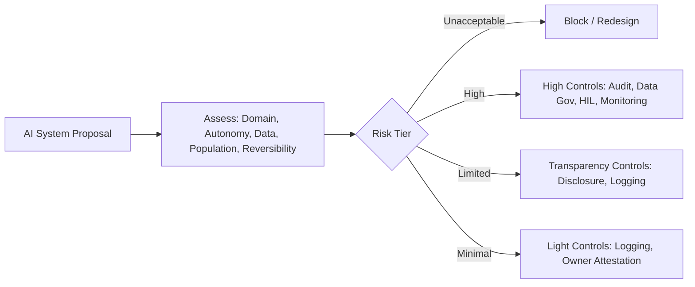

# Risk classification

> **Learning Path:** Responsible AI & Governance
> **Section:** 18.1.12 — Learn

**Risk classification**

### The problem

You have 50 AI features in flight. One is a chatbot for internal FAQs. One is a resume screener for hiring. One is a medical triage classifier.

If you apply the same governance to all three you either waste money on low-impact systems or you under-control high-impact systems. Regulators and boards don't want a policy document, they want proof you matched controls to harm.

The problem is selection: which systems need what level of evidence, testing, monitoring, and human oversight, and who decides it.

Risk classification is the decision layer that makes that selection repeatable.

### Mental model

Risk = Impact x Likelihood x Context.

Classification turns that equation into tiers that map to a control set.

Think of it as a router, not a score. The output is not "7.2/10 risky". The output is "High Risk → requires model card, data governance, human-in-the-loop, pre-deployment audit, continuous monitoring". Minimal Risk → requires basic logging and transparency.

The tiers are stable; the thresholds are policy.

### How it works

Classification happens at design time and is re-evaluated on change.

1. **Dimensions, not vibes.** You assess a bounded set of dimensions: domain of use, decision autonomy, exposure, data sensitivity, population affected, reversibility of harm.
2. **Tier assignment.** Dimensions map to a tier. EU AI Act uses Unacceptable / High / Limited / Minimal. NIST / internal frameworks often use Low / Moderate / High / Critical.
3. **Control mapping.** Each tier activates a pre-defined control bundle: documentation, testing, risk assessment, monitoring, audit trail, human oversight, explainability.
4. **Evidence gate.** Tier determines the approval path. High risk needs independent review; minimal risk can be self-attested.

Architecture wise, classification lives in the model registry / governance platform as metadata on the system record, not in a spreadsheet.

### Architectural reasoning

When it helps:
* Portfolio scale where you cannot manually review every experiment
* Regulatory environments with tiered obligations
* Mixed criticality workloads on shared infrastructure

What it solves:
* Prioritizes limited audit and ML safety resources
* Makes compliance auditable: "Why did this system get these controls?"
* Decouples policy from implementation

Alternatives:
* Flat governance: same controls for all. Simple, expensive, brittle.
* Per-system bespoke review. Accurate, unscalable.
* Risk classification is the middle: standardized decision rules with human override.

Choose it when you need repeatable, defensible trade-offs at speed.

### Trade-offs and failure modes

* **Granularity vs overhead.** Too many tiers create classification debates. Too few lump dissimilar risks together. 3-4 tiers is usually enough.
* **Static classification.** Risk drifts with data, deployment scope, and model updates. Classification must be re-triggered on change, not set once.
* **Gaming the thresholds.** Teams will optimize for the tier, not the risk. Mitigate with mandatory dimensions and independent review for High+.
* **False precision.** A score feels objective but hides judgment. Prefer explicit dimension checks over a single number.

Failure mode to watch: classifying by model type instead of use case. A small model used for credit scoring is higher risk than a large model used for poetry generation.

### Example

Enterprise wants two LLM features.

1. Internal knowledge assistant for HR policies. Minimal data, no decision, reversible. Classification: Limited Risk. Controls: prompt filtering, basic logging, user disclosure.
2. Resume screener for hiring. High-stakes employment decision, sensitive PII, affects many, hard to reverse. Classification: High Risk. Controls: bias testing on protected attributes, data lineage, human-in-the-loop override, pre-deployment risk assessment, ongoing performance monitoring, audit trail.

Same model family, different tiers, different architecture and cost.

### Reasoning challenge

Your team proposes to reuse the hiring screener model for internal employee attrition prediction to trigger proactive retention outreach.

Same model, new use case. Does the risk tier stay the same? What dimensions change and what controls would you add or remove? What evidence would you need before approving?

### Key takeaway

* Risk classification is a control selector, not a risk rating.
* Classify by use case and impact, not by model size or vendor.
* Tiers must map 1:1 to a concrete, auditable control bundle.
* Classification is a living property; re-evaluate on data, scope, and behavior change.
* Keep the dimensions explicit so decisions are reviewable, not subjective.
