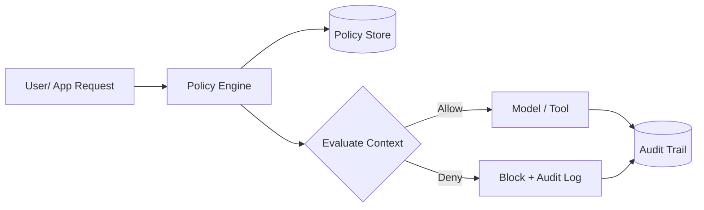

# AI policies

> **Learning Path:** Responsible AI & Governance
> **Section:** 18.1.13 — Learn

**The problem**

An experienced engineer can ship a good model. An organization cannot ship good models at scale without breaking compliance, leaking data, or creating inconsistent behavior.

The problem appears when:
- Teams spin up models ad-hoc and pick different safety thresholds
- Prompts and data flows bypass review
- Regulations like GDPR, EU AI Act, and internal risk tiers require auditable decisions
- Cost and latency explode because anyone can call the largest model for any task

Without a single source of truth, you get shadow AI, policy drift, and incidents that are hard to explain to legal or security.

**Mental model**

AI policies are declarative constraints on *what* can be done with AI, *who* can do it, *with what data*, and *how* outputs may be used.

Think of them as traffic rules for the AI system, not as code inside the model. They live outside the model and are enforced at boundaries.

Policy = Intent + Conditions + Action

Intent: e.g., no PII in training data
Conditions: data classification = PII, model type = fine-tune
Action: block + log + alert

**How it works**

Policies are defined once, evaluated everywhere.

Enforcement points are architectural seams:
* Gateway / API layer: model choice, rate limits, user tier
* Data layer: data classification, retention, training vs inference use
* Prompt layer: input filters, redaction, jailbreak detection
* Output layer: toxicity, PII leakage, watermarking, routing for human review

Policy as Code makes them testable. A policy is versioned, reviewed, and evaluated against a context object: user, data, model, task, risk tier.

**Architectural reasoning**

When it helps:
* Multiple teams share models and data
* Compliance requires provable controls
* You need consistent guardrails without hard-coding them in every app

Alternatives:
* Hard-coded guardrails per service → fast initially, impossible to audit centrally
* Manual review boards → accurate, not scalable
* LLM self-refusal → inconsistent, not auditable

Choose a policy engine when you need centralized control with decentralized execution. The engine is read-only at runtime, low latency, and produces an audit log for every decision.

**Trade-offs and failure modes**

* Centralization vs latency. Policy evaluation adds a hop. Cache decisions for low-risk paths, evaluate synchronously for high-risk.
* Flexibility vs enforceability. Too granular policies become unmaintainable. Too coarse policies cause false positives and workarounds.
* Policy drift. Models and data change faster than policy docs. Without CI for policies, rules rot.
* Bypass. If enforcement is only in the app, someone will call the model directly. Enforcement must be at a chokepoint you control: gateway, service mesh, or data plane.
* False sense of safety. Policies block known bad patterns, not unknown risks. They complement, not replace, evaluation and monitoring.

**Example**

Enterprise customer support chatbot.

Policy set:
* Tier 1 users → only approved base model, no tool calls
* Tier 2 users → approved model + retrieval over internal KB, data classification = public/internal only
* Any request with PII detected → redact before model, log for review
* Output containing financial advice → force disclaimer + human review queue

The policy engine sits behind the API gateway. The app sends context: user_id, data_classification, model_requested. The engine returns allow/deny with obligations. Audit logs feed compliance dashboards.

**Reasoning challenge**

You are architecting a multi-tenant AI platform. Should you enforce sensitive-data policies at the prompt gateway or inside the model provider's fine-tuning pipeline?

Consider latency, blast radius, and who owns the policy. What breaks if a team bypasses the gateway?

**Key takeaway**

* AI policies exist to make risk and compliance decisions explicit, auditable, and reusable
* Define policies declaratively as Policy = Intent + Conditions + Action, and enforce at architectural chokepoints
* Policy as Code gives you versioning, testing, and auditability
* Centralize policy definition, distribute enforcement, and always log decisions
* Policies reduce risk but do not eliminate it; design for bypass and drift
