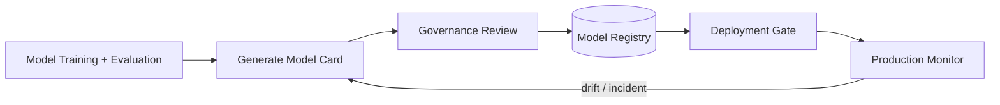

# Model cards

> **Learning Path:** Responsible AI & Governance
> **Section:** 18.1.14 — Learn

**Model cards**

### The problem

What problem appears when a model leaves the research notebook and enters production?

The people who built it know its quirks. The people who will deploy it, audit it, support it, and be liable for it do not. Performance numbers from a Jupyter run do not tell a risk owner whether the model is safe for hiring decisions in the EU. A README does not survive a model retrain. And without a shared source of truth, every stakeholder reconstructs the same questions: What was it trained on? Where does it fail? Who should use it, and who should not?

In a single-team prototype this friction is tolerable. In an organization with model governance, compliance, and multiple downstream consumers it becomes a risk and a bottleneck.

### Mental model

Think of a model card as a nutrition label for a model, not a user manual.

It is a short, versioned document shipped with the model artifact that answers the questions an architect, product owner, and auditor need before they say yes. It is not the full experiment log, and it is not marketing.

### How it works

A model card is generated at training time and versioned with the model artifact. It contains a small set of decision-relevant facts:

* **Intended use and limitations.** Primary use case, acceptable users, out-of-scope uses.
* **Data.** Training data sources, size, label distribution, known biases and collection constraints.
* **Metrics.** Evaluation results on representative test sets, including performance by subgroup where relevant.
* **Ethical considerations / caveats.** Known failure modes, risks, mitigation, and what monitoring is required.

The card is stored in the model registry alongside the weights and is referenced in the deployment manifest. Changes to data or training trigger a new card version.

### Architectural reasoning

**When it helps.** Model cards help when the cost of misunderstanding a model exceeds the cost of writing it down: regulated domains, internal model marketplaces, and any system where non-technical stakeholders must approve use.

**What problem it solves.** It decouples *what the model is* from *how it was built*. Researchers keep detailed experiment logs; consumers get a contract they can audit.

**Alternatives.** Ad-hoc READMEs, model datasheets, and registry metadata. A datasheet is more exhaustive and researcher-focused. Registry metadata is machine-readable but too sparse for human risk review. A model card sits in the middle: human-readable, standardized, and lightweight enough to maintain.

You choose a model card when you need a governance artifact that can be enforced in CI/CD, not just documentation.

### Trade-offs and failure modes

* **Freshness vs. overhead.** Cards go stale fast. If generation is manual, they become fiction. Automate metric extraction and data summaries from the training pipeline, and make card update a required step in the release gate.
* **Standardization vs. usefulness.** Too rigid a template produces checkbox compliance. Too loose produces noise. Keep the schema stable but allow domain-specific sections.
* **Transparency vs. risk.** More detail can aid misuse. Decide what is public vs internal. For internal models, include the hard limitations; for external, redact sensitive data details.
* **Trust.** A card is only as credible as its review process. Without a reviewer sign-off, it is marketing.

Failure mode to watch: the card is written once at launch and never updated after retraining. That creates a false sense of safety.

### Example

Enterprise HR screening LLM.

The model card states: Intended use is resume screening for entry-level roles in the US only. Training data is US resumes 2020-2023 from three companies, with known under-representation of career changers. Performance: 0.81 precision overall, 0.62 precision for candidates over 50. Known limitation: degrades on non-standard formatting and non-English names. Mitigation: human review required for all rejections, monitoring of demographic parity monthly.

Product can now decide to not use it for promotion decisions, and compliance can approve it for the stated scope.

### Reasoning challenge

Your team ships an internal sentiment analysis model used by three products. One product needs high recall, another needs low latency, a third needs explainability for customer-facing outputs. Do you maintain one model card or three? What belongs in the shared card vs product-specific notes, and where do you enforce that separation in the architecture?

### Key takeaway

* Model cards exist to make model risk communicable across teams, not to document training.
* Ship the card with the model artifact and version it together.
* Automate generation from the pipeline; enforce review at the deployment gate.
* A good card enables a yes/no decision about use, not a deep dive into research.
