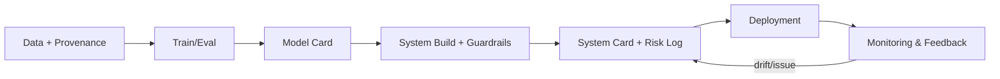

# AI system documentation

> **Learning Path:** Responsible AI & Governance
> **Section:** 18.1.15 — Learn

**AI System Documentation**

### 1. The problem

Traditional software documentation describes deterministic code: inputs, outputs, and invariants. AI systems break that contract.

A model’s behavior is a function of data, training choices, prompts, and deployment context. It drifts over time, fails unpredictably, and creates risks that are not captured by an API spec. When an incident happens, or an auditor asks “why was this decision made?”, a README is not enough.

You need to answer for multiple audiences at once: engineers who will change the system, product owners who will scope it, users who will trust it, and compliance who will audit it. Without a shared, auditable record, you get silent drift, rework, and unquantified risk.

### 2. Mental model

Think of AI system documentation as a living operational contract, not a marketing sheet.

It answers three questions: **What does it do and what does it not do?** **Under what conditions is it safe and effective?** **How do we know it stays that way?**

The contract is signed by the system, its data, its evaluation, and the humans responsible for it.

### 3. How it works

Effective documentation is a small set of linked artifacts generated from the system, not written after it.

* **Dataset / Data Card:** source, collection method, labeling process, known biases, distribution shifts, retention.
* **Model Card:** intended use, performance by subgroup, limitations, training data summary, evaluation metrics, ethical considerations.
* **System Card:** the deployed system, not just the model. Prompting, RAG pipeline, guardrails, human-in-the-loop, latency/cost, monitoring signals.
* **Risk & Decision Log:** risk assessment, mitigation choices, trade-offs accepted, who approved them, when.

These artifacts are versioned with the model and system, and linked to provenance: training run, dataset version, evaluation results, and deployment config.

### 4. Architectural reasoning

Documentation helps when the cost of a mistake exceeds the cost of writing it down.

Choose it when:
* The system is used by non-technical users or has external impact
* Models are updated frequently and need reproducibility
* You operate under regulations like EU AI Act, ISO 42001, or internal risk policy
* Multiple teams will build on the system

Alternatives are ad-hoc notes, internal wiki pages, or no docs. Those work for prototypes. They fail at scale because they are not tied to the artifact, they rot, and they cannot be audited.

Architecturally, treat documentation as a first-class output of your ML pipeline. Capture metrics, data lineage, and decisions automatically, then add human review for intent and risk. Store it alongside the model artifact in your model registry.

### 5. Trade-offs and failure modes

* **Freshness vs effort.** Documentation that is not automated drifts immediately. The failure mode is doc-reality mismatch, which is worse than no doc.
* **Granularity vs usability.** Too detailed and no one reads it; too high-level and it is useless for risk assessment. Target the audience: a one-page System Card for users, detailed Model Card for engineers.
* **Transparency vs safety.** Disclosing limitations can reduce misuse, but can also reveal attack surfaces. Document internally with full detail, publish externally with risk-appropriate summaries.
* **Cost.** Human review is expensive. Automate the mechanical parts: metrics, data summary stats, lineage. Keep humans for intended use, limitations, and residual risks.

Common failure: treating documentation as a one-time deliverable at launch. It must be updated on retraining, data change, prompt change, or incident.

### 6. Example

Enterprise RAG assistant for HR policies.

System Card records: intended use = internal employees only, not for legal advice. Retrieval corpus = HR policies v3.2, updated monthly. Model = Llama 3 70B fine-tuned on internal Q&A, temperature 0.2. Guardrails = PII redaction, refusal for medical/benefits specifics. Evaluation = 82% factuality on held-out queries, 15% drop on non-English queries. Known limitation = hallucinates on draft policies not yet published. Risk log = residual risk of outdated policy retrieval, mitigated by freshness check <7 days and human review queue.

When an employee complaint about a bad answer comes in, the team can trace the exact corpus version, model version, and retrieval logs. When compliance audits, the System Card shows the boundary of use and mitigations.

### 7. Reasoning challenge

Your team ships a new version of an LLM-based fraud detection model weekly. Performance improves, but data distribution shifts. You have a Model Card that is manually updated quarterly.

Do you invest in automating the Model Card from your evaluation harness, or do you keep a lightweight System Card with a change log and rely on monitoring alerts?

What signals would you need to decide?

### 8. Key takeaway

* Documentation is risk control and handoff, not paperwork.
* Automate provenance and metrics; human-write intent, limitations, and risk decisions.
* Version docs with the model and system; treat drift as an incident.
* The right level of detail depends on audience and regulatory exposure, not completeness.

You should finish knowing why the system exists, when to invest in it, and what makes it rot.
