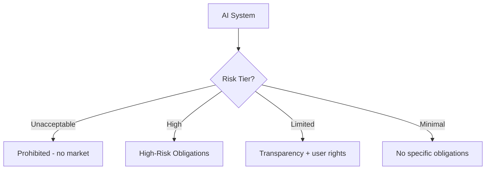

# EU AI Act

> **Learning Path:** Responsible AI & Governance
> **Section:** 18.1.16 — Learn

### The problem

AI systems can scale fast and silently change decisions that affect health, work, credit, and safety. In the EU single market, member states were creating fragmented rules, creating legal uncertainty for providers and uneven protection for citizens. The problem is not AI itself, but ungoverned risk: opaque models, poor data, no recourse, and no way to prove a system is safe and lawful before it harms.

The EU AI Act solves this with a market-access gate: you can deploy AI in the EU only if you can demonstrate compliance for the risk tier you operate in.

### Mental model

Think of the Act as a risk-based traffic light for architecture.

Risk determines obligations, not technology. The same model can be minimal risk in one use and high risk in another. Classification drives design.

### How it works

Classification first. Four tiers:

* **Unacceptable risk:** Real-time biometric ID in public for mass surveillance, social scoring, manipulative techniques. Prohibited.
* **High-risk:** Systems in Annex III areas like medical devices, critical infrastructure, education/vocational training, employment, essential services, law enforcement, migration. Also AI used as safety component of regulated products. Requires a full conformity regime.
* **Limited risk:** Chatbots, deepfakes, emotion recognition. Transparency obligations.
* **Minimal risk:** Spam filters, recommendation for ads. No specific obligations.

For General Purpose AI models, additional obligations kick in if the model is powerful enough to be systemic risk, e.g., large compute thresholds, and for all GPAI providers: technical documentation, model evaluation, copyright compliance.

High-risk obligations are the architectural load. You must implement and document a risk management system, data governance, technical documentation, record keeping for traceability, transparency and human oversight, accuracy/robustness/cybersecurity, and post-market monitoring. Conformity assessment is required before placing on market, with CE marking and registration in EU database.

Scope is extraterritorial: if you place a system on the EU market or impact EU persons, you are in scope.

### Architectural reasoning

When it helps: any AI product targeting EU users, especially SaaS, hiring, finance, healthcare, or embedded in regulated products.

What it solves: it forces you to design for auditability from day one. You cannot bolt on compliance later.

Alternatives: voluntary principles, sector-specific codes. Those lack enforcement and harmonization. The Act creates a predictable, auditable baseline.

Why choose compliance by design: it changes non-functional requirements. You need:

* **Data lineage and governance:** Provenance, bias mitigation, quality controls for training and validation data. You must justify data choices.
* **Model documentation:** Technical documentation, risk assessment, performance metrics per intended use. This becomes living artifacts, not PDFs.
* **Observability:** Logging of inputs/outputs for traceability, drift monitoring, incident reporting. Post-market surveillance is continuous.
* **Human oversight:** Interfaces for human-in-the-loop, ability to override, clear responsibility chains.
* **Security and robustness:** Cybersecurity measures and resilience testing by design.

Architecturally this pushes toward modular, observable pipelines with clear boundaries between provider and deployer responsibilities.

### Trade-offs and failure modes

* **Speed vs evidence.** Rapid iteration conflicts with documented risk management and conformity. You trade velocity for auditability.
* **Centralized logging vs privacy.** Record keeping for traceability must be balanced with GDPR data minimization. You need retention policies and pseudonymization.
* **Classification risk.** Misclassifying high-risk as limited is the most common failure. Classification depends on use case, not model. A general LLM is GPAI; a resume screener is high-risk.
* **Drift and post-market.** Models degrade. Without monitoring, you lose conformity. Failure mode: no automated performance monitoring, no incident channel, no update process.
* **Provider vs deployer split.** In SaaS, who owns what? Ambiguity leads to gaps in documentation, human oversight, and monitoring.

### Example

Enterprise hiring screening in the EU.

Problem: a SaaS provider offers a resume ranking model to EU companies.

Decision: use case is employment decision support → high-risk under Annex III.

Architecture implications: you need a risk management file linked to the model version, data governance for training data with bias assessment, technical documentation with intended use and limitations, human-in-the-loop UI for recruiters to review and override, audit logs of decisions, accuracy and robustness testing, cybersecurity controls, and a post-market monitoring plan for bias drift. The deployer company is responsible for implementation of human oversight and workplace monitoring. The provider must supply the conformity documentation. Without this, the system cannot be legally used.

### Reasoning challenge

You build a conversational LLM assistant for customer support, trained on public data, offered as an API to EU customers. You also offer a fine-tuned version for banks to summarize loan applications.

Question: where do obligations land, and what architectural changes are needed compared to a non-EU deployment? Who is provider, who is deployer, and which tier applies to each use?

### Key takeaway

* Risk tier determines architecture, not model choice. Classify by intended use first.
* High-risk means compliance by design: risk management, data governance, logging, human oversight, and post-market monitoring are first-class components.
* EU scope is extraterritorial. If you serve EU users, you must be able to prove conformity.
* Provider vs deployer responsibilities split. Design contracts and interfaces to make the split auditable.
* Treat documentation and observability as products, not paperwork.
