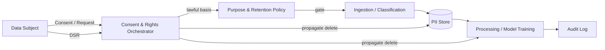

# GDPR

> **Learning Path:** Responsible AI & Governance
> **Section:** 18.1.17 — Learn

**GDPR**

### The problem

Before GDPR, personal data was collected, merged, and retained with little friction. A user signed up once and their data was copied across marketing, analytics, ad-tech, and internal models with no clear boundaries, no easy way to delete it, and no proof of why it was kept.

For an architect, this creates three operational risks:
1. **Unbounded data growth** with unknown downstream uses
2. **Asymmetric control**: the data subject can't see, move, or remove their data
3. **Liability concentration**: the company is liable for every copy, even in third-party processors

GDPR codifies that risk into law for any service targeting EU residents. It is extraterritorial.

### Mental model

Think of GDPR not as a checklist, but as a **data contract enforced at the system level**.

The data subject is a principal. You are a data controller or processor. The contract has terms: lawful basis, purpose, minimization, retention, security, and auditability. The regulation gives the subject enforceable rights to inspect, correct, move, and delete their data, and it makes you prove compliance, not just claim it.

For AI systems this matters because models are memory. Training data, feature stores, logs, and embeddings all become personal data if they can be linked back to a person.

### How it works

The system must implement accountability by design.

Core mechanisms:
* **Lawful basis and purpose limitation.** Every data flow needs a documented basis: consent, contract, legal obligation, legitimate interest. Purpose is fixed at collection and cannot be silently reused.
* **Data minimization and storage limitation.** Collect only what is needed for the stated purpose, and define a retention clock. Default to deletion.
* **Rights orchestration.** Data Subject Requests for access, rectification, erasure, portability, and objection must be routable across all stores, backups, and third parties, with verifiable completion.
* **Risk governance.** Data Protection Impact Assessments for high-risk processing, including profiling and large-scale AI training. DPIA is an architectural review, not paperwork.

### Architectural reasoning

GDPR helps when you build systems that touch EU personal data and especially when you build AI that learns from it.

When it helps:
* You need provable deletion and lineage across services
* You need to limit scope of data used for model training
* You need to separate identity from behavior for analytics

Alternatives:
* **Bolt-on compliance**: add a deletion API later. Cheaper now, expensive and incomplete later.
* **Pseudonymization + access control**: reduces risk but does not eliminate it. Pseudonymized data is still personal data if re-identification is possible.
* **Data residency and regional isolation**: required for some data categories, useful for reducing cross-border transfer complexity.

Choose privacy by design: classify data at ingest, tag lawful basis and purpose, enforce retention via policy, and make deletion a first-class operation.

### Trade-offs and failure modes

* **Privacy vs model utility.** Right to erasure conflicts with immutable training sets. You cannot practically "unlearn" a person from a trained LLM. Architects must decide: exclude EU data from training, use differential privacy, or accept limited model retraining windows.
* **Completeness vs cost.** Propagating deletion through logs, backups, embeddings, and third-party processors is operationally hard. Failure modes: shadow PII in application logs, orphaned copies in data lake snapshots, and incomplete third-party erasure.
* **Consent granularity vs UX.** Fine-grained consent improves compliance but degrades conversion. The trade-off is architectural: a Consent Management Platform that is a source of truth for all downstream services.
* **Auditability vs performance.** Full lineage and immutable audit logs increase storage and latency. You pay for accountability.

Common failure: treating GDPR as a legal document. The failure is technical: no data map, no deletion propagation, no retention enforcement.

### Example

Enterprise AI assistant trained on internal support tickets.

Architectural decisions:
* Ingestion pipeline classifies tickets for PII, tags with purpose = "internal support improvement", lawful basis = legitimate interest, retention = 24 months.
* Names and emails are pseudonymized before feature extraction; a separate vault maps pseudonyms to real IDs with access control.
* Consent and DSR service holds a graph of where a user's data lives: ticket store, vector DB, training snapshot, evaluation logs, and third-party observability.
* On erasure request, the orchestrator deletes from primary store, queues deletion from vector DB, marks training snapshot for exclusion in next retrain, and notifies processors with proof of deletion.

Result: you can answer a DSR in days, not months, and you can prove it.

### Reasoning challenge

You are fine-tuning a recommendation model on EU user behavior logs. A user exercises right to erasure. The model has already been trained and is in production.

What is the minimum viable architectural response that satisfies GDPR without full model retraining from scratch every request? What do you document as residual risk?

### Key takeaway

* GDPR is an accountability system, not a data ban. Design for provable lawful basis, purpose, and deletion.
* Treat personal data as a liability with a lifecycle. Minimize at ingest, tag purpose and retention, and make deletion a first-class operation.
* For AI, the hardest conflict is erasure vs model memory. Architectural choices must be made before training, not after a request.
* Compliance is a property of data flows, not documents. If you cannot map and delete a data subject's data, you are non-compliant.
