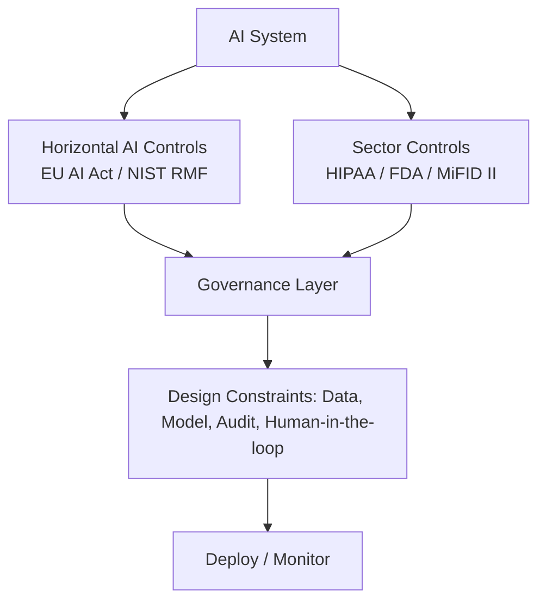

# Sector-specific regulation

> **Learning Path:** Responsible AI & Governance
> **Section:** 18.1.18 — Learn

### The problem

Horizontal AI regulation sets a baseline: risk tiers, transparency, documentation. Sector-specific regulation exists because AI risk is not uniform.

A fraud detection model in banking and a diagnostic model in healthcare both process personal data, but the *consequences of failure, the data source, and the duty of care* are radically different. Banking regulators care about model risk, fairness in lending, and auditability. Healthcare regulators care about clinical safety, patient consent, and device approval. Finance has MiFID II, healthcare has FDA SaMD and HIPAA, insurance has Solvency II.

If you design governance only for the horizontal rules, you will pass an AI audit and still fail a sector audit. The problem is *compliance layering*: you need both, and they interact.

### Mental model

Think of regulation as two layers.

**Horizontal AI regulation** = what the AI must do to be trustworthy: risk classification, data governance, logging, human oversight.

**Vertical sector regulation** = what the *domain* must do regardless of AI: who can access data, how decisions are explained to customers, what evidence is required for deployment, who is liable.

Sector-specific regulation is the vertical layer that constrains how you implement horizontal AI requirements.

### How it works

Sector rules shape three architectural surfaces:

* **Data admissibility and retention.** HIPAA limits use of PHI to treatment/payment/operations and requires minimum necessary access. GDPR adds consent. Finance rules like MiFID II require record-keeping for 5+ years and prohibit certain profiling.

* **Decision accountability.** In credit, you must provide adverse action reasons. In healthcare, you must show clinical validation and post-market surveillance. In hiring, you must demonstrate non-discrimination.

* **Evidence and change control.** FDA treats a diagnostic model as a medical device: locked version, clinical validation, change control. Banking model risk management requires independent validation and periodic revalidation.

Governance therefore becomes a stack, not a single checklist.

### Architectural reasoning

When does sector-specific regulation drive architecture?

* When the domain has a statutory duty of care, you need provable safety and traceability, not just performance metrics.
* When data is legally restricted, you need data zoning, purpose binding, and audit logs that survive regulatory inspection.
* When decisions are contestable, you need explainability tailored to the domain's definition of explanation, not generic SHAP values.

Alternatives:
* Build one generic Responsible AI platform and hope it satisfies everyone. Fails when sector audits demand domain-specific evidence.
* Build completely siloed systems per sector. Expensive and duplicates horizontal controls.

Reasoned choice: a **shared horizontal core with sector adapters**. Common model registry, logging, drift detection, and risk assessment. Sector-specific policies, data handling, validation gates, and reporting bolt on top.

### Trade-offs and failure modes

* **Complexity vs coverage.** More adapters increase operability cost. Centralizing too much hides sector requirements.
* **Speed vs evidence.** Sector validation slows iteration. Healthcare requires locked models and clinical studies; finance requires model risk sign-off.
* **Generic explainability vs regulatory explainability.** A feature importance plot may satisfy engineers but not a regulator who wants a documented reasoning trace mapped to a clinical guideline.
* **Failure mode:** treating sector rules as documentation after the fact. You cannot retrofit HIPAA minimum necessary access or MiFID record-keeping onto a system built for open data.

### Example

Credit scoring vs radiology triage.

Both are high-risk under EU AI Act. Both need data governance, logging, human oversight.

Credit scoring under MiFID/FCRA/ECOA needs: adverse action notices with specific reasons, bias testing on protected classes, retention of decision inputs for 5 years, and challenger model validation.

Radiology triage under FDA SaMD/HIPAA needs: clinical validation study, locked algorithm versioning, PHI de-identification for training, audit trails for each inference linked to patient record, and post-market surveillance for drift.

Same horizontal controls, different implementation of data access, model lifecycle, and reporting.

### Reasoning challenge

You are architecting an AI copilot for clinical notes that also flags patients for proactive outreach by the insurer.

Which governance boundary do you design first: the horizontal AI risk controls, or the separation between HIPAA clinical data use and insurance underwriting use? What breaks if you get the order wrong?

### Key takeaway

* Sector regulation is not optional add-on; it defines permissible data use, evidence standards, and liability.
* Architect a layered governance model: shared horizontal AI controls + sector-specific adapters for data, validation, and reporting.
* Design for auditability in the regulator's language, not just model metrics.
* Trade-off to manage: reuse across sectors vs domain-specific compliance guarantees.
