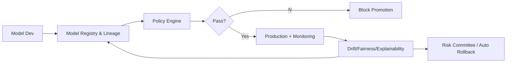

# Financial-services AI governance

> **Learning Path:** Responsible AI & Governance
> **Section:** 18.1.19 — Learn

**Financial-services AI governance**

### 1. The problem

A high-performing model is not a deployable model in finance.

In financial services an AI decision can create regulatory liability, capital impact, or reputational damage. Regulators expect you to prove: what data was used, how the model was validated, who approved it, and how it behaves in production.

The problem is not accuracy. It is *accountability under constraints*:

* Model Risk Management expectations, e.g. SR 11-7, require documented development, independent validation, and ongoing monitoring
* EU AI Act and sector rules classify credit, fraud, and hiring models as high-risk
* Data privacy and auditability requirements make “black box in production” untenable
* Business needs speed, compliance needs evidence

Without governance you get either slow manual sign-off or silent drift in production.

### 2. Mental model

Think of governance as a control plane over the AI lifecycle, not a checklist.

It enforces policy as code at decision points: data ingestion, training, validation, deployment, monitoring, and retirement. The goal is consistent evidence, not bureaucracy.

Risk tiering is the core lever: not all models need the same controls. A chatbot FAQ is low risk; a credit approval model is high risk.

### 3. How it works

Governance is implemented as three integrated layers:

**Policy layer.** Risk taxonomy and mandatory controls encoded as rules. Example: High-risk models require independent validation, explainability, bias testing, and human-in-the-loop.

**Evidence layer.** Model registry + lineage. Every model has an immutable record of data sources, features, training run, metrics, approvals, and deployment config. This is the audit trail regulators ask for.

**Enforcement layer.** Automated gates in CI/CD and serving. Policy checks block promotion if evidence is missing. Monitoring emits drift, fairness, and performance signals back to the registry.

### 4. Architectural reasoning

When it helps:
* Any model with material financial, legal, or customer impact
* Models that consume regulated data or make adverse decisions
* Organizations with multiple teams shipping models

What it solves:
* Reduces undocumented risk by making requirements explicit and automated
* Enables safe velocity: low-risk models flow fast, high-risk models get rigor
* Creates defensible auditability for regulators and internal risk

Alternatives:
* Manual review boards only: high latency, inconsistent
* Model ops tooling without policy: good lineage, no enforcement
* Full central approval for everything: safe but kills innovation

Choose a tiered, policy-as-code approach when you need both speed and defensibility.

### 5. Trade-offs and failure modes

* **Centralization vs autonomy.** Central governance team owns policy; product teams own implementation. Too central = bottleneck. Too loose = policy drift.
* **Signal vs noise.** Over-monitoring creates alert fatigue. Under-monitoring misses silent failures like data drift in a feature distribution.
* **Explainability vs performance.** Post-hoc explanations are cheap but may be inaccurate. Intrinsically interpretable models constrain accuracy. Choose per tier.
* **Cost of evidence.** Lineage, tests, and approvals add latency and infra cost. The trade is explicit: pay now or pay in incident / fine later.

Common failures:
* Policy defined but not enforced in CI/CD -> bypassed
* Monitoring without action -> drift detected, no rollback
* Registry becomes stale -> evidence doesn’t match production artifact

### 6. Example

Credit underwriting model in a bank.

Risk tier = High. Policy requires: data lineage to source systems, bias testing across protected attributes, independent validation sign-off, explainability per decision, and 24h drift alerting.

Architecture: Model registry stores model artifact + validation report + approver. CI gate checks for required tests before promotion to canary. Production serving logs inputs, outputs, and SHAP values to an immutable store. Monitoring tracks approval rate by segment, feature distribution shift, and PSI. If drift exceeds threshold, auto-roll back to previous version and open risk ticket.

Result: product ships faster for low-risk models, high-risk models have auditable evidence, and regulators can trace a decision end-to-end.

### 7. Reasoning challenge

You have two teams: Fraud detection, which needs daily retraining on new patterns, and Mortgage pricing, which changes quarterly and is highly regulated.

Do you enforce the same governance controls for both? What would you automate vs require human sign-off for, and where would you draw the tier boundary?

### 8. Key takeaway

* Governance is a control plane for evidence and policy enforcement, not a review meeting
* Risk tiering lets you trade rigor for speed appropriately
* Automate gates in CI/CD and monitoring; humans review exceptions, not every build
* The audit trail is the product: lineage, validation, approvals, and monitoring must be immutable and queryable
