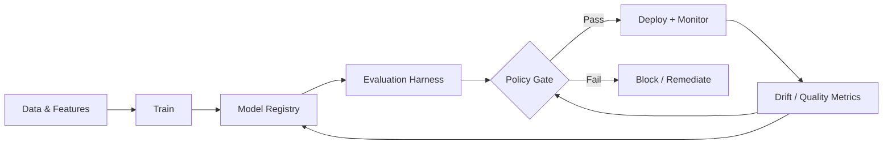

# Model governance

> **Learning Path:** Responsible AI & Governance
> **Section:** 18.1.2 — Learn

**Model governance**

### 1. The problem

A model in production is not a deployable artifact. It is a data-dependent, non-deterministic system whose behavior drifts over time.

Traditional software governance assumes code is static, tests are reproducible, and a release is reversible by rollback. Models violate all three:
* Performance degrades with data drift and concept drift, not bugs.
* Training data, feature pipeline, and hyperparameters are part of the behavior.
* Regulators and customers ask *why* a decision was made, not just *that* it was made.

Without governance you get silent degradation, un-auditable decisions, and a proliferation of shadow models.

### 2. Mental model

Think of model governance as risk control for a living asset.

Code governance controls *what you ship*. Model governance controls *what you can ship, with what data, under what conditions, and for how long*.

It is a policy layer around the model lifecycle: build → evaluate → approve → deploy → monitor → retire. The registry is the source of truth, policy-as-code is the gate, and telemetry is the feedback loop.

### 3. How it works

Essential mechanisms, not a feature list:

* **Central registry with lineage.** Every model version is immutable and linked to training data snapshot, code commit, feature definition, and evaluation results. You can reconstruct *why* a model behaves as it does.
* **Evaluation gates.** Automated checks before promotion: performance thresholds, bias/fairness metrics, data quality, cost/latency. Gates are policy-as-code, not manual checklists.
* **Approval workflow.** Risk-based approvals tie model use to business context. A low-risk internal recommendation needs less review than a credit decision.
* **Runtime monitoring and kill-switch.** Track data drift, prediction drift, business KPI degradation, and safety signals. Governance defines who can roll back or throttle.
* **Model card and audit trail.** A concise record of intended use, limitations, metrics, and approvals for auditors and operators.

### 4. Architectural reasoning

Use governance when models affect users, money, or compliance.

It helps when:
* You have multiple teams shipping models to shared platforms.
* Regulatory requirements exist: explainability, fairness, data privacy, model risk management.
* You need reproducibility and accountability across environments.

Alternatives are implicit governance via MLOps best practices only, or heavy manual review. MLOps gives you reproducibility; governance adds risk policy and accountability. Manual review does not scale and is not auditable.

Choose a federated model: central policy and registry, decentralized ownership. Centralize identity, lineage, and risk thresholds; let teams own training and evaluation. This avoids a bottleneck while keeping auditability.

### 5. Trade-offs and failure modes

* **Speed vs safety.** Tighter gates reduce risk but slow iteration. Mitigate with tiered risk levels, not one-size-fits-all.
* **Centralization vs autonomy.** Strong central registry improves auditability but can become a bottleneck. Keep the registry lightweight and policy declarative.
* **Observability cost.** Monitoring drifts and bias is expensive. Monitor the metrics that matter to business risk, not everything.
* **Governance theater.** Policies that are documented but not enforced in CI/CD are useless. Gates must be automated and blocking.

Common failures: drift detected too late because monitoring is on predictions not on features; lineage broken because feature store and training data are not versioned together; approvals happen in Slack, not in the registry.

### 6. Example

Enterprise loan approval.

Model team trains a credit risk model. Governance requires:
1. Registry entry links model v3.2 to training data snapshot `loans_2024Q2`, feature definitions from the feature store, and code commit.
2. Evaluation harness checks AUC >= 0.78 on holdout, demographic parity difference < 0.05, and explainability coverage.
3. Policy gate auto-approves for staging, requires risk officer approval for production because risk tier = high.
4. In production, monitor feature drift on income and employment status, and business KPI default rate. If drift > threshold for 3 days, auto-throttle and alert owner.

Result: an auditor can trace a declined application to the exact model version, data, and approval.

### 7. Reasoning challenge

Your org wants to let product teams ship LLM-powered chatbots quickly. Compliance requires PII redaction and prompt injection testing before production.

Do you enforce governance at the central model registry for all LLMs, or only for fine-tuned models you own, and rely on API provider guardrails for the rest? What would break first if you choose wrong?

### 8. Key takeaway

* Model governance exists to manage risk and accountability for non-deterministic, data-dependent systems.
* Treat models as living assets with lineage, policy gates, and continuous monitoring, not one-off artifacts.
* Centralize policy and auditability, decentralize ownership of training and evaluation.
* Automate gates in CI/CD; manual approvals do not scale and are not auditable.
* The goal is not perfect models, it is controlled, observable risk.
