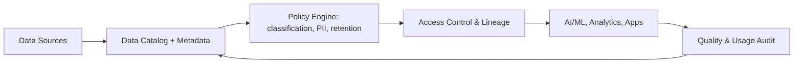

# Data governance

> **Learning Path:** Responsible AI & Governance
> **Section:** 18.1.3 — Learn

### 1. The problem

You are building AI features. Data lives in Postgres, S3, Snowflake, SaaS apps, and employee laptops. Teams copy datasets, rename columns, and train models on stale or PII-laden data. 

Now a regulator asks: *Where did this training record come from? Is it allowed to be used? Who accessed it last month?* 

Without a consistent answer, you have three risks:
* **Compliance risk:** GDPR, CCPA, HIPAA require provable control over personal data.
* **Model risk:** Bad data → bad model. You cannot debug drift if you cannot trace lineage.
* **Operational risk:** Teams waste weeks re-cleaning the same data, or avoid using it because they don't trust it.

Data governance is the answer to: *How do we make data safe, trustworthy, and usable at scale without creating a data bottleneck?*

### 2. Mental model

Think of data governance as **contracts for data**, not a data police force.

A contract defines: what the data is, who can use it, how it should be used, and how you prove it was used correctly. It is enforced by metadata, policy, and lineage, not by manually reviewing every query.

### 3. How it works

The core loop is: Discover → Describe → Control → Monitor.

* **Catalog + Metadata:** Automatic discovery tags datasets with business context, owner, sensitivity, and lineage. This is the single source of truth.
* **Policy as Code:** Classification rules, retention, and consent are expressed as policies. Example: `PII data cannot leave EU region; model training requires opt-in consent flag = true`.
* **Lineage:** End-to-end graph from raw source → feature store → model. If a source is poisoned, you can find every downstream model.
* **Quality & Observability:** Data contracts with SLAs on freshness, completeness, schema. Violations trigger alerts before bad data reaches training.

Implementation is federated: central platform for catalog, policy, and audit; domain teams own their data products and quality.

### 4. Architectural reasoning

When it helps:
* Multiple teams consume the same data for production AI.
* Regulatory auditability is required.
* You need to reuse data safely across environments.

Alternatives:
* **Central data team gatekeeping.** Simple, but becomes a bottleneck and slows innovation.
* **No governance.** Fast initially, then collapses under compliance incidents and data duplication.

Choice: Federated governance with central policy and domain ownership. Central team provides the catalog, policy engine, and lineage. Domain teams publish data products with defined contracts, owners, and quality SLAs. This preserves autonomy while providing trust.

### 5. Trade-offs and failure modes

* **Control vs Velocity.** Strict approval workflows protect compliance but slow developers. Mitigate with automated policy enforcement and self-service catalogs.
* **Centralization vs Autonomy.** Too central = bottleneck. Too loose = policy drift. The balance is policy as code enforced at the platform layer.
* **Cost of metadata.** Discovery and lineage are expensive to build and maintain. Value comes only if teams actually use the catalog for decisions.
* **Failure mode: governance theater.** A catalog that is filled once and never updated is worse than none. It creates false confidence. Governance must be continuous, tied to CI/CD and data pipelines.

### 6. Example

A bank builds a credit risk model. Data comes from core banking, CRM, and external bureaus.

Governance in practice:
* Catalog tags `customer_ssn` as PII, retention 7 years, region EU.
* Policy engine blocks training jobs that try to log raw PII and requires data minimization.
* Lineage shows the feature `avg_balance_12m` depends on a nightly ETL job. When the ETL schema changes, the feature store flags downstream models for re-validation.
* Audit log proves for regulators exactly which data was used for each model version and when consent was checked.

Without this, a model retrain could silently use unconsented data and the bank could not explain it.

### 7. Reasoning challenge

Your company wants to open an internal data marketplace for AI teams. Option A: Require all datasets to be approved by a central data governance board before publishing. Option B: Allow self-publishing with automated classification, policy checks, and an owner requirement, plus automated quality monitoring.

Which do you choose and what is the first failure you would watch for?

### 8. Key takeaway

* Data governance is about **trust and provability**, not just central control.
* Make it **federated**: central platform, domain ownership.
* Enforce **policy as code** at the platform layer; let teams move fast within guardrails.
* Lineage and quality observability are non-negotiable for AI systems; without them you cannot debug or audit models.
