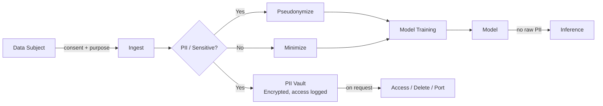

# Privacy

> **Learning Path:** Responsible AI & Governance
> **Section:** 18.1.4 — Learn

### 1. The problem

AI systems need data. More data, more personal data, and data that stays fresh. Personal data is also a liability: it's regulated, it can be misused, and it erodes user trust when mishandled.

The problem isn't "hide secrets". It's that data subjects have a right to control their personal data, and an AI architect must design systems that respect that control while still delivering model utility. Compliance is the floor, not the goal.

### 2. Mental model

Think of privacy as **boundary control over personal data across its lifecycle**, not as encryption in isolation.

The boundary has three actors:
* **Data subject** - who can consent, access, correct, delete
* **Data controller** - who decides the purpose and means of processing
* **Data processor** - who processes on behalf of the controller

Your architecture must make those boundaries auditable and enforceable by default.

### 3. How it works

Privacy is enforced architecturally through data handling, not just policy.

Core mechanisms:
* **Classification and minimization at ingest.** Identify PII, sensitive data, and data necessary for purpose. Drop what you don't need.
* **Separation of identity and utility.** Pseudonymization/tokenization decouples identifiers from features. Raw PII lives in a vault with strict access controls; training uses de-identified views.
* **Purpose limitation and retention.** Data is kept only for the stated purpose and a defined TTL. Automated deletion and model retraining windows enforce it.
* **Rights fulfillment path.** Consent, access, correction, deletion, and portability must be first-class operations, not manual tickets.

### 4. Architectural reasoning

Privacy changes where data can live and how it moves.

**When it helps:** Any system processing personal data for AI, especially cross-border, regulated domains like health, finance, HR.

**What it solves:** Reduces legal risk, enables user trust, and limits blast radius of breaches.

**Alternatives and when to choose them:**
* **Centralized training with anonymization.** Fastest, works when data is low-sensitivity and you can tolerate re-identification risk.
* **Pseudonymization + vault.** Good default for production. Keeps utility while restricting raw access.
* **Federated learning.** Data stays on device/organization. Use when data cannot leave its source due to regulation or business constraints. Higher coordination cost.
* **Differential privacy.** Adds calibrated noise to outputs/training. Use when you must publish models or aggregate statistics and need a mathematical privacy guarantee. Accepts utility loss.

Decision is driven by data sensitivity, regulatory jurisdiction, and model performance tolerance.

### 5. Trade-offs and failure modes

* **Privacy vs utility.** More privacy = less signal. Differential privacy, aggressive minimization, and short retention all reduce model accuracy. You must quantify the trade-off, not assume it away.
* **Pseudonymization is not anonymization.** With enough auxiliary data, pseudonyms can be re-identified. Architects often treat tokenization as safe. It isn't.
* **Model leakage.** Models memorize training data. Membership inference and model inversion attacks can extract PII even if raw data was deleted. Mitigate with training data audits, output filtering, and privacy-preserving techniques.
* **Consent drift.** Consent granted for one purpose is reused for another. Architect purpose tags into data lineage and enforce purpose checks at access time.
* **Operational cost.** Rights requests, audit logs, data mapping, and retention automation are ongoing engineering work, not one-time compliance.

### 6. Example

A bank wants a fraud detection model using transaction history and customer profiles.

Architectural choice: Raw PII stays in a secure vault in the customer's region. A nightly pipeline extracts features, pseudonymizes customer_id to a token, drops free-text notes, and writes to a training store with a 90-day retention. Model training runs in a VPC with no internet egress. Inference uses tokenized features only.

Subject rights are served by a service that maps token back to vault via audited access, provides export/delete, and triggers model retraining exclusion. Differential privacy is applied to aggregate fraud reports published externally.

Result: Model gets behavioral signal without holding unnecessary PII, and legal requests are automated.

### 7. Reasoning challenge

You are designing a mental health chatbot for EU users. The model needs conversation history to personalize responses. Users expect deletion on request, and you must comply with GDPR.

Do you store raw conversations centrally for fine-tuning, store them on-device and use federated learning, or store only embeddings with differential privacy?

What constraints drive your decision and what fails first if you get it wrong?

### 8. Key takeaway

* Privacy is an architectural constraint on data flow, retention, and access, not a compliance checklist.
* Design for minimization, separation of identity from utility, and auditable rights fulfillment from day one.
* Pseudonymization reduces risk but does not eliminate re-identification; models can leak training data.
* Choose privacy techniques by sensitivity, jurisdiction, and acceptable utility loss: centralized > pseudonymized vault > federated > differential privacy.
