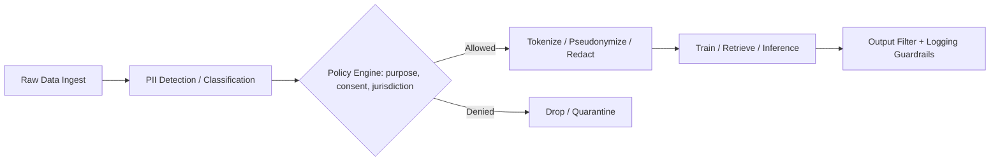

# PII

> **Learning Path:** Responsible AI & Governance
> **Section:** 18.1.5 — Learn

**The problem**

AI systems learn from data. Data from customers, employees, patients, and users is full of personal details. Build a support chatbot, a hiring model, or a recommendation engine without controls and you will ingest names, emails, phone numbers, IDs, health notes, financial records — data that can identify a real person.

The problem is not just storage. It's propagation. PII flows into training sets, feature stores, vector indexes, logs, prompt histories, and model weights. Once it's in, it can be extracted via inference, reproduced in outputs, or exposed through logs. That creates legal liability under GDPR, CCPA/CPRA, HIPAA, and contractual obligations, plus reputational risk and loss of trust.

PII is also a governance problem: you need to know *what* personal data you have, *where* it came from, *who* can use it, and how to delete it on request. Without that, you cannot prove compliance.

**Mental model**

Think of PII as an *identifiability surface*, not a list of fields.

A name alone is PII. An email alone is PII. A zip code + age + gender can be PII. The mental model is: if an attacker with reasonable auxiliary data can single out an individual, it's PII.

For architects this means classification is contextual and combinatorial, not just regex for "email".

**How it works in AI systems**

PII control is a data lifecycle control, not a one-time scrub.

Essentially: detect → classify → decide → transform → audit.

Detection uses pattern matching, NER models, and context classifiers. Classification tags data by type and sensitivity, e.g., direct identifier vs quasi-identifier, and by legal basis: consent, legitimate interest, etc.

Transformation options:
* **Redaction**: remove or mask, e.g., `[EMAIL_REDACTED]`. Safe for compliance, destroys utility.
* **Pseudonymization**: replace with token mapped in a secure vault. Reversible with key control. Good for training with later deletion.
* **Tokenization**: similar, but tokens are non-reversible for model use.
* **Generalization / k-anonymity**: coarsen values, e.g., age to decade, zip to region. Preserves statistics, risks re-identification.

Outputs also need guardrails: PII detectors on prompts and completions, log redaction, and access controls on the vault that holds the mapping.

**Architectural reasoning**

When does PII matter architecturally? Whenever data crosses trust boundaries or is used to train/fine-tune models.

Choose controls based on use case, not fear.

* **Model training on internal data**: you often need pseudonymization + strict data lineage, plus ability to honor right-to-erasure by removing a person's contributions and retraining or unlearning.
* **RAG over customer documents**: you need real-time PII detection at ingest and at query time, plus per-document access policies. The retriever must respect entitlements; the LLM must not echo PII to unauthorized users.
* **Production inference**: never log raw prompts. Redact PII from telemetry. Add output filters to block disclosure.

Alternatives exist: delete PII entirely vs keep it with controls. Deletion is simplest and safest, but often kills model utility. Pseudonymization preserves utility while limiting direct exposure, but adds key management complexity and is not a silver bullet for GDPR — pseudonymized data is still personal data.

**Trade-offs and failure modes**

* **Utility vs privacy.** Aggressive redaction improves compliance but degrades model quality. The architect's job is to minimize PII surface while keeping task performance.
* **Anonymization is not guaranteed.** LLMs can memorize rare PII from training data and regurgitate it. Statistical anonymization can be broken with auxiliary data. Assume re-identification risk remains.
* **Scope creep.** PII discovered late in the pipeline forces expensive rework. Detection must be at ingest, not after training.
* **Operational burden.** Mapping tables, consent records, and data lineage must be maintained. If the vault is lost, pseudonymized data becomes unrecoverable. If the vault is breached, pseudonymization collapses.
* **Logging leakage.** The most common production failure: PII in application logs, prompt caches, and vector stores that are later exposed to developers or third parties.

**Example**

Enterprise support chatbot built on customer tickets.

Architectural decision: ingest tickets → PII detection labels emails, phone numbers, account IDs → policy engine checks consent and data retention → pseudonymize identifiers with per-tenant vault → store tokenized tickets in vector DB with tenant isolation → at query time, retrieve only authorized chunks, run output filter to block PII leakage, log only redacted prompts.

When a customer exercises right-to-erasure, you delete the mapping entry for their identifiers and re-index affected documents. No model retraining needed if you used pseudonymization; if you trained on raw tickets, you have a problem.

**Reasoning challenge**

You have 2M historical support chat logs containing names and emails. You want to fine-tune a model to improve tone and resolution. Legal says you can use the data only if you can honor deletion requests within 30 days.

Do you fine-tune on raw logs, on redacted logs, or on pseudonymized logs with a vault? What do you build to support deletion, and what failure mode worries you most?

**Key takeaway**

* PII is about identifiability and risk, not a fixed field list. Design for combinatorial risk.
* Control PII at ingest, in storage, and at output. Detection + policy + transformation is the pattern.
* Pseudonymization preserves utility but adds key-management and deletion obligations; redaction is safer but costly to model quality.
* Assume models can memorize. Build guardrails for prompts, completions, and logs, and keep data lineage to prove compliance.
