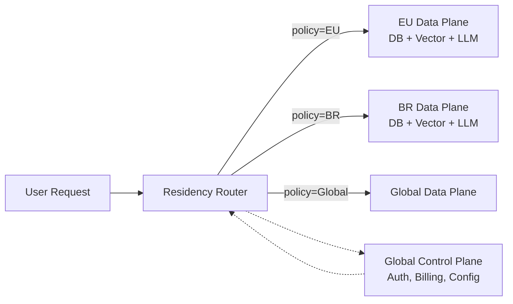

# Data residency

> **Learning Path:** Responsible AI & Governance
> **Section:** 18.1.6 — Learn

### 1. The problem

You build a global AI service. Data flows in from customers in Germany, Brazil, and Singapore. The model, API gateway, and vector store live in us-east-1 for lowest latency and cost.

A German bank asks you to process customer support transcripts with an LLM. GDPR and German banking law require personal data to be stored and processed only within the EU, and not be accessible from outside. A Brazilian health app cites LGPD and requires health data to never leave Brazil.

The problem is not security. It is legal geography. Data has a required location, and moving it breaks compliance, contracts, and trust. Once data is copied to a non-allowed region, you cannot un-copy it.

Data residency is the constraint that forces architecture to respect borders.

### 2. Mental model

Think of data with a passport and visa.

The passport is the residency policy: EU, Brazil, US-only. The visa is where the data is allowed to be stored, processed, and accessed.

The application is the travel agency. It must route each request to a data plane that is physically and logically inside the allowed jurisdiction. Control plane can be global, data plane must be pinned.

Data residency ≠ data sovereignty. Residency is *where* the bits live. Sovereignty is *who* governs them, including government access. Residency is the architectural problem you solve first.

### 3. How it works

Residency is enforced at three layers:

* **Ingestion routing.** Identify tenant, region policy, and route write to the correct regional cluster. No default global write.
* **Storage pinning.** Primary store, backups, logs, object storage, and vector embeddings all stay in the allowed region. Cross-region replication is opt-in and policy-gated.
* **Compute colocation.** Inference, feature extraction, and training jobs run in the same region as the data. Model weights can be global, but data used to build them and prompts used at inference time must stay resident.

Control plane is global for operability. Data plane is regional and isolated. The router is the enforcement point.

### 4. Architectural reasoning

Use residency when a legal or contractual requirement mandates physical location of data at rest and processing.

It solves: auditability, regulatory acceptance, and risk reduction for data exfiltration.

Alternatives:
* **Global store with encryption.** Cheaper and simpler, but fails a residency audit if the bits can be stored outside the region.
* **Logical separation only.** Same region but different accounts. Insufficient if the provider can replicate transparently.
* **On-prem / private cloud.** Strongest guarantee, highest operational cost.

Choose residency-aware architecture when you have multi-tenant data with mixed policies, or when AI workloads ingest PII, PHI, or financial data. For AI specifically, you must track residency for: raw inputs, conversation logs, embeddings, fine-tuning datasets, and model outputs that contain personal data.

### 5. Trade-offs and failure modes

**Cost and complexity.** You run N regional stacks instead of one. Data fragmentation increases operational surface.

**Latency vs compliance.** Routing to the nearest allowed region can add latency. You cannot cheat by processing in a faster region.

**Data gravity.** Analytics, training, and cross-tenant features become harder. You need region-aware aggregation, not global joins.

**Failure modes architects miss:**
* Backups and snapshots replicating to a global vault.
* Log aggregation shipping PII to a central SIEM in another region.
* Vector embeddings created in allowed region, then stored in a global vector DB.
* Model fine-tuning that mixes resident datasets with non-resident data, contaminating residency guarantees.

Residency is a property of the whole data lifecycle, not just the primary database.

### 6. Example

EU bank uses an LLM copilot for advisors. Policy: all customer transcripts and generated advice must reside in eu-central-1.

Architecture: Global control plane for auth and billing. Residency router reads tenant policy from control plane and routes all writes to EU PostgreSQL and EU OpenSearch vector store. Inference runs on EU-hosted model endpoints. Backups stay in EU, with a secondary backup in eu-west-1 for DR, both EU. Logs are shipped to an EU-only logging account. Model weights are global and read-only, but prompts and completions never leave EU.

If a US advisor accesses the UI, the request still executes in EU. Latency is accepted for compliance.

### 7. Reasoning challenge

You have a SaaS AI analytics product with US and EU customers. EU customers require data residency in EU. You want to train a shared retrieval model on anonymized usage patterns to improve search relevance.

Can you train a global model on EU data? What must you decide about the training data pipeline, model artifacts, and inference to remain compliant? What is the minimum architectural change to make this safe?

### 8. Key takeaway

* Data residency is a legal geography constraint that forces data and compute colocation, not just encryption.
* Enforce residency at ingestion routing, storage pinning, and compute colocation. Control plane can be global; data plane must not be.
* Residency increases cost, latency, and complexity, and breaks global data consolidation assumptions.
* The most common failures are invisible data movement: backups, logs, embeddings, and training pipelines.
