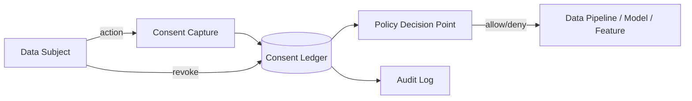

# Consent

> **Learning Path:** Responsible AI & Governance
> **Section:** 18.1.7 — Learn

**Consent is not a checkbox. It is an auditable capability contract between a data subject and your system.**

### The problem

AI systems need data at scale. That data is personal, regulated, and often reused across training, inference, retrieval, and third-party sharing.

Without a verifiable basis for use, you have:
* Legal risk: GDPR, CCPA/CPRA, HIPAA require lawful basis. Consent is one of them and must be informed, specific, freely given, and revocable.
* Model risk: training on data you had no right to use creates contamination, takedown liability, and poisoned provenance.
* Operational risk: you cannot prove what you were allowed to do with which data at what time.

The problem is not collecting a "yes". The problem is proving the yes was valid, scoped, and still valid when the data is used months later in a different pipeline.

### Mental model

Think of consent as a signed capability token with scope, not a boolean flag.

Scope = what data, for what purpose, for how long, with what downstream sharing.
Expiry = time bound or event bound.
Revocation = the token must be invalidatable everywhere it propagated.

Consent degrades. A consent given for "personalized recommendations" does not automatically authorize training a foundation model, selling to a partner, or retaining data after account deletion.

### How it works

A minimal consent architecture has four parts:

1. **Capture intent with context.** Record what was shown to the user, in which language, what choices were offered, and the exact purpose string. Store the rendered artifact, not just a timestamp.
2. **Bind to data subject and data.** Consent must be linkable to an identifiable subject and to the specific data categories it covers. Pseudonymous IDs are fine if you can re-identify for revocation.
3. **Store immutably and centrally.** A consent ledger is the source of truth. It emits events on grant, change, and revocation.
4. **Enforce at use time.** Policy Decision Point checks the ledger before ingestion, training, or inference. Consent is evaluated at the point of use, not only at collection.

Implementation is simple: store consent records with `subject_id, purpose_id, data_categories, granted_at, expires_at, version, proof_hash`. Propagate revocation as a tombstone that pipelines must honor.

### Architectural reasoning

Use explicit consent management when:
* You process personal data for multiple purposes with different legal bases.
* Data flows cross organizational boundaries or long-lived models.
* You need to demonstrate compliance to auditors.

Alternatives:
* **Legitimate interest** avoids consent UI but requires balancing tests and is weaker for high-risk AI.
* **Anonymization/pseudonymization** can remove consent requirement, but re-identification risk and model memorization make this hard for LLMs.
* **Opt-out** is cheaper UX-wise but often insufficient for training.

Choose centralization when consent is a cross-cutting concern. A dedicated Consent Service avoids duplication and consent drift across products. Accept the latency and dependency cost.

### Trade-offs and failure modes

* **Granularity vs UX.** Finer purpose controls increase compliance but increase drop-off. Coarse controls increase usable data but create legal exposure.
* **Central truth vs availability.** A single ledger is auditable but becomes a critical path. Cache decisions with short TTL and always revalidate on high-risk actions.
* **Scope creep.** Models trained on consented data are hard to un-train. Treat training sets as immutable snapshots bound to a consent version. New consent version = new snapshot.
* **Dark patterns.** Pre-ticked boxes, bundling purposes, and vague "improve our services" are invalid under GDPR and destroy trust.
* **Revocation lag.** If revocation events do not reach all downstream stores and models, you are non-compliant. Design for eventual consistency with a clear max lag SLO.

Common failure: consent captured in the UI but never enforced in the data pipeline. The UI is marketing; enforcement is architecture.

### Example

Enterprise AI copilot trained on internal documents.

Problem: employees must consent to having their documents used for model fine-tuning and retrieval.

Architecture: Consent Service stores per-user purpose grants: `workspace_search`, `fine_tune`, `share_with_partners`. Document ingestion pipeline queries PDP before indexing. Fine-tune job builds training set only from users with `fine_tune` active and not revoked. On revocation, a background job deletes embeddings and excludes user docs from future snapshots. Audit log provides proof of what data was included in which model version.

This lets product ship personalization while keeping a defensible lineage.

### Reasoning challenge

Your chatbot offers an opt-in for "help us improve the model". You already have a broad Terms of Service. Can you use conversation logs from non-opted-in users for safety fine-tuning under legitimate interest?

What would you need to verify before saying yes? Consider purpose specificity, risk level, ability to prove which logs were used, and revocation mechanics.

### Key takeaway

* Consent is a verifiable, scoped, revocable capability, not a UI checkbox.
* Capture the context, store it immutably, enforce it at every use point.
* Centralize consent state; enforce via Policy Decision Points in data and model pipelines.
* Design for revocation and scope creep from day one; training data cannot be easily unlearned.
* Optimize for auditability first, UX second. A system you cannot prove is compliant is non-compliant.
