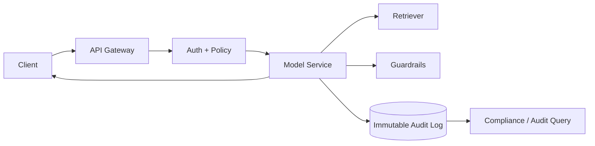

# Auditability

> **Learning Path:** Responsible AI & Governance
> **Section:** 18.1.8 — Learn

### The problem

An AI system makes a decision that matters: denies a loan, flags a patient, hires a candidate, blocks a user. Six months later someone asks: *Why did it do that? Was it compliant? Who approved the model? What data was it using?*

Without evidence you cannot answer. You cannot defend to regulators, auditors, customers, or your own risk team. You also cannot debug bias, drift, or safety failures.

The problem is not visibility in the moment. It is **provable reconstruction later**, under adversarial scrutiny, with incomplete memory.

### Mental model

Auditability is an immutable, tamper-evident record of *what happened, with what inputs, by which system, under which policy*, that can be replayed independently of the live system.

Think of it as a court transcript, not a dashboard. Observability tells you the system is healthy now. Auditability proves what the system did then.

### How it works

Auditability is built from three primitives:

**1. Capture the decision envelope.** For every auditable action, record:
* Who/what triggered it: user id, service principal, session
* What inputs were used: prompt, user message, retrieved context, features
* What system decided: model id + version + config, policy version, tool calls
* What output was produced and why: response, scores, guardrail decisions
* When and where: timestamp, request id, deployment

**2. Link with correlation.** A single request id ties together API gateway, auth, retrieval, model, post-processing, and business action. Without linkage you have fragments, not a story.

**3. Store immutably.** Append-only storage with cryptographic integrity, retention policy, and access controls. Logs must be write-once, readable by auditors, not mutable by developers.

The audit record is written asynchronously, but the decision is not committed until the write is durably accepted or the envelope is provably captured.

### Architectural reasoning

When it helps:
* Regulated domains: finance, healthcare, hiring, EU AI Act high-risk systems
* Systems with non-reversible impact on people
* Models that change over time: you must prove which version acted
* Multi-stakeholder accountability: product, legal, risk need independent evidence

Alternatives:
* Full replay from application logs: cheap but incomplete, logs rotate, schemas drift
* Post-hoc explanations only: insufficient for proving provenance
* Synchronous blocking audit writes: correct but adds latency

Choose auditability when the cost of *not being able to prove* exceeds the cost of storing data. For low-risk features, sample or summarize. For high-risk decisions, capture the full envelope.

### Trade-offs and failure modes

* **Completeness vs cost.** Full prompts + retrieved documents + raw features = huge volume. Architects must define an *audit schema per risk tier*, not one size fits all.
* **Privacy vs transparency.** Audit logs contain PII and prompts. You need redaction, tokenization, and access segregation. Logging raw user data can violate GDPR if retention is not justified.
* **Latency vs durability.** Async logging is cheaper but risks loss on crash. Use outbox pattern or write-ahead log to guarantee at-least-once capture.
* **Tamper evidence vs operability.** Immutable stores are hard to correct when you logged the wrong field. Version your schema and never mutate old records; append corrections.
* **Failure modes:** missing correlation ids create orphan logs; model version not recorded makes replay impossible; logging only output without input makes explanation unverifiable; developers with write access to audit store destroy trust.

### Example

A lending assistant uses RAG + LLM to summarize a credit application and recommend approve/decline.

Audit envelope per decision:
* request_id, user_id, timestamp
* model: `llm-v3.2`, temperature 0.1, system prompt v4
* retrieved docs: policy v12, applicant features hash
* guardrail decision: PII redaction passed, bias check passed
* output: recommendation + rationale

Six months later an auditor asks why applicant A was declined. You replay the exact request_id, show model version, retrieved policy, and guardrail checks. No reconstruction guesswork.

### Reasoning challenge

You are designing a customer support chatbot that can issue refunds up to $500.

Do you log the raw user transcript verbatim, or only a redacted summary? What do you do with refund decisions where the model is confident but the retrieval returned no policy doc?

Decide based on risk, regulation, and what an auditor would need to reconstruct.

### Key takeaway

* Auditability is proof, not monitoring. Design for reconstruction under scrutiny.
* Capture the decision envelope: who, what inputs, which model/policy version, what output, when.
* Correlation ids and immutable append-only storage are the architectural backbone.
* Trade completeness, privacy, and cost explicitly by risk tier; never log everything everywhere.
* If you cannot replay a decision from the audit log alone, you are not auditable.
