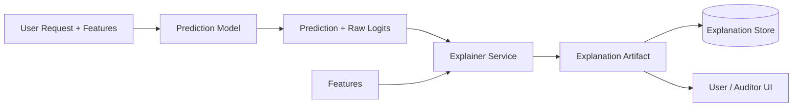

# Explainability

> **Learning Path:** Responsible AI & Governance
> **Section:** 18.1.9 — Learn

**Explainability: 18.1.9 — Learn**

### 1. The problem

A high-performing model is not deployable if no one can justify its decision.

When a model denies a loan, flags a patient for high risk, or routes a support ticket to human review, three pressures appear:
* **Trust:** Users and operators need to know *why* not just *what*.
* **Debugging:** When the model is wrong, you need to know which signal drove the error.
* **Governance:** Regulations like GDPR Art. 22 and EU AI Act require meaningful information about automated decisions for high-risk systems.

Black box performance is a liability. The need is not for a perfect replica of internal weights, but for a decision record that is auditable, stable, and actionable.

### 2. Mental model

Explainability is a translation layer. It converts a model's internal computation into a human-interpretable reason that preserves fidelity to the actual decision logic.

Think of it as two questions:
* **Global:** How does the model work in general? e.g., which features matter across the population.
* **Local:** Why did this specific prediction happen? e.g., why *this* applicant was denied.

You never get both perfectly. Global explanations help design and monitoring. Local explanations help users and compliance.

### 3. How it works

There is no single technique. The architecture separates the explainer from the model.

Essential mechanisms:
* **Model-specific:** Interpretable models like decision trees or linear models with monotonic constraints give intrinsic explanations.
* **Post-hoc model-agnostic:** SHAP, LIME, counterfactuals approximate the decision boundary locally by perturbing inputs and observing output changes.
* **Self-documenting:** Feature attribution, attention maps, or rule extraction provide a narrative.

The explainer needs the input features, the prediction, and ideally a reference distribution to produce a stable explanation.

### 4. Architectural reasoning

Explainability is an architectural choice, not a bolt-on.

**When it helps**
* High-stakes decisions: credit, hiring, medical triage, fraud blocking.
* Human-in-the-loop systems where an operator must override.
* Regulated domains requiring audit trails.

**Alternatives**
* Use an inherently interpretable model. Best fidelity, worst accuracy ceiling.
* Use post-hoc explanations. Keeps performance, adds latency and approximation error.
* Use a surrogate model for explanation only. Faster, lower fidelity.

Decision driver is risk. If a wrong decision costs > cost of accuracy loss, prefer interpretability. If accuracy is safety-critical and domain allows human review, prefer post-hoc explanations with strong monitoring.

### 5. Trade-offs and failure modes

* **Fidelity vs Interpretability.** A simple rule is easy to read but may misrepresent the model. A high-fidelity approximation is hard to read.
* **Stability.** Post-hoc explanations can change with random seeds or similar inputs. Unstable explanations destroy trust.
* **Latency and cost.** SHAP on tabular data is cheap. SHAP on large language models or high-cardinality features is expensive. Explainer must be budgeted as a service.
* **Proxy explanations.** Explaining a proxy model instead of the real model creates a compliance gap. Auditors will ask: is this the explanation for the decision that was actually made?

Failure modes architects see: explanations that are technically correct but not actionable, explanations generated offline and not tied to the exact model version, and explanations exposed to end users without risk framing.

### 6. Example

Enterprise credit scoring.

Model: Gradient boosted trees for default prediction, meets accuracy target.
Constraint: Regulator requires a reason for denial and a way to contest.

Architecture:
* Prediction service returns score + model version id.
* Explainer service receives the same feature vector, computes SHAP values for the top 3 features, and generates a counterfactual: "Approval would be likely if annual income were +$12k or debt-to-income < 32%".
* Explanation is stored immutably with request id, model version, features, and timestamp for audit.
* UI shows: "Denied primarily due to high utilization on revolving credit and short credit history." No raw SHAP numbers to the customer.

The explanation is local, tied to the exact model version, and auditable.

### 7. Reasoning challenge

You are architecting a real-time fraud detection system with 80ms p99 latency budget. The model is a deep neural network with 99.4% precision. The business needs explanations for blocked transactions within 2 seconds for customer service.

Do you: a) run a post-hoc explainer synchronously in the request path, b) generate explanations asynchronously and store them for later retrieval, or c) replace the model with an interpretable one?

What do you measure to ensure explanations remain trustworthy over time?

### 8. Key takeaway

* Explainability exists to make model decisions auditable, contestable, and debuggable, not to open the model.
* Local explanations support users and compliance; global explanations support design and monitoring.
* Choose intrinsic interpretability when risk demands fidelity; use post-hoc explainers when performance dominates, and pay the cost in latency, stability, and monitoring.
* An explanation is only as good as its versioning, traceability, and operational monitoring. If you cannot prove which model produced which explanation, you have no governance.

You should be able to reason about when to pay for explanation quality, how to isolate it from the prediction path, and what breaks first in production.
