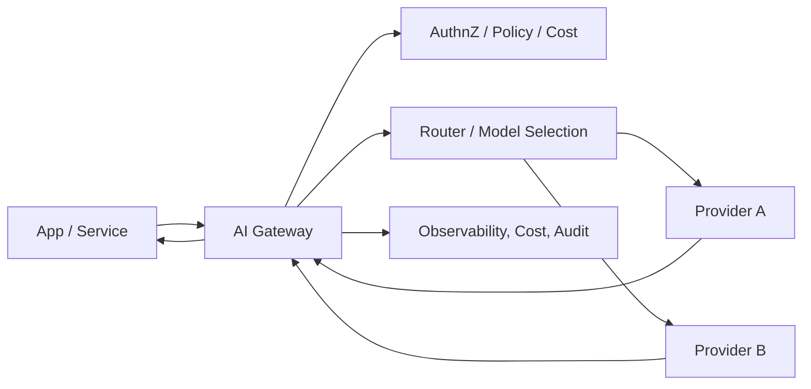

# AI gateway

> **Learning Path:** Enterprise AI Architecture
> **Section:** 19.1.1 — Enterprise patterns

## The problem

You start with one LLM call in one app. Then you add a second app. Then you add a second provider. Then you need different models for different use cases, different rate limits per team, PII redaction, prompt versioning, cost caps, and audit logs.

Without a control plane, every service implements its own auth, retry, logging, cost tracking, and provider SDK. You get vendor lock-in at the app layer, inconsistent policy enforcement, and zero visibility into spend.

The problem isn't calling a model. It's governing hundreds of heterogeneous model calls across an enterprise with consistent security, cost, and reliability.

## Mental model

An AI gateway is a centralized proxy for all LLM and embedding traffic. Think API gateway, but purpose-built for AI workloads.

Clients send a normalized request: `intent, input, constraints`. The gateway decides *which* model, *where*, and *under what policy*, then translates to provider-specific API, returns a normalized response, and records the full lifecycle.

It decouples producers of AI capability from consumers of AI capability.

## How it works

The essential mechanism is request interception + policy enforcement + routing.

1. **Ingress normalization**: Accept OpenAI-compatible or custom schema, extract identity, tenant, and routing hints.
2. **Policy check**: Auth, entitlements, PII redaction, prompt injection guardrails, data residency.
3. **Routing decision**: Choose model based on cost/latency/quality rules, tenant config, or load. Can do canary, fallback, and failover.
4. **Transformation**: Map to provider schema, inject system prompts/version, add tracing headers.
5. **Egress + telemetry**: Stream back response, log tokens, latency, cost, and prompt/version for audit.

It does not replace the model. It adds a control layer.

## Architectural reasoning

**When it helps**
* Multiple apps share models/providers
* You need central cost control, rate limiting, and quotas per team/product
* Compliance requires data residency, logging, and redaction before leaving the org
* You want to swap models without redeploying apps

**Alternatives**
* Direct SDK calls per service: simple, low latency, but policy sprawl and no visibility.
* Generic API gateway: handles auth/rate limiting, but lacks model routing, token counting, prompt management, and provider abstraction.
* Service mesh sidecar: good for infra concerns, poor for AI-specific semantics like prompt versioning and cost attribution.

Choose an AI gateway when governance and operational control outweigh the added hop. For a single prototype, it's overkill. For enterprise scale, it's mandatory.

## Trade-offs and failure modes

* **Latency vs control**: Every request adds 5-50ms. For real-time agents this matters. You can mitigate with colocated edge and async telemetry.
* **Single point of failure / blast radius**: Gateway downtime kills all AI. Needs multi-region active-active, circuit breakers, and provider fallback.
* **Complexity tax**: Teams now depend on a new critical service. Operability, SLOs, and on-call must be first-class.
* **Data privacy**: The gateway sees all prompts and responses. It becomes a high-value target. Must enforce encryption in transit/at rest, zero-retention options, and strict access controls.
* **Cost attribution accuracy**: Token counting must be correct per provider. Miscounts destroy trust in chargeback.

Failure mode to remember: provider throttling looks like gateway throttling. Without per-provider backpressure and queueing, you amplify failures.

## Example

Enterprise with customer support chatbot, internal RAG assistant, and marketing copy generator.

All three apps use different providers and models. Finance needs per-product cost caps. Legal requires PII redaction and audit logs for EU traffic. Product wants to A/B test GPT-4.1 vs Claude for support.

With a gateway:
* Support app sends `intent=support, tier=gold`. Gateway routes to Claude, applies redaction, enforces 100 RPM per tenant.
* RAG assistant is forced to stay in EU region providers only.
* Marketing traffic is routed to cheaper model during off-hours via policy.
* One dashboard shows spend, latency, and error rate by app, model, and user.

No app code changes when swapping models.

## Reasoning challenge

You have two workloads behind the same gateway: a real-time voice agent needing <500ms p95 latency, and a nightly batch summarization job processing 10M documents.

Do you route both through the same gateway instance and policy set? What do you change?

## Key takeaway

* An AI gateway exists to centralize governance, cost, and observability for LLM traffic, not to make models better.
* It trades a small latency and operational cost for control over security, vendor abstraction, and experimentation.
* Design it for failure isolation, accurate telemetry, and policy as code.
* Use it when you have multiple consumers, multiple providers, and compliance requirements. Don't use it for a single prototype.
