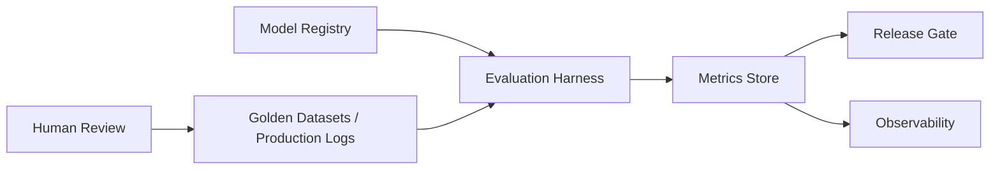

# Evaluation platform

> **Learning Path:** Enterprise AI Architecture
> **Section:** 19.1.10 — Enterprise patterns

**The problem**

You ship an LLM-powered service. Next week you change the prompt, swap the model, or refresh the retrieval corpus. Did quality go up or down? With traditional software the answer is tests. With AI the answer is not.

Outputs are non-deterministic, quality is multi-dimensional, and the data the model sees changes continuously. A passing unit test tells you nothing about hallucination, tone drift, or task failure. Manual spot checks don't scale and can't gate releases.

The real constraint is organizational: product wants speed, risk wants safety, compliance wants evidence. You need a repeatable way to measure the same behaviors across models, prompts, and datasets, and you need to do it before production and after.

**Mental model**

An evaluation platform is a quality control plane for AI systems, not a dashboard.

Think of it as a CI pipeline for behavior. You define what good looks like as datasets and metrics, run models against them in a controlled environment, and compare results over time. It decouples *what* you measure from *how* you measure it.

**How it works**

The core loop is small: register artifacts → run harness → store metrics → decide.

* Datasets: golden sets for offline tests, and sampled production traces for online evaluation. You keep task-specific and safety-specific sets separate.
* Harness: runs the model/prompt/system under test with the same inputs, captures outputs, computes metrics. Supports LLM-as-judge for semantic tasks and classic metrics for structured tasks.
* Metrics store: versioned results per model+prompt+dataset. Enables regression detection and comparison.
* Gate: policy, e.g., "do not promote if task accuracy drops >2% or toxicity increases".

The platform also feeds back: failures become new golden examples, and production signals become new evaluation data.

**Architectural reasoning**

Use it when you have multiple models, multiple use cases, or regulated outputs and you need to compare options safely.

It solves:
* **Regression detection** before release
* **Model selection** with comparable numbers, not opinions
* **Compliance evidence** for audits and risk reviews
* **Continuous improvement** by closing the loop from production feedback to test data

Alternatives:
* Ad-hoc notebooks. Fast to start, impossible to reproduce or gate releases.
* Production A/B only. Expensive, risky, and you learn too late.
* Third-party benchmarks alone. Useful but not specific to your data or policies.

Choose a platform when the cost of a bad release exceeds the cost of building the control plane. For a single prototype, notebooks are fine. For enterprise services, you need reproducibility.

**Trade-offs and failure modes**

* Offline vs online. Offline is cheap and safe; online reflects real distribution. You need both. Over-relying on offline creates benchmark overfitting.
* Synthetic vs human judgment. LLM-as-judge is cheap and scalable but can be biased and gameable. Human review is ground truth but slow and expensive. Use hybrid: automated filter, human audit sample.
* Centralized vs per-team. Central platform gives consistency and governance. Too rigid and teams work around it. Provide shared metrics library and self-service harnesses.
* Coverage vs cost. Evaluation is compute. Running full suites on every commit is expensive. Tiered evaluation: fast smoke tests on PR, full suite on release candidate.

Failure modes to watch: metrics that don't map to business outcomes, stale golden sets that drift from real usage, and evaluation results without enforcement - a dashboard nobody gates on is just theater.

**Example**

A bank deploys a financial advisory assistant. The evaluation platform holds:
* Task set: 500 real customer questions with expected answer structure and disallowed advice types
* Safety set: prompts testing disclosure, bias, and financial advice guardrails
* Latency/ cost budget

Before release, candidate model A vs B is run through the harness. B scores higher on task accuracy but fails more safety prompts. The release gate blocks B. Production logs are sampled weekly; a drop in "intent match" triggers an automatic rollback review.

**Reasoning challenge**

Your team wants to evaluate a new RAG retriever using only offline recall@k on a static QA set. Product is pushing to ship because offline scores improved 8%. What do you ask before approving?

**Key takeaway**

* Evaluation is an architecture concern, not an analytics afterthought. It gates releases.
* Define quality explicitly as versioned datasets and metrics, not vague accuracy.
* Separate offline regression testing from online behavioral monitoring; both are required.
* Centralize metric definitions and artifact storage, decentralize execution to keep teams fast.
* If you can't reproduce a quality claim, you can't ship it.
