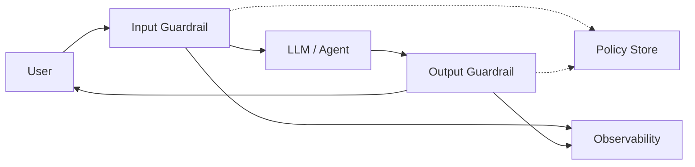

# Guardrail layer

> **Learning Path:** Enterprise AI Architecture
> **Section:** 19.1.12 — Enterprise patterns

### 1. The problem

When you put an LLM behind a product, you no longer control what goes in and what comes out. The model will happily:
* follow a prompt injection hidden in user input
* hallucinate a fact and present it as truth
* leak PII from context
* generate disallowed content or violate brand policy
* produce output that breaches regulation

You can’t fix this by prompt engineering alone. The model is probabilistic, the threat surface is open, and enterprise requirements are deterministic: no PII in logs, no advice outside scope, auditable decisions.

Without a control plane, policy lives in scattered prompts, app code, and post-hoc reviews. That is not operable at scale.

### 2. Mental model

Think of a guardrail layer as a bouncer and inspector for the model.

It sits on both sides of the LLM call and enforces policy as code, not as hope. Input guardrails sanitize and validate what the model is allowed to see. Output guardrails validate what the model is allowed to emit. Policy is centralized, testable, and observable.

### 3. How it works

The essential mechanism is **check-then-call, call-then-check**.

Input side: classify intent, detect prompt injection / jailbreak, redact PII, enforce allowlists for topics, tools, and data sources, and rewrite or reject.

Output side: classify toxicity / disallowed content, detect PII leakage, check factual grounding against retrieved context, enforce style/compliance rules, and redact or block.

The guardrail layer is a separate service with its own policy store. It returns a pass/fail + reasons, and optionally a sanitized version of the payload. The application never talks directly to the model without it.

### 4. Architectural reasoning

**When it helps:** any production LLM that touches user data, regulated data, or external users. Especially agents with tool access.

**What it solves:** centralizes safety, compliance, and quality policy; makes enforcement auditable; decouples policy from model and app code.

**Alternatives:**
* Inline checks in the app. Fast to start, impossible to maintain consistently across services.
* Rely on the model provider’s built-in safety. Insufficient for company-specific policy, PII, and audit.
* Post-hoc moderation. Too late for data exfiltration or harmful output already delivered.

Choose a guardrail layer when policy must be consistent, changeable without redeploying the app, and observable.

### 5. Trade-offs and failure modes

* **Latency vs safety.** Synchronous guardrails add 50-300ms per call. Async post-check reduces latency but allows bad output to be emitted once.
* **False positives vs false negatives.** Over-blocking kills UX; under-blocking creates incidents. You need tunable thresholds and human review loops.
* **Policy brittleness.** Rules based on regex/classifiers drift. You need continuous evaluation with real traffic and red teaming.
* **Bypass risk.** Attackers will try to encode injections or smuggle data via tools. Guardrails must also inspect tool inputs/outputs, not just text.
* **Observability cost.** Every decision must be logged for audit. That creates a sensitive data store of its own.

### 6. Example

Enterprise finance assistant for advisors.

Input guardrail: detects prompt injection, redacts client names and account numbers, enforces that only approved knowledge bases can be used, and blocks queries outside "investment guidance" scope.

LLM: generates advice using RAG over approved docs.

Output guardrail: checks for disallowed recommendations, hallucinations vs retrieved context, PII leakage, and required disclaimer presence. If missing disclaimer, rewrite or block.

Policy changes like "no crypto advice" are updated in the Policy Store and apply instantly to all apps without code deploy.

### 7. Reasoning challenge

You are building an internal HR chatbot vs a public customer support bot.

Where would you place stricter guardrails, and would you make input checks synchronous and output checks asynchronous for either? What changes if the model has access to payroll data?

### 8. Key takeaway

* Guardrails exist because LLMs are non-deterministic and open to adversarial input; enterprise policy must be deterministic and auditable.
* Input + output checks, centralized policy, and observability are the core mental model.
* The decision is about control plane separation: policy changes without app redeploys, and consistent enforcement across services.
* Main trade-offs to remember: latency vs safety, false positive rate vs coverage, and the cost of maintaining an observable policy store.

You should be able to reason: what policy belongs in guardrails vs prompts vs app code, and where a guardrail will fail first under attack.
