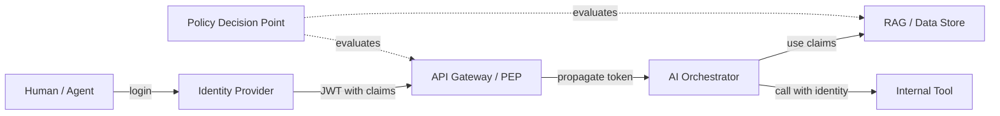

# Identity layer

> **Learning Path:** Enterprise AI Architecture
> **Section:** 19.1.14 — Enterprise patterns

**Identity layer**

### 1. The problem

An enterprise AI system is not one app. It is a graph of human users, agents, tools, LLMs, and data stores. Each node needs to answer two questions: *Who is asking?* and *What are they allowed to see/do?*

If every service implements its own auth, you get fragmented policies, inconsistent audit trails, and data leakage. If you put auth only at the front door, an agent can pull data from RAG, call an internal tool, and write to a database with no consistent identity context.

AI adds new risk: prompts can be injected, agents can be delegated, and data access must be enforced per-user, per-tenant, per-record. Compliance requires provable lineage: which human request led to which model output and which data was used.

The problem is not authentication. It is propagating a verifiable, centrally governed identity and entitlements through an asynchronous, multi-hop AI workflow.

### 2. Mental model

Think of the identity layer as passport control + customs for your architecture.

The Identity Provider issues a verifiable passport, the Policy Decision Point checks visas, and the Policy Enforcement Point stamps every border crossing. Applications never ask "who are you?" They ask the layer: "Is this passport valid for this action on this resource, right now?"

The layer is the single source of truth for *who* and *what they can do*. Apps only need to trust the token and enforce the decision.

### 3. How it works

Core mechanisms, not features:

* **Authentication & federation.** Central IdP issues short-lived tokens, typically OIDC/JWT. Supports human login and non-human identities for services and agents via SPIFFE/SPIRE or workload identity.
* **Claims as context.** Token carries identity, tenant, roles, attributes. For AI, it also carries request context: user id, session id, purpose, data classification.
* **Policy decision point.** Central PDP evaluates requests against policy, e.g., ABAC: `user.department == data.owner AND purpose == "support"`.
* **Enforcement & propagation.** PEP sits at API gateway, service mesh, and data access layer. Identity is propagated downstream via token forwarding or signed context headers. Every hop validates the chain.

### 4. Architectural reasoning

Choose an explicit identity layer when:

* You have >1 AI surface that must share access rules
* Auditability and non-repudiation are required
* Data is sensitive and access is attribute-based, not just role-based
* You need to distinguish human intent from agent action

Alternatives: per-app auth, API keys per service, ad-hoc RBAC in the app. Those work for prototypes but create policy drift and invisible privilege escalation when agents chain tools.

The identity layer enables central policy changes without redeploying models or agents, and gives you a single audit log for *who triggered what AI decision with what data*.

### 5. Trade-offs and failure modes

* **Latency vs security.** Every hop validates tokens and checks policy. Cache decisions, but cache invalidation on revocation is hard.
* **Central point of failure and blast radius.** IdP/PDP outage blocks all AI traffic. Design for high availability and graceful degradation.
* **Token lifetime vs workflow length.** Long-running agent workflows outlive short tokens. Use refresh or delegation tokens, not long-lived secrets.
* **Identity spoofing in agents.** An agent must not be able to mint its own identity. Enforce workload identity and signed delegation chains.
* **Policy complexity.** ABAC is expressive but hard to test. Drift between policy intent and enforcement creates silent over-permission.

### 6. Example

Enterprise Copilot for HR. User Alice in Finance opens a query: "Summarize Q2 turnover for my team."

Request flows: Gateway validates JWT, PDP checks `department == finance` and `data_classification <= internal`. Token propagates to RAG. RAG filters documents at retrieval time using the user's tenant and department claims, not just at the UI. The agent that calls the payroll tool forwards Alice's identity in a signed context, so the tool logs *Alice requested via Agent X*, not just *Agent X requested*.

If Alice switches to HR role, policy changes instantly without code changes. Audit shows the exact data rows used for the summary.

### 7. Reasoning challenge

You are building an internal agent that can read Confluence, query Postgres, and post to Slack. Should access control be enforced only at the identity layer at the gateway, or also inside each tool?

Consider token expiry mid-workflow, tool-to-tool calls without human in the loop, and the need to log which human is ultimately responsible for an automated Slack post. What breaks if you rely on gateway checks alone?

### 8. Key takeaway

* Identity is a cross-cutting concern for AI systems, not an app feature.
* The layer provides verifiable *who* and *what they can do* that propagates through the entire agent graph.
* Centralize policy decision, distribute enforcement, and always propagate identity context, not just authenticate at the edge.
* Design for non-human identities and audit lineage from the start; retrofitting it is expensive.
