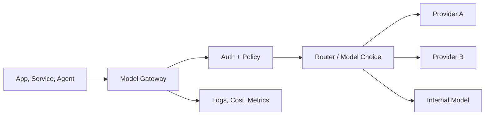

# Model gateway

> **Learning Path:** Enterprise AI Architecture
> **Section:** 19.1.2 — Enterprise patterns

**Model gateway**

### 1. The problem

You have 12 teams building AI features. Each team picks a model provider, writes its own auth, retries, logging, and prompt handling. 

What happens:
* Cost and usage are invisible until the bill arrives
* A PII leak happens in one app because prompts aren't filtered
* You need to switch from Provider A to B for latency, and it becomes 12 rewrites
* Rate limits hit in production because there is no global throttling
* Security and compliance policies are enforced inconsistently

The problem is not calling a model. It's uncontrolled consumption of a shared, expensive, non-deterministic resource.

### 2. Mental model

A model gateway is a reverse proxy and control plane for LLM calls. It sits between your services and model providers.

Think of it as an API gateway, but purpose-built for inference: authentication, routing, policy enforcement, observability, and cost control for AI workloads.

All model traffic goes through one place. Apps talk to `gateway.internal/v1/chat`, not directly to OpenAI, Anthropic, etc.

### 3. How it works

Essential mechanisms only:

* **Routing and model choice.** Route by tenant, request type, cost target, or latency SLA. `summarization` -> cheap model, `code review` -> stronger model. Can be static rules or dynamic based on load.
* **Policy enforcement.** Input/output filtering, PII redaction, prompt injection checks, allowlists. Centralized before the call leaves your network.
* **Auth and tenancy.** Map internal identities to provider keys. No secrets in apps. Quotas per team/tenant.
* **Observability and cost.** One place to log prompts, tokens, latency, errors, and cost. Enables chargeback and anomaly detection.
* **Resilience.** Retries with backoff, circuit breakers, fallback model on failure.

Apps need almost no change: swap base URL and key, or use a thin SDK client.

### 4. Architectural reasoning

When it helps:
* Multiple teams, products, or regions consume models
* You need governance, cost control, or compliance attestation
* You want to experiment with models without app redeploys
* You need to abstract providers to avoid lock-in

What it solves:
* Decouples consumers from providers
* Centralizes non-functional concerns you don't want in every service
* Gives a single control point for policy and cost

Alternatives:
* Direct SDK calls. Cheapest to start, worst at scale. No governance.
* Per-team wrappers. Duplicates logic, drifts over time.
* Service mesh sidecar. Good for transport, not for LLM-specific policy/cost.

Choose a gateway when the cost of inconsistency exceeds the cost of an extra hop.

### 5. Trade-offs and failure modes

* **Latency.** Gateway adds 5-30ms and is in the critical path. Keep it hot, colocated, and stateless.
* **Single point of failure.** If it goes down, all AI features go down. Run active-active, multi-region, with local fail-open options for non-critical paths.
* **Complexity.** You now own routing logic, key rotation, and policy. Start with routing + auth + logging, add policy later.
* **Observability bias.** You see token counts, not business value. Pair gateway metrics with product metrics to avoid optimizing cost over outcome.
* **Prompt leakage risk.** Gateway sees all prompts. It becomes a high-value target. Encrypt in transit, limit retention, enforce strict access.

### 6. Example

Enterprise support platform. Three apps: customer chat, internal knowledge Q&A, and agent tooling.

Without gateway: each app has its own keys, no filtering, different retry logic. A prompt injection in chat bypasses controls. Costs spike when a bug loops calls.

With gateway:
* Chat traffic routes to Provider A with PII filter and  $0.002/token cap per tenant
* Internal Q&A routes to on-prem model, with allowlist for internal docs
* Agent tooling routes to Provider B with higher latency tolerance, fallback to A on error
* All prompts logged to centralized store for audit, redacted for PII

Teams change model in one config, not in code.

### 7. Reasoning challenge

Your org has one low-risk internal chatbot and one high-risk finance summarizer that must stay on-prem.

Do you route both through the same gateway instance with the same policy set, or split them? What changes if the finance summarizer requires air-gapped deployment with no external egress?

### 8. Key takeaway

* A model gateway exists to centralize governance, cost, and observability for LLM consumption across an organization.
* It trades a small latency and operational cost for control, portability, and safety.
* Design it as a thin, stateless control plane. Don't put business logic in it.
* The value is not routing; it's the ability to change models, policies, and costs without touching every consumer.
