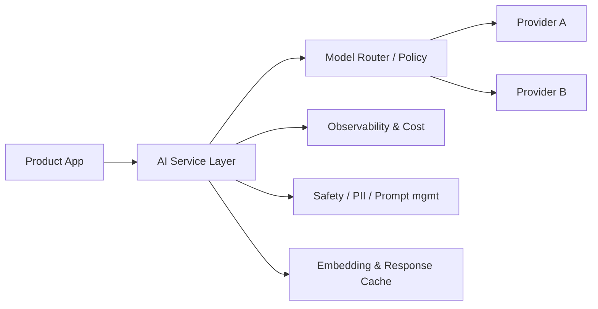

# AI service layer

> **Learning Path:** Enterprise AI Architecture
> **Section:** 19.1.3 — Enterprise patterns

### The problem

Direct LLM calls from product services work for a prototype. At enterprise scale they create sprawl.

Each team picks a provider, a model, a temperature, a prompt format. Guardrails, PII redaction, logging, and cost controls are re-implemented per app. A model deprecation or price change forces changes across dozens of codebases. Prompt leakage, inconsistent safety policies, and zero centralized observability follow.

You need a single place to reason about *how AI is used*, not *where AI is called*.

### Mental model

The AI service layer is an internal platform API for AI capabilities. Apps call `POST /ai/chat` or `POST /ai/embed` with intent and business context. The layer owns model selection, routing, policy enforcement, telemetry, and cost control. Providers are replaceable implementations behind a stable contract.

Think of it as an internal data platform, but for model inference.

### How it works

Essential mechanism:

* **Facade API**: Stable contracts for chat, completion, embedding, retrieval, tool use. Apps never import OpenAI/Anthropic SDKs directly.
* **Routing & selection**: Route by cost/latency/quality, tenant, prompt type, or fallback on failure. Can A/B models without app deploys.
* **Policy enforcement**: System prompts, guardrails, PII redaction, allowlists, rate limits per tenant/user, audit logs.
* **Observability**: One place for prompt, tokens, latency, cost, and hallucination signals. Feeds feedback loops for prompt tuning and fine-tuning.
* **Lifecycle management**: Prompts, tools, and vector stores are versioned assets, not strings in code.

### Architectural reasoning

When it helps:
* Multiple apps need AI and must share safety, cost, and compliance posture.
* Model choice is volatile. You want to swap or blend providers without app changes.
* You need centralized telemetry to justify spend and detect drift.

What it solves:
* Vendor lock-in and prompt sprawl.
* Inconsistent guardrails and auditability.
* Uncontrolled cost and latency.

Alternatives:
* **Client SDK per app** - fast to start, unmaintainable at scale.
* **API gateway only** - routes traffic but has no model logic, policy, or observability depth.
* **Fully serverless calls** - cheap, zero control.

You choose the service layer when AI is a *capability* not an experiment, and when non-functional requirements dominate.

### Trade-offs and failure modes

* **Latency and tail risk**: Extra hop adds 10-50ms and a new failure domain. Mitigate with caching, async queues for non-interactive workloads, and provider fallbacks.
* **Single point of failure / blast radius**: One bug can degrade all AI features. Design for graceful degradation: bypass paths, circuit breakers, per-tenant quotas.
* **Abstraction leakage**: Apps demand model-specific features. Keep the contract intentionally limited; expose feature flags for opt-in capabilities.
* **Cost concentration**: Centralization makes spend visible, but also makes you responsible for it. Without quotas you get surprise bills.
* **Prompt drift**: Teams work around the layer with shadow calls. Enforce via platform policy and network controls.

### Example

Enterprise support copilot used by Web, Mobile, and Agent desktop.

All three call `ai/assist` with `{intent, conversation_id, tenant_id}`. The service layer injects tenant-specific system prompt, retrieves from a tenant-scoped vector store, runs PII redaction, routes to `gpt-4o-mini` for simple queries and `claude-3.5` for complex reasoning, logs tokens and cost per tenant, and caches embeddings.

When the provider raises prices, the router shifts 30% of traffic to a cheaper model for low-risk intents. No app deploy required. Compliance audit is one log store.

### Reasoning challenge

Your finance team wants a fine-tuned model for invoice extraction embedded directly in the billing service for lowest latency. Legal wants all extraction to go through the AI service layer for audit and redaction.

Do you allow a direct call? What conditions would make it acceptable, and what would you lose?

### Key takeaway

* AI service layer exists to centralize policy, cost, and observability, not to hide LLMs.
* It trades a little latency for control over vendor churn, safety, and spend.
* Design the contract first. The providers are an implementation detail.
* Failure modes are operational: blast radius, abstraction leakage, and shadow AI. Operate it like a platform, not a library.
