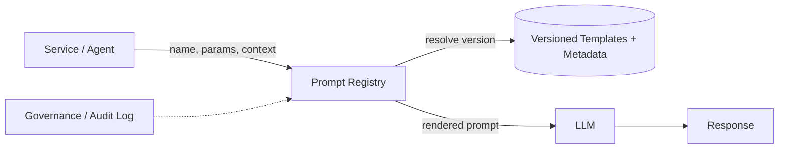

# Prompt registry

> **Learning Path:** Enterprise AI Architecture
> **Section:** 19.1.4 — Enterprise patterns

**Prompt registry**

### 1. The problem

When prompts are first experimented with, they live in notebooks and code comments. When they move to production, they become a hidden dependency.

A team copies a prompt into three services. Someone tweaks wording for a bug fix in one service only. Another team invents a similar prompt from scratch. No one knows which version is live, who approved it, or what data it was tested against. An LLM upgrade changes behavior and you cannot reproduce yesterday’s output.

Prompts are now production logic: they encode business rules, tone, safety constraints, and task decomposition. Unmanaged prompt sprawl creates drift, non-reproducibility, compliance risk, and costly rework.

### 2. Mental model

A prompt registry treats prompts as versioned artifacts, not strings.

Think of it as an internal package registry for LLM instructions: a single source of truth for prompt templates, with versioning, metadata, access control, and lineage. Apps request a named prompt with parameters, the registry returns the correct versioned template for the context.

### 3. How it works

The essential mechanism is centralize, version, parameterize.

* Store prompt templates with variables, not baked examples.
* Version each template immutably. A version is tied to model, temperature, system + user structure, and test results.
* Attach metadata: owner, approval status, PII handling, cost, latency, evaluation score.
* Serve via API: `getPrompt(name, version, model, region)` returns the template and rendering instructions.
* Prompts are rendered at call time with validated inputs.

### 4. Architectural reasoning

It helps when prompts are reused across services, teams, or regions and when governance matters.

* **Reproducibility and auditability.** You can point to `summarize-invoice-v3.2` used on 2026-01-14 and replay outputs.
* **Safe rollout.** Versioning enables canary and A/B testing of prompts without code deploys.
* **Governance.** Central approval, classification, and PII checks before a prompt goes live.
* **Discoverability.** Teams find existing prompts instead of reinventing.

Alternatives:
* Git repo with prompts. Works for a single team, fails at discoverability, access control, and runtime selection.
* Hardcoded strings. Fast initially, unmaintainable at scale.
* Config service. Handles parameters but not versioning, lineage, or evaluation linkage.

Choose a registry when prompt change frequency, compliance, and cross-team reuse are high. Skip it for one-off experiments.

### 5. Trade-offs and failure modes

* **Latency and coupling.** A runtime dependency on the registry adds a call in the critical path. Mitigate with local cache with TTL and fallback to last-known-good.
* **Single point of failure.** Registry outage blocks prompt resolution. Design for read replicas and cache-first.
* **Governance overhead.** Review processes slow down engineers. Balance with auto-promotion for low-risk changes and clear ownership.
* **Version explosion.** Too many fine-grained versions create confusion. Enforce semantic versioning and deprecation windows.
* **Security.** The registry becomes a high-value target. Prompt injection via malicious template variables or metadata is a real risk. Validate inputs, sign versions, and audit access.

### 6. Example

Enterprise customer support uses the same LLM across web chat, voice, and email.

The registry holds `support-triage` with versions per channel and locale. `support-triage-v2.1` adds a policy constraint for refunds. The web app requests `support-triage` with `channel=web, locale=en-US`. The registry resolves to v2.1 for that model and region, renders the template with ticket data, and logs the version used. When compliance updates refund policy, a new version is published, tested against golden conversations, approved, and rolled out to 10% of traffic via the registry. Rollback is instant.

### 7. Reasoning challenge

Your org has three product teams using the same summarization model but with different brand tone requirements. One team wants rapid iteration, another is regulated and needs audit trails, the third shares prompts with an external partner.

Do you give each team its own registry namespace with different promotion policies, or enforce one global registry with a single policy? What do you optimize for and what breaks?

### 8. Key takeaway

* Prompts are production artifacts. Manage them like code and models.
* A prompt registry provides versioning, discoverability, and governance for LLM instructions.
* It trades operational complexity for reproducibility, safety, and cross-team reuse.
* Design for cache, failure modes, and clear ownership from day one.
