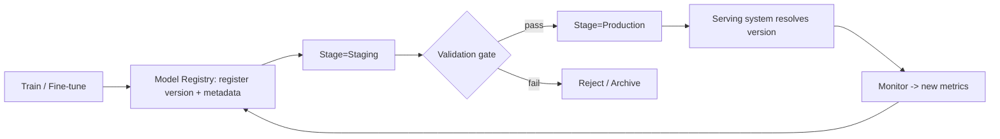

# Model registry

> **Learning Path:** Enterprise AI Architecture
> **Section:** 19.1.5 — Enterprise patterns

## The problem

You ship a model to production. Six months later it drifts, a customer complains, and compliance asks: which model served that request? Who trained it? On what data? With what metrics? What code?

Without a single source of truth, answers live in Slack, a researcher's notebook, an S3 path, and a JIRA ticket. Teams re-train the same model, promote the wrong version, or roll back to an artifact with no provenance. Experiments are not reproducible and production incidents become forensic exercises.

The problem is not storing artifacts. It's coordinating **lifecycle, lineage, and trust** for a mutable, data-dependent artifact across teams.

## Mental model

A model registry is the source of truth for model artifacts *and* their metadata, with an explicit lifecycle.

Think of it as a package registry for models, like PyPI for code: immutable versions, named releases, and a promotion path from experiment to production. It does not train models. It governs them.

Core entities: Model, Version, Stage. A Model groups related versions. A Version is immutable and points to artifact URI + metadata + lineage. A Stage is a business state: Staging, Production, Archived.

## How it works

Essential mechanism, not features:

Training completes → register version with metadata: metrics, parameters, data version, code commit, owner.  
Registry assigns a version ID and stores pointers to artifacts, not necessarily the blobs.  
Version transitions through stages via policy, not ad-hoc copy.  
Serving systems resolve "model X in Production" to a specific version ID.

The registry couples artifact identity to experiment lineage. Promotion is a controlled state change, auditable.

## Architectural reasoning

When it helps:
* Multiple teams share models
* Models must be promoted through environments with approvals
* Compliance/audit requires reproducibility
* You need to roll back fast with confidence

What it solves: naming chaos, silent drift, untracked experiments, and "works on my machine" for ML.

Alternatives:
* Ad-hoc S3 + spreadsheet / experiment tracker only. Cheaper early, collapses with scale.
* Git-only for code, artifacts in object storage. Loses metadata coupling and stage governance.
* Feature store or MLOps platform with built-in registry. Tighter integration, higher coupling.

Why choose a registry: you need a contract between research, platform, and ops. It decouples *where* artifacts live from *how* they are governed.

## Trade-offs and failure modes

Centralization vs autonomy. A single registry becomes a critical dependency and schema bottleneck. Teams may work around it if the registration friction is high.

Metadata quality > artifact storage. Registries are only trustworthy if registration is automated in CI. Manual entry rots.

Stage semantics are business-specific. "Production" may mean different things per use case. Over-standardizing stages creates false safety.

Vendor lock-in of metadata schema. Artifact URIs can be portable; custom metadata may not.

Failure modes to watch:
* Registry drift: model in serving not registered, or registered version points to wrong artifact.
* Promotion without validation: stage moves on human click, no metrics gate.
* Stale models: no ownership, no deprecation policy, production serves an orphaned version.
* Split brain: two registries for different clouds, no unified view.

## Example

Enterprise fraud detection.

Two teams: research builds new gradient boosted model weekly; platform team manages serving. Data science registers each candidate in Model Registry with metrics: precision@k, latency, data snapshot id, training code SHA. 

Policy: auto-promote to Staging if precision@k > baseline +2% and data drift < threshold. Manual approval moves to Production. Serving resolves `fraud_model vProd` to version 42. 

When fraud rate spikes, ops roll back to version 39 in 30 seconds with full lineage. Audit shows exact data and code used.

No registry, and they would be hunting S3 prefixes.

## Reasoning challenge

You have a low-latency recommendation model retrained daily and a high-risk credit risk model retrained quarterly with heavy compliance.

Do you use the same registry policy for both? What changes in registration metadata, promotion gates, and retention?

Think about cadence, risk, and validation cost.

## Key takeaway

* A model registry exists to make model identity, lineage, and promotion auditable and repeatable, not to store weights.
* It creates a contract between experiment and production; promotion is a controlled state change, not a file copy.
* Value comes from automated registration and enforced gates, not from the registry UI.
* Central governance helps at scale but introduces coupling; keep artifact storage portable and metadata minimal but complete.
