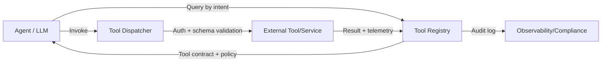

# Tool registry

> **Learning Path:** Enterprise AI Architecture
> **Section:** 19.1.7 — Enterprise patterns

### The problem

You are building an enterprise AI system. Multiple agents — sales assistant, support triage, finance summarizer — need to call the same external capabilities: get customer profile, create ticket, check inventory, run SQL, call an internal model.

Initially you hardcode tool calls in each agent. Then the problems start:

* New tools appear weekly and must be discovered by every agent.
* The same tool has different auth, rate limits, and schemas per environment.
* A model upgrade breaks a tool call because the function signature changed.
* Security and compliance teams demand auditability: who can call what, when, and with which data.
* Agents start duplicating tools with slightly different wrappers.

You need a single source of truth for *what tools exist, how to call them, who can use them, and how they behave* — without coupling agents to implementation details.

### Mental model

A tool registry is a capability catalog, not a tool itself.

Think of it as an internal app store for agent actions. Agents don't import tools; they query the registry for tools matching a task, receive a contract to invoke them, and execute via a dispatcher.

The registry holds metadata and policy, not business logic.

### How it works

Essentially three parts:

* **Catalog:** Metadata for each tool: name, description, input/output schema, owner, version, cost, latency SLO, auth requirements.
* **Discovery & routing:** Agents request tools by intent or capability. Registry returns the valid tool(s) and an invocation endpoint.
* **Governance layer:** Policy enforcement, versioning, observability, and lifecycle management.

Simplified flow:

Agents never call tools directly. The registry mediates discovery, authorization, and telemetry.

### Architectural reasoning

**When it helps**

* Many agents share a growing set of tools.
* Tools are owned by different teams and change independently.
* You need centralized governance: allow/deny by agent, tenant, data classification.
* You need observability and cost attribution across the tool graph.

**What problem it solves**

Decouples *agent logic* from *tool implementation*. An agent says "I need to get a customer profile". The registry decides which implementation to return — production vs sandbox, v2 vs v1, region-specific endpoint — and enforces policy.

Alternatives:

* **Hardcoded function map per agent.** Works for 1-3 tools. Fails at scale with drift and duplication.
* **Per-team service mesh.** Good for infrastructure routing, poor for semantic discovery and LLM-friendly descriptions.
* **Model-level tool calling only.** No governance, no versioning, no cross-agent reuse.

Choose a registry when the cost of inconsistency and shadow tooling exceeds the overhead of operating a catalog.

### Trade-offs and failure modes

* **Latency vs freshness.** Registry lookups add a hop. Cache aggressively, but risk stale contracts. Version pinning is essential.
* **Single point of truth becomes single point of failure.** If the registry is down, agents can't discover new tools. Make the catalog read-replicated and allow agents to operate on a cached snapshot with TTL.
* **Schema drift.** Tool owners change parameters without updating the registry. Enforce CI checks: tool deployment requires a registry update and schema validation.
* **Over-abstraction.** If the registry tries to normalize every tool into one schema, you lose fidelity. Keep the contract close to the tool's native schema; add a thin adapter layer.
* **Security surface.** The registry knows everything. Protect it like an IAM service: mTLS, strict RBAC, audit logs. A compromised registry can redirect agents to malicious tools.

### Example

Enterprise AI platform for a retailer.

The registry stores:
* `get_customer_profile` v2, owner: CRM team, PII, requires `customer.read` scope, cost $0.001/call.
* `create_support_ticket` v1, owner: Support, requires `ticket.write`, rate limited 100/min.
* `check_inventory` v3, owner: Warehouse, non-PII, cached 60s.

The sales agent needs customer data. It queries the registry with intent + tenant. Registry returns the approved tool for that tenant, with the correct endpoint and auth token from the vault. The call is logged for compliance. When CRM releases v3, the registry stages it, tests with canary agents, then rolls out.

No agent code changes.

### Reasoning challenge

You have 12 internal teams shipping tools. Some tools are sensitive and must only be callable by agents in the finance domain, with human-in-the-loop approval for >$10k actions.

Do you put the approval logic inside each agent, inside the dispatcher, or inside the registry policy? What breaks if you choose wrong?

### Key takeaway

* Tool registry exists to make tool discovery, governance, and lifecycle manageable at enterprise scale, not to simplify a single agent.
* It decouples agents from tool implementation via a centralized capability catalog with policy enforcement.
* Centralization buys consistency and auditability at the cost of operational complexity and a new failure mode.
* Design for versioning, caching, and strong schema contracts from day one.
