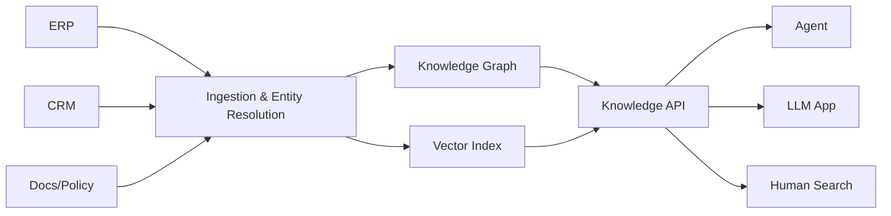

# Knowledge platform

> **Learning Path:** Enterprise AI Architecture
> **Section:** 19.1.8 — Enterprise patterns

**19.1.8 Enterprise patterns — Knowledge platform**

### The problem

Enterprise AI fails not because models are weak, but because knowledge is fragmented.

An LLM can reason, but it has no single source of truth. Customer data lives in CRM, product specs in PLM, policies in SharePoint, transactions in ERP, and tribal knowledge in Slack. Each app built its own RAG pipeline, its own embeddings, its own filters.

Result: inconsistent answers, hallucinations, duplicated ingestion, and no auditability. Data teams optimize for storage and batch analytics. AI teams need fresh, contextualized, governed knowledge that can be queried by humans and agents alike.

The constraint is not data volume. It is semantic consistency, freshness, and trust.

### Mental model

A knowledge platform is a productized semantic layer, not a data lake.

Think of it as a company memory with a contract: *What is true, about what entity, at what time, with what provenance, and who can see it?*

Data platform stores raw facts. Knowledge platform resolves facts into entities and relationships, then makes them retrievable and governed for AI consumption.

### How it works

Ingestion is domain-aware, not just schema-aware. Sources are normalized to a canonical entity model, entity resolution links duplicates, and a knowledge graph captures relationships.

Content is stored in two complementary forms:
* Structured graph for precise reasoning: `Customer -> owns -> Account -> has_policy -> ...`
* Vector index for semantic search and retrieval.

Access is through a governed API with retrieval policies: freshness windows, role-based access, citation requirements, and lineage.

### Architectural reasoning

When it helps:
* Multiple AI apps and agents need the same entities
* Answers require grounding with citations and audit trails
* Knowledge freshness and correctness are a business risk

It solves: duplicated pipelines, semantic drift across apps, and ungoverned retrieval.

Alternatives:
* *Per-app RAG.* Fast to start, unmaintainable at scale. Every app re-ingests, re-embeds, re-writes filters.
* *Data mesh.* Good for domain autonomy on raw data, but does not guarantee a shared semantic model for AI.
* *Central data warehouse.* Strong for reporting, weak for unstructured retrieval and real-time agent queries.

Choose a knowledge platform when reuse, governance, and trust outweigh domain autonomy. It is the enterprise pattern for turning data into a reusable knowledge product.

### Trade-offs and failure modes

* Centralization vs autonomy. One canonical model simplifies retrieval but can become a bottleneck. Mitigate with domain-owned knowledge domains and a federated governance model.
* Freshness vs consistency. Near-real-time ingestion improves accuracy but increases cost and complexity. Define SLAs per entity type.
* Semantic decay. Entities and relationships go stale. Without active curation and feedback loops, the platform quietly drifts.
* Over-normalization. Trying to make a single perfect model kills adoption. Start with a thin canonical core and let domains extend it.

Failure mode to watch: *knowledge hallucination by omission.* The platform returns no results, the app falls back to the LLM, and users trust a hallucinated answer.

### Example

A global insurer builds a Claims Knowledge Platform.

Sources: policy admin, claims system, medical notes, regulatory PDFs.

Platform builds entities: PolicyHolder, Policy, Claim, Provider, Regulation. Links claims to applicable regulations and prior adjudications.

Agents use the Knowledge API for retrieval with citations. A claims triage agent can ask: *Find similar claims for this provider and cite the regulation that governs coverage.*

Instead of five teams building five RAG pipelines, one platform provides governed retrieval, audit logs, and freshness guarantees. Human adjusters use the same search interface.

### Reasoning challenge

Two business units need different views of "customer". Sales wants a marketing persona; Risk wants a compliance profile with KYC data. Sales wants low-latency updates; Risk requires immutable audit trails.

Do you model one canonical Customer entity with views and policies, or two separate entities? What controls the freshness SLA and access?

### Key takeaway

* Knowledge platform exists to provide a single, governed, citable semantic layer for AI and humans, not just more storage.
* It trades per-app speed for enterprise reuse, consistency, and trust.
* Success depends on entity resolution, freshness SLAs, and retrieval policies, not just better embeddings.
* Design for federated ownership: central contracts, domain extensions, and measurable semantic quality.
