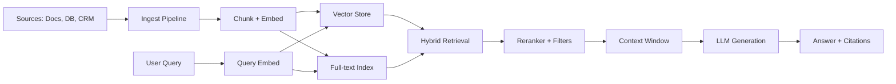

# RAG platform

> **Learning Path:** Enterprise AI Architecture
> **Section:** 19.1.9 — Enterprise patterns

**RAG Platform**

### 1. The problem

You need LLMs to answer questions using your enterprise data, not just their training data.

That creates three architectural pressures at once:
* **Accuracy / Hallucination:** The model must be grounded in real, current sources.
* **Access:** Data lives in SaaS, databases, docs, tickets. It is private, permissioned, and constantly changing.
* **Control:** You need auditability, citations, PII redaction, and tenant isolation for compliance.

A one-off prompt with a file upload works for a demo. It fails in production because ingestion, retrieval quality, freshness, and governance are now first-class systems problems.

### 2. Mental model

A RAG platform is not a vector DB. It is the production system that makes retrieval-augmented generation reliable for an organization.

Think of it as three layers:
* **Knowledge Layer:** Ingest, normalize, chunk, embed, index. Keeps the corpus searchable.
* **Retrieval Layer:** Hybrid search, reranking, and permission filtering that turns a query into a high-quality context set.
* **Generation Layer:** Prompt orchestration, context injection, citation, and guardrails.

The platform’s job is to make the LLM *grounded* without making it *slow, leaky, or ungovernable*.

### 3. How it works

Essentially:
1. **Ingest:** Connectors pull from sources on schedule or via CDC. Content is cleaned, PII redacted, chunked with overlap, and versioned.
2. **Index:** Embeddings go to a vector store. Text/metadata goes to a full-text index. Metadata carries tenant, owner, sensitivity, and freshness.
3. **Retrieve:** Query is embedded. Hybrid search combines vector similarity with keyword BM25. Results are filtered by entitlements and reranked.
4. **Generate:** Top k chunks are injected into the prompt with citations. Generation is logged for audit.

### 4. Architectural reasoning

**When it helps:** You need answers over proprietary, dynamic data with traceability.

**Alternatives:**
* Fine-tuning: Good for stable knowledge, expensive, slow to update, hard to cite.
* Tool calling / agents: Good for live APIs, poor for large unstructured corpora.
* Retrieval alone: Search is useful, but users want natural language synthesis.

**Why a platform vs a pipeline:** A pipeline solves one use case. A platform solves many. It provides shared ingestion, unified embeddings, centralized governance, and observability. That amortizes cost and enforces policy.

Choose a platform when you have multiple apps, multiple data sources, and compliance requirements.

### 5. Trade-offs and failure modes

* **Latency vs quality:** More retrieval steps, reranking, and larger context improve answer quality but increase p95 latency. Architects usually cap retrieval to 2-3 stages and use async pre-fetch for common queries.
* **Chunking strategy:** Small chunks improve precision; large chunks preserve context. There is no universal optimum. You will need per-domain strategies and evaluation.
* **Embedding drift:** Models and corpora evolve. Stale embeddings degrade recall silently. You need re-embedding jobs and freshness SLAs.
* **Retrieval leakage:** Forgetting to filter by user permissions returns data they shouldn't see. Permission filtering must happen at retrieval time, not post-generation.
* **Citation fidelity:** The model can hallucinate citations. You need grounding checks and source anchoring, not just appending URLs.

### 6. Example

Enterprise support RAG: Zendesk tickets, Confluence, internal API docs.

Ingestion runs hourly, chunks ticket threads with metadata `team, product, sensitivity`. Retrieval filters by `team = user's team` and `sensitivity <= user's clearance`. Hybrid search finds relevant solved tickets, reranker boosts recent resolved issues. Generation returns answer with 3 citations and a “confidence low” flag when recall < threshold.

This gives agents grounded answers in 800ms with audit logs for compliance.

### 7. Reasoning challenge

You have a financial services RAG platform serving 5 business units. One unit needs real-time retrieval from a trading DB with <500ms latency and strict row-level security. Another unit needs deep research over 10M historical PDFs where latency can be 3s.

Do you build one shared retrieval path or two? What changes in indexing, caching, and permission model?

### 8. Key takeaway

* A RAG platform exists to make LLM answers grounded, fresh, and governable at enterprise scale.
* Retrieval quality, not model size, is the dominant driver of production accuracy.
* Design for ingestion, permissions, and observability first; vector DB choice is secondary.
* The core trade-offs are latency vs recall, freshness vs cost, and centralization vs domain-specific tuning.
