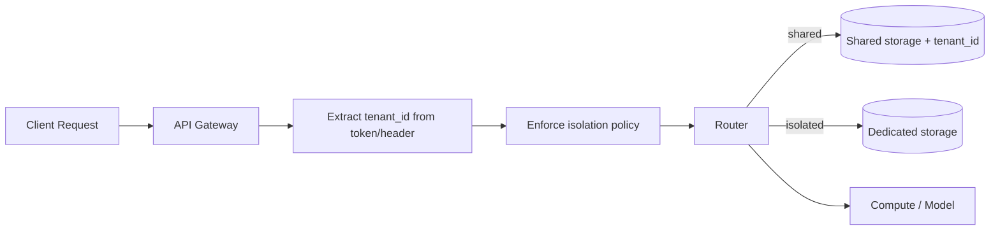

# Tenant isolation

> **Learning Path:** Enterprise AI Architecture
> **Section:** 19.2.1 — Multi-tenancy

**Tenant isolation**

### The problem

You want to serve many customers from one AI platform to get economies of scale. Customers want guarantees that their data, prompts, fine-tunes and embeddings never touch another customer's.

That tension creates the problem: shared infrastructure saves cost, shared data risks breach, compliance violation, and prompt leakage. In AI systems the risk is higher because data is not just rows, it is vectors, prompts, model weights, and inference logs that can be exfiltrated via cross-tenant retrieval.

You need a way to share the platform while making cross-tenant access architecturally impossible, not just policy-impossible.

### Mental model

Think of a building. Multi-tenancy is the building. Tenant isolation is the walls, locks, and separate meters.

Tenants share the foundation and elevators, but each apartment has its own key, its own water meter, and its own address. You can increase isolation by moving from shared walls to separate floors to separate buildings.

Isolation is never free. It trades cost and operational complexity for blast radius and compliance.

### How it works

Isolation is enforced at multiple layers and the tenant identity must be propagated end-to-end.

Request flow:

Key mechanisms:
* **Identity propagation.** Tenant ID is extracted at ingress and attached to every downstream call, DB query, and vector search. No request is allowed without a tenant context.
* **Storage isolation.** Either a shared store with a mandatory tenant_id filter / Row Level Security, separate schema per tenant, separate database per tenant, or separate vector namespace/collection per tenant.
* **Compute isolation.** Shared serving with tenant-aware routing vs dedicated model endpoints, queues, and GPU pools to prevent noisy neighbor and data remnants in GPU memory.
* **Model artifact isolation.** Separate fine-tuned weights, LoRA adapters, RAG indexes, and prompt templates per tenant. In AI, the model itself is state.

The strongest isolation is not a feature, it is a default: every access path must fail closed if tenant is missing.

### Architectural reasoning

Choose isolation strength by risk, not by habit.

* **Shared everything + tenant_id.** Cheapest, works when data is low sensitivity and you can trust application code to always filter. Fails catastrophically on one bug.
* **Shared DB, separate schema.** Better blast radius. Good for strong logical isolation with moderate tenant count.
* **Separate DB per tenant.** Strong data isolation, simpler compliance export/delete. Operational overhead grows with tenant count.
* **Dedicated cluster / VPC / model endpoint.** Required for regulated data, dedicated SLAs, or noisy neighbor on GPU. Highest cost.

In AI platforms the hardest part is retrieval. Vector DBs need per-tenant namespaces/collections and a tenant-scoped filter on every search. Prompt logs and embeddings must be stored with tenant_id and never be used for cross-tenant training.

### Trade-offs and failure modes

* **Cost vs blast radius.** More isolation = more infra, more ops. Shared saves money until one tenant causes an outage or a leak.
* **Correctness vs performance.** Mandatory tenant filters and RLS add latency. Dedicated resources add cost but remove contention.
* **Noisy neighbor.** One tenant saturating GPU or vector search degrades others in shared compute.
* **Implementation drift.** The most common failure is a missing tenant filter on one query, one background job, or one admin tool. Isolation must be enforced by the platform, not by developer discipline.
* **Data remnants.** Model weights, KV caches, and logs can leak across requests if you reuse shared inference workers without proper context clearing.

### Example

Enterprise AI copilot for legal firms.

Requirement: each firm can upload private documents, build a private RAG index, and optionally fine-tune a LoRA adapter. Data must not be visible to other firms and must be deletable on request.

Architecture: API gateway extracts firm_id from JWT. Requests route to shared API layer but storage is isolated.

* Postgres: one database, row-level security on `documents`, `chats`, `users` tables with `tenant_id` as mandatory filter.
* Vector store: one cluster, but per-tenant collection `firm_<id>_chunks`. Search always scoped to the collection.
* Model serving: shared base model with per-tenant LoRA adapters loaded on demand. Inference requests tagged with tenant_id to select correct adapter and isolate logs.
* Observability: all logs include tenant_id, and tenant-scoped audit trails.

This gives logical isolation with cost control, and allows a path to hard isolation for top-tier tenants by moving them to a dedicated DB and model endpoint.

### Reasoning challenge

You are designing an AI coding assistant for 10,000 startups. 95% are low-risk, 5% are in healthcare and finance requiring HIPAA/SOC2 with data residency in EU.

Do you build one shared platform with RLS and per-tenant vector namespaces, or do you build two tiers with dedicated infra for regulated tenants from day one? What changes if the regulated segment grows to 40% next year?

### Key takeaway

* Tenant isolation exists to make data leakage architecturally impossible, not just policy-prohibited.
* Isolation is a spectrum across network, compute, storage, and model artifacts; match it to compliance and blast radius.
* Enforce tenant context at the edge and propagate it everywhere; fail closed if missing.
* The real cost is operational: more isolation means more tenants to provision, monitor, and migrate.
* In AI, isolation must cover vectors, prompts, fine-tunes, and logs, not just relational rows.
