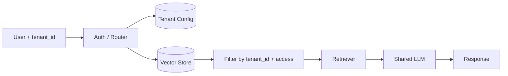

# Tenant-specific knowledge

> **Learning Path:** Enterprise AI Architecture
> **Section:** 19.2.2 — Multi-tenancy

### The problem

You are building an AI product for multiple customers. One shared LLM backbone is cheap and efficient. The moment you let tenants upload their own documents, policies, and conversation history, a new constraint appears: **knowledge must not leak between tenants, but it must feel personal to each tenant.**

A generic model answers generically. A model trained on Tenant A’s contracts, pricing, and support tickets will hallucinate Tenant B’s data if you share a retrieval corpus. Compliance, brand safety, and basic trust require strict isolation.

The problem is not just data isolation. It is also relevance. A query like “what is our refund policy?” means different things for Acme Corp vs Beta Ltd. You need tenant-specific knowledge with tenant-specific retrieval, while keeping inference cost and operational complexity under control.

### Mental model

Think of a shared brain with private notebooks.

The LLM is the shared brain. Tenant-specific knowledge is a private notebook per tenant that the brain can read from, but never mixes with another tenant’s notes.

The notebook is not the model weights, it is the retrieval surface: documents, embeddings, fine-tuned adapters, prompt templates, tool configs. The routing layer decides which notebook is opened for each request.

### How it works

Every request carries a tenant_id. That ID gates everything downstream.

Essential mechanisms:
* **Partitioned retrieval.** One vector store with a tenant_id metadata field, or physically separate stores per tenant. Queries are always filtered: `WHERE tenant_id = X`.
* **Tenant context injection.** System prompt, policies, and tool allowlists are loaded per tenant before generation.
* **Separate embedding namespaces.** Prevents cross-tenant similarity search from surfacing the wrong docs.
* **Optional per-tenant adaptation.** Lightweight LoRA adapters or fine-tunes for tone/terminology, kept isolated and loaded on demand.

You do not need all of these. Most systems start with filtered retrieval + prompt injection.

### Architectural reasoning

When it helps:
* SaaS with proprietary data per customer
* Compliance requirements like GDPR, HIPAA, SOC2
* Need for personalization without retraining a model per tenant

Alternatives:
* **Shared corpus.** Cheapest, but zero isolation and poor relevance. Only viable for public knowledge.
* **Per-tenant model.** Maximum isolation and personalization, prohibitive cost and ops.
* **Tenant-specific knowledge with shared backbone.** Compromise: shared inference, isolated data plane.

Choose tenant-specific knowledge when isolation and relevance matter more than absolute cost savings, and when you cannot guarantee data sanitization across tenants.

### Trade-offs and failure modes

* **Isolation vs cost.** Physically separate stores = stronger isolation, higher storage and ops cost. Logical partitioning is cheaper but requires rigorous query filtering.
* **Latency vs freshness.** Per-tenant retrieval adds a hop. Caching embeddings per tenant helps, but stale docs hurt trust.
* **Leakage risk.** A missing tenant filter in one query path is a data breach. This is the dominant failure mode. Defense in depth: filter at storage, filter at retrieval, filter at application layer, and audit logs.
* **Cold start.** New tenants have empty notebooks. You need fallback to generic knowledge and clear onboarding for first documents.
* **Prompt injection across tenants.** If you concatenate tenant documents into a single context window without boundaries, the model can confuse sources. Use clear delimiters and source attribution.

### Example

Enterprise support copilot for a SaaS platform.

Each customer uploads internal KB, Jira tickets, and product docs. The service uses one LLM.

On request:
1. Auth returns tenant_id = `acme_123`.
2. Router loads Acme’s system prompt: tone formal, do not mention pricing.
3. Retriever queries vector store with `tenant_id = acme_123` and the user query.
4. Top docs are injected with source citations.
5. LLM answers with Acme-specific info only.

Beta Ltd sees a different KB, different prompt, different tool allowlist, same model.

### Reasoning challenge

You are designing an AI agent for a multi-tenant fintech platform. Tenants are banks with strict data residency requirements. One bank demands data never leaves EU. Another wants real-time fine-tuning on transaction notes. You have budget for one vector store and one LLM cluster.

How do you architect tenant-specific knowledge here? What would you isolate, and what would you share? What is the first failure you would test for?

### Key takeaway

* Tenant-specific knowledge exists to solve isolation + relevance, not just personalization.
* The shared model is the brain; retrieval, prompts, and adapters are the private notebooks.
* Always enforce tenant boundaries at multiple layers; a single missing filter is a breach.
* Start with filtered retrieval + prompt injection. Add per-tenant adapters only when generic retrieval is insufficient.
* Design for cold start and leakage testing from day one.
