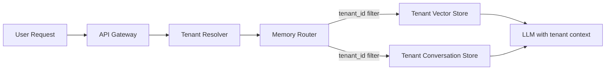

# Tenant-specific memory

> **Learning Path:** Enterprise AI Architecture
> **Section:** 19.2.3 — Multi-tenancy

**Tenant-specific memory**

### The problem

A single AI service serves many tenants. The model is shared, but the memory must not be.

If Tenant A asks "summarize our Q4 contract", the model should not retrieve Tenant B's contract. Worse, if Tenant A's assistant learns preferences, jargon, and past conversations, that context must not bleed into Tenant B's session.

Shared memory creates three hard constraints:
* **Isolation:** Data, embeddings, and learned context must not cross tenant boundaries.
* **Compliance:** GDPR, HIPAA, SOC2 require provable data separation and deletion per tenant.
* **Personalization:** Value comes from memory that is specific to a tenant's domain, not generic knowledge.

Without tenant-specific memory you get leakage, noisy retrieval, and legal risk.

### Mental model

Think of memory as a partitioned library, not one big pile.

Each tenant gets its own shelves. The librarian still uses the same catalog system, but the query `tenant_id = X` is enforced before any book is returned. The model is the reader; the shelves are the memory.

Memory here means:
* Conversation history and session state
* RAG documents and their embeddings
* Long-term preferences and facts the agent learns
* Tool outputs cached per tenant

The tenant_id is the isolation boundary, not the model.

### How it works

The essential mechanism is routing + partitioning.



On every request:
1. Resolve tenant from auth token/subdomain.
2. Route retrieval to the tenant's partition.
3. Build context from that partition only.
4. Write back writes to that partition only.

Implementations vary:
* **Logical partition:** single vector DB with `tenant_id` as partition key + row-level security.
* **Physical partition:** separate collections/indexes per tenant.
* **Hybrid:** high-value tenants get dedicated stores; low-value tenants share a logical partition.

Deletion is a tenant-scoped `DELETE WHERE tenant_id = X`, not a full rebuild.

### Architectural reasoning

When it helps:
* SaaS AI assistants, customer support, copilot per organization.
* Any multi-tenant RAG where documents are confidential.
* Agents that learn per-tenant facts over time.

Alternatives:
* **Shared memory with filters.** Cheaper, but filters can fail and compliance is weak.
* **Global memory + tenant prompt prefix.** Saves cost, loses isolation and personalization.

Choose tenant-specific memory when isolation is a requirement, not a preference. If you cannot prove no cross-tenant retrieval, you cannot ship.

### Trade-offs and failure modes

* **Isolation vs cost.** Physical partitions scale cleanly but multiply indexes, storage, and cold start costs. Logical partitions are cheaper but increase blast radius on bugs.
* **Latency vs freshness.** Per-tenant indexes are smaller and faster to search, but you pay for per-tenant embedding pipelines and cache warm-up.
* **Complexity of deletion.** Tenant offboarding must purge vectors, conversations, and derived models. Miss one store and you have a compliance violation.
* **Failure modes to watch:** 
  * Missing tenant filter in retrieval = cross-tenant leakage.
  * Prompt injection that tricks the model into revealing other tenant IDs.
  * Shared embedding cache keyed only by text, not by tenant_id.
  * Tenant migration that leaves orphaned vectors.

### Example

Enterprise support copilot for a SaaS platform.

Each company tenant uploads its own KB, tickets, and internal docs. The system stores embeddings in `vector_store_{tenant_id}` and conversation history in `conversations` table with `tenant_id` PK.

When Acme Corp asks about refunds, retrieval is:
```
WHERE tenant_id = 'acme' AND collection = 'kb'
```
The LLM context is built only from Acme's data plus Acme's conversation history. When Acme churns, a single purge job deletes its vectors and history. Beta Corp never sees Acme's data, even with identical queries.

### Reasoning challenge

You have 10k tenants. 5% are enterprise with strict compliance, 95% are freemium with low usage. One shared vector DB with logical partitioning costs $X/month. Physical per-tenant indexes cost 10x for low-usage tenants.

Do you partition physically for all, logically for all, or tier it? What controls do you need to prevent a developer from accidentally querying without tenant_id?

### Key takeaway

* Tenant-specific memory is an isolation boundary, not a feature.
* Route every read and write through tenant_id before any retrieval or generation.
* Physical vs logical partitioning is a cost/compliance trade-off, not a technical debate.
* The most dangerous failure is silent leakage via missing filters or shared caches.
* If you cannot delete a tenant's memory completely and provably, you do not have multi-tenancy.
