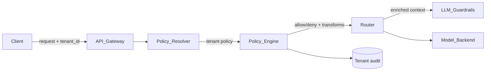

# Tenant-specific policies

> **Learning Path:** Enterprise AI Architecture
> **Section:** 19.2.4 — Multi-tenancy

**Tenant-specific policies**

### 1. The problem

A multi-tenant AI platform shares one model, one codebase, and one infrastructure for many customers. The platform works until the customers disagree on rules.

One tenant is a hospital. It needs HIPAA audit logging, no data leaving US-East, and PII redaction before any LLM call.
Another tenant is a European fintech. It needs GDPR right-to-erasure, model allow-listing, and stricter prompt injection guardrails.
A third tenant is an internal R&D team. It wants no guardrails and access to experimental models.

A single global policy forces you to pick the strictest common denominator and lose customers, or the loosest and violate compliance. You need policy to vary by tenant without forking the platform.

### 2. Mental model

Think of the platform as a shared highway and tenant-specific policies as per-tenant toll rules and lanes.

The road, cars, and traffic control are shared. Each tenant gets its own rule card checked at entry: which lanes it can use, what it must carry, where it can go, and who can inspect it. The enforcement happens once, centrally, using the tenant context.

Policy is not code per tenant. It is configuration + enforcement points that interpret a tenant context.

### 3. How it works

Every request is tagged with a tenant id at the edge. That id resolves to a policy object, cached and versioned.



Enforcement points are consistent:
* **Ingress:** authz, rate limits, model allow-list, data residency routing
* **Pre-processing:** PII redaction, prompt rewriting, classification
* **Runtime:** tool allow-list, max tokens, temperature caps
* **Post-processing:** logging, retention, egress filters
* **Governance:** audit trail written with tenant id, policy version

The policy engine is declarative. Example shape:
```
tenant_id: acme_health
data_residency: us-east-1
allowed_models: [gpt-4o, claude-3.5]
guardrails: { pii_redaction: strict, jailbreak_block: true }
retention_days: 30
audit: { destination: s3-hipaa, log_level: full }
```

### 4. Architectural reasoning

When it helps:
* Regulatory isolation is required: HIPAA, GDPR, SOC2
* Commercial differentiation: enterprise tier gets stricter controls
* Risk segmentation: untrusted tenants cannot affect trusted ones

Alternatives:
* **Single global policy.** Cheapest to build, fails as soon as tenants diverge.
* **Per-tenant forked deployment.** Perfect isolation, impossible to operate at scale.
* **Tenant-specific policies on shared platform.** The compromise: shared compute, isolated control plane.

You choose it when you need both economies of scale and contractual isolation. The decision enables one platform to sell to regulated and non-regulated customers simultaneously.

### 5. Trade-offs and failure modes

* **Complexity vs flexibility.** Policy engine adds latency and a new failure domain. A bad policy rollout can deny service to a tenant.
* **Blast radius.** A bug in the policy evaluator affects all tenants. Version and canary policies per tenant.
* **Policy sprawl.** Hundreds of tenants = hundreds of policy variants. Need schema validation, linting, and drift detection.
* **Context leakage.** If tenant context is not propagated correctly through async jobs, you can log data to the wrong audit store. Propagation must be explicit, not ambient.
* **Performance.** Resolving policy per request costs. Cache policy per tenant with short TTL and invalidation on update.

Common failure: treating policy as post-hoc. Enforcement must be at the chokepoints, not after the model has already seen data.

### 6. Example

SaaS AI copilot for customer support.

Tenant A, a German bank. Policy: data residency EU, model allow-list only approved models, PII redaction strict, retention 30 days, audit logs shipped to on-prem SIEM.

Tenant B, a US startup. Policy: allow experimental models, no redaction, retention 365 days, audit logs to standard cloud.

Same API endpoint, same model fleet. The gateway resolves tenant_id from API key, loads policy, routes request to EU model fleet for Tenant A, applies redaction, blocks tool calls to internal DB, writes audit to SIEM. Tenant B bypasses redaction and routes to US fleet.

No code fork. One change to Tenant A's policy immediately tightens guardrails without redeploy.

### 7. Reasoning challenge

You have a shared RAG pipeline. Tenant X wants all retrieved documents watermarked with tenant id before LLM. Tenant Y considers watermarking a privacy risk and forbids any modification of retrieved content.

Where do you enforce this, and what breaks if you put the policy in the retrieval service vs the LLM wrapper?

### 8. Key takeaway

* Tenant-specific policies solve the conflict between shared infrastructure and divergent compliance/commercial requirements.
* Policy is tenant-scoped configuration evaluated at well-defined enforcement points, not per-tenant code.
* Design for safe rollout: versioned policies, per-tenant canaries, and explicit context propagation.
* The main costs are operational complexity and the risk of policy misconfiguration; the main benefit is one platform serving many regulatory regimes.

You should be able to reason: given a new tenant requirement, where does it fit in the policy layer, and what failure mode does it introduce.
