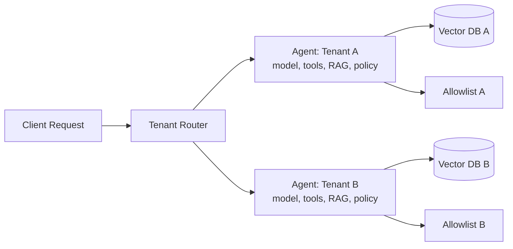

# Tenant-specific agents

> **Learning Path:** Enterprise AI Architecture
> **Section:** 19.2.5 — Multi-tenancy

**Tenant-specific agents**

### 1. The problem

A single shared agent in a multi-tenant SaaS looks cheap at first. One model, one prompt, one toolset, route by `tenant_id`.

Then reality hits:
* **Data isolation.** Tenant A's documents must never influence answers for Tenant B. Shared retrieval and shared conversation memory leak context.
* **Customization.** Tenants want different tone, guardrails, tools, and knowledge bases. A global prompt becomes lowest-common-denominator.
* **Governance and compliance.** One tenant requires PII redaction, EU data residency, and audit logs. Another wants the opposite. A single agent cannot enforce both policies simultaneously.
* **Blast radius.** A bad prompt injection, tool failure, or model drift in one tenant degrades all tenants.

You need per-tenant behavior without building N separate products.

### 2. Mental model

Think dedicated concierge per tenant vs a shared front desk.

A shared agent is the front desk: fast and cheap, but everyone hears the same answers and shares the same memory.

A tenant-specific agent is a dedicated concierge with their own briefing book, tools, and rules. They still run on the same building infrastructure, but their state and policy are isolated.

### 3. How it works

Routing is done on `tenant_id`. The agent is not just a prompt; it is a configured instance.

Essential pieces:
* **Agent config store:** model choice, temperature, system prompt, guardrails per tenant.
* **Isolated knowledge:** per-tenant vector store or namespace, per-tenant embeddings.
* **Isolated tools and permissions:** each tenant has its own tool allowlist and API keys.
* **Isolated memory:** short-term session memory stays per tenant; long-term memory is opt-in and scoped.
* **Policy enforcement layer:** PII redaction, data residency routing, audit logging applied before the agent runs.

The agent logic can be shared code. The runtime configuration is tenant-specific.

### 4. Architectural reasoning

When it helps:
* High-value B2B tenants with strict isolation and compliance needs.
* Tenants with materially different knowledge bases or workflows.
* Need for per-tenant SLAs, model selection, or cost controls.

Alternatives:
* **Shared agent + tenant context injection.** Cheapest. Works when customization is cosmetic and data is public.
* **Shared model, tenant-scoped RAG.** Good middle ground for knowledge isolation, but tools and policies remain shared.
* **Tenant-specific agents.** Max isolation and customization. You pay for it in ops.

Choose tenant-specific when isolation is a requirement, not a preference. If a breach would be contractual or regulatory, share is not an option.

### 5. Trade-offs and failure modes

* **Cost vs isolation.** N agents means N configs, N retrieval indexes, more compute. You can mitigate with warm pools and config-driven reuse of the same agent class.
* **Operational complexity.** Versioning prompts and tools per tenant creates sprawl. You need config-as-code, canary rollouts per tenant, and a single control plane.
* **Agent drift.** Tenants diverge over time. Without governance, you get 200 slightly different agents you cannot upgrade safely.
* **Cold start and scaling.** Per-tenant warm instances waste resources. Use lazy instantiation + tenant router with pooling.
* **Leakage via shared infra.** Isolation is only as good as your data layer. Shared embedding cache, logs, or error traces can leak tenant signals.

Failure mode to watch: prompt injection in a shared tool poisons the shared tool schema for everyone. With tenant-specific agents, the blast radius is one tenant.

### 6. Example

Enterprise legal assistant SaaS.

* Tenant A: US law firm. Needs GPT-4o, strict PII redaction, retrieval from its own contract corpus in US-East, tools: internal billing API only.
* Tenant B: EU healthcare org. Needs a smaller model, data residency in EU-West, retrieval from its clinical guidelines, tools: FHIR read-only, no billing.

One shared agent would force a compromise on model, residency, and tools. Tenant-specific agents let each have its own RAG, tool allowlist, and policy while the same agent orchestration code runs both.

### 7. Reasoning challenge

You have 500 tenants, 10 are enterprise with compliance needs, 490 are SMB with identical needs. Do you build 500 agents, 11 agents, or 1 shared agent with tenant context?

What would you put in the router, what would you share, and where do you draw the isolation boundary?

### 8. Key takeaway

* Tenant-specific agents solve isolation, customization, and governance, not just prompt personalization.
* Isolation is about data, tools, memory, and policy — not just a `tenant_id` in the prompt.
* Share code, not state. One agent class, many tenant-scoped configurations.
* The decision is cost and ops complexity vs contractual risk and tenant experience.
