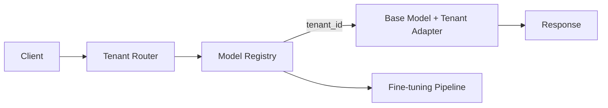

# Tenant-specific models

> **Learning Path:** Enterprise AI Architecture
> **Section:** 19.2.6 — Multi-tenancy

**Tenant-specific models**

### The problem

A multi-tenant SaaS AI product starts with one shared model. It works until tenants demand:
* Data isolation. Tenant A cannot see Tenant B's prompts, documents, or fine-tuning data.
* Consistent brand voice and domain accuracy. A generic model hallucinates on Tenant A's terminology.
* Compliance. Some tenants require data residency, auditability, or no cross-tenant learning.

Shared model + per-tenant RAG helps, but it doesn't change the model's priors, style, or safety boundaries. Prompt engineering is brittle at scale.

The constraint is not just performance, it's *trust and control* per tenant.

### Mental model

Think of a model as a tenant-specific service, not a utility.

Shared model = one kitchen, many customers, same menu. Tenant-specific model = private kitchen per customer with their own recipes, ingredients, and staff. You pay more, but you guarantee taste and hygiene.

In practice you rarely train from scratch. You have a base model + tenant adaptation: full fine-tune, LoRA adapter, or prompt-based personalization. The model artifact is namespaced by tenant ID.

### How it works

Request path is tenant-aware from the edge:

Router resolves tenant_id -> model artifact. The registry stores:
* `tenant_id -> adapter_id / model_version`
* data residency constraints
* policy gates

On inference, the base model loads the tenant adapter or routes to a dedicated model replica. Fine-tuning is decoupled: a background pipeline retrains on tenant-approved data, runs evals, then promotes with canary.

### Architectural reasoning

When it helps:
* **High-value, high-differentiation tenants** where accuracy and tone directly impact revenue.
* **Regulated data** where cross-tenant contamination is unacceptable and RAG isolation isn't enough.
* **Domain depth** where the tenant's ontology, jargon, and workflows are too specific for in-context learning.

Alternatives:
* **Shared model + per-tenant RAG.** Cheapest, works for retrieval-heavy use cases. Fails on style and reasoning priors.
* **Shared model + system prompt per tenant.** Cheap, easy. Fails on consistency and leakage risk.
* **Tenant-specific LoRA adapter.** Good middle ground: ~MBs per tenant, fast swap, shared base compute.

Decision rule: Start shared. Isolate the model when customization ROI > cost of isolation and the failure mode of sharing is *business-critical*.

### Trade-offs and failure modes

* **Cost vs isolation.** N tenants = N adapters or models. Storage, GPU memory for loading/unloading, fine-tuning compute, and eval overhead scale with tenants.
* **Cold start and drift.** New tenant has no data. Model needs warm-up. Without continuous evaluation, adapter degrades as tenant data evolves.
* **Operational complexity.** Versioning, rollback, A/B testing, and security per tenant. A bad fine-tune can poison one tenant without affecting others, which is good isolation but bad if not caught.
* **Under-utilization.** Small tenants never justify a dedicated model. You need a tiering policy: shared for tier 1, adapter for tier 2, dedicated for tier 3.

Failure mode to watch: *adapter thrashing* on a single GPU serving hundreds of LoRAs. Load time and context switching kill latency. You need a routing layer with model cache and pre-warming.

### Example

Legal SaaS with 50 firms. Base model is fine for generic Q&A. Firm A uses Delaware corporate law, Firm B uses UK employment law, both with private matter documents.

Shared model + RAG leaks risk and mixes legal standards. Solution: shared base + per-firm LoRA fine-tuned on approved playbooks, briefs, and style guides, plus per-firm vector store. Routing by tenant_id ensures prompts never cross. Fine-tuning runs monthly with human eval on hallucination and tone.

Result: higher win rate on matter-specific Q&A, auditable data boundary, and firms accept the product.

### Reasoning challenge

You are architecting an AI copilot for a SaaS CRM used by 10,000 SMBs and 20 enterprise accounts. Enterprises demand SOC2 data isolation and custom sales playbooks. SMBs want low price.

Do you build:
A) One shared model with per-tenant RAG and system prompts
B) One base model + LoRA per enterprise tenant, shared model for SMBs
C) Fully isolated models for all tenants

Which do you pick and what is the first operational metric you would instrument to validate the choice?

### Key takeaway

* Tenant-specific models exist to buy isolation, accuracy, and brand consistency when shared abstractions leak.
* Isolation is a spectrum: shared base → prompt → RAG → LoRA adapter → dedicated fine-tune.
* The decision is economic: cost of a bad hallucination or data leak vs cost of training and serving N models.
* Architect for tiering, routing, and eval. Without automated guardrails and promotion policy, per-tenant models become an operational nightmare.
