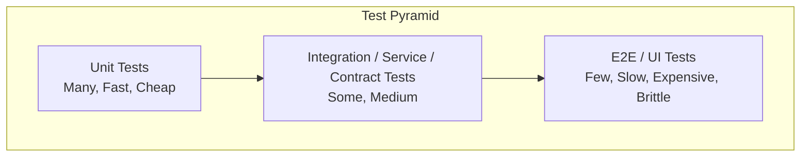

# Test pyramid trade-offs

> **Learning Path:** Testing, Quality & Observability Foundations
> **Section:** 22.1.1 — Testing strategy

**Test pyramid trade-offs**

### The problem

You need confidence software works before it reaches users, but testing has costs. Every test costs to write, run, and maintain. Slow tests kill feedback loops. Flaky tests erode trust.

The problem is not coverage. It is *economic*: how much confidence do you buy per unit of cost, and how fast can you get that confidence?

### Mental model

The test pyramid is a cost model, not a moral rule.

Confidence increases as you move up the pyramid. Cost, time, and fragility increase faster.

Think of it as risk placement. Put cheap tests where they can run often. Put expensive tests only where they add unique confidence.

### How it works

Three layers, three different contracts.

**Unit tests** test one unit of logic in isolation. Fast milliseconds, no I/O, deterministic. They verify *correctness of decisions*.

**Integration tests** verify boundaries: DB, message queue, HTTP service, external API. Medium speed seconds, needs test doubles or real infra. They verify *correct wiring*.

**E2E tests** run the whole user flow through the real stack. Slow minutes, fragile, environment dependent. They verify *the system works as a user experiences it*.

The shape comes from frequency. You run units on every save. Integration on every PR. E2E on merge / nightly. If you can't afford that cadence, you lose the value.

### Architectural reasoning

When does the pyramid help? When feedback speed matters and failure cost is high.

It solves: *How do we get fast signal without losing confidence?*

Alternatives exist:
* **Ice cream cone / inverted pyramid:** Mostly E2E, few units. Fast to start, slow to maintain. Brittle.
* **Testing trophy:** More contract and integration, less E2E, service-level tests replace UI tests. Better for microservices.
* **No pyramid, property-based:** For complex logic, property tests give higher confidence per unit than example-based units.

Choose pyramid when you need a sustainable feedback loop across a team. Choose trophy when you have many teams and service boundaries dominate risk. Choose inverted when you are prototyping and throwing away code.

### Trade-offs and failure modes

**Speed vs Confidence.** Units are fast but can't catch mis-wiring. E2E catch wiring but are slow and flaky. The trade-off is not "more tests = better". It is *where* to place tests for the risk.

**Maintenance cost.** E2E tests break on UI changes, data changes, timing. They become a tax. Teams start skipping them.

**False confidence.** A tall pyramid of fast unit tests can give 90% line coverage and still miss integration failures. A short pyramid of E2E can give green builds and still miss edge cases inside units.

**Inversion failure mode.** The pyramid inverts when teams find unit tests "hard" and E2E "easy". You get slow CI, flaky builds, and developers stop running tests locally. The system becomes un-observable.

**Cost of test doubles.** Over-mocking units creates tests that pass but don't reflect reality. Under-mocking integration tests makes them slow.

Architectural rule: Push risk down as far as possible, but not lower than where the risk lives. Business logic belongs in fast units. Contracts belong in integration. User journeys belong in a small, critical E2E set.

### Example

E-commerce checkout in a distributed system.

Unit: `calculate_tax()` with many inputs, pure logic. Runs in 5ms.

Integration: Order service -> Payment service via contract test. Verify schema and error handling with testcontainers. Runs in 10s.

E2E: One happy-path checkout and one failure path with real browser against staging. Runs in 2 minutes.

If payment API changes its error shape, contract test fails fast. If tax law changes, unit test fails fast. If a CSS change breaks the pay button, only the E2E catches it. You don't need 50 E2E variations for tax rules.

### Reasoning challenge

You are architecting an AI feature service with a model API, feature store, and async scoring pipeline. CI is already 25 minutes due to E2E tests. Product wants faster iteration.

Where would you move tests, and what confidence do you lose? Would you add contract tests, reduce E2E scope, or invest in unit tests for the scoring logic? What is the failure mode if you choose wrong?

### Key takeaway

* The pyramid is an economic model for confidence per cost, not a dogma.
* Fast, cheap tests enable tight feedback loops. Slow tests are expensive signals, use them sparingly.
* Place tests at the lowest layer that can still prove the risk. Don't test wiring with units, don't test business rules with E2E.
* An inverted pyramid is a reliability and velocity debt. It will break developer trust.
* Architect testing like you architect systems: optimize for feedback speed, failure isolation, and maintainability.
