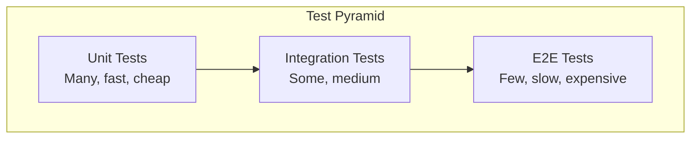

# Unit vs integration vs e2e testing

> **Learning Path:** Testing, Quality & Observability Foundations
> **Section:** 22.1.2 — Testing strategy

**Unit vs Integration vs E2E Testing**

### 1. The problem

You need confidence to change a system without breaking it, but full manual validation is too slow and too expensive.

The constraint is feedback loop time vs. realism.

Fast feedback lets you refactor safely. Realistic feedback catches the bugs that actually reach production. You cannot afford both at maximum for every test.

That tension creates three testing layers, not one.

### 2. Mental model

Think of a test as a cone of isolation.

* Unit test = isolate the function/class. Prove logic is correct given assumptions.
* Integration test = isolate the boundary. Prove two real components work together.
* E2E test = no isolation. Prove the user journey works through the whole system.

The pyramid shape is intentional:

More units at bottom, fewer E2E at top.

### 3. How it works

**Unit:** Test one unit of logic in isolation. Dependencies are mocked or faked. The goal is speed and precision.

You are asking: *If inputs are X, does this pure logic produce Y?*

**Integration:** Test the contract between real components. Use real DB, real message bus, real HTTP client, but often in a controlled environment.

You are asking: *Do these two real systems agree on protocol, schema, and side effects?*

**E2E:** Run a full user flow against a real deployment stack. No mocks for the path under test.

You are asking: *Can a real user complete a critical business transaction end-to-end?*

### 4. Architectural reasoning

When does each help?

* **Unit tests** give you fast, cheap safety for business logic changes. They are the base for refactoring. If you change an algorithm, unit tests tell you immediately if you broke the invariant.

* **Integration tests** catch the class of bugs unit tests cannot see: serialization mismatches, DB constraint violations, auth token propagation, eventual consistency gaps, and third-party API contract drift. They are where most production bugs hide.

* **E2E tests** validate the critical path from the user's perspective. They are not for finding bugs, they are for preventing regressions on money-making flows.

Decision rule for architects:
Choose the *lowest layer that can give you confidence for this change*.

Changing a pricing formula? Unit + maybe one integration for persistence.
Changing how payment is initiated? Integration for payment provider contract + one E2E for checkout flow.

Alternatives exist: contract tests, property-based tests, synthetic monitoring. They sit between layers. Contract tests replace some E2E with cheaper checks between services.

### 5. Trade-offs and failure modes

**Speed vs realism.** Unit is fast but blind to wiring. E2E is realistic but slow and flaky.

**Cost of maintenance.** E2E tests are brittle. UI changes, timing, environment drift cause flakes. Flaky E2E erodes trust and gets ignored.

**False confidence.** Over-mocked unit tests pass while real integration fails. Tests that mock the database will not catch a missing index or schema mismatch.

**Coverage vs signal.** 10,000 unit tests with 0 integration tests means you will ship integration bugs fast. 200 E2E tests with no units means a one-line change takes 20 minutes to validate.

Common failure mode in architecture: teams rely on E2E as a safety net and skip units/integration. Result: slow CI, flaky pipeline, developers avoid running tests locally. Velocity dies.

### 6. Example

Payment service in a SaaS platform.

* Unit: Test `calculate_tax(amount, region)` for edge cases. ~50ms, runs on every commit.
* Integration: Test `PaymentService` against a real Postgres testcontainer and a stubbed Stripe client using a recorded contract. Verify money is written to ledger with correct idempotency key. ~5s.
* E2E: One test that logs in as a test user, clicks checkout, completes Stripe test card flow, and asserts subscription is active in DB. Runs nightly against staging. ~2 min.

Architectural decision: No E2E for every promo code variation. That is unit + integration. E2E only covers the golden path: sign up → checkout → payment succeeds.

### 7. Reasoning challenge

You are adding a new event-driven notification service. It consumes `order.created` events and calls SendGrid.

You have limited CI minutes. Where do you invest test effort?

Options:
A. 20 E2E tests covering all notification templates via full UI flow.
B. Unit tests for template rendering + integration test with real Kafka testcontainer and SendGrid sandbox + 1 E2E for the happy path.
C. Only unit tests with mocked Kafka and SendGrid.

Which gives you the best risk-adjusted feedback loop? Why?

### 8. Key takeaway

* Testing is an architectural trade-off between speed, realism, and maintenance cost, not a coverage target.
* Unit tests protect logic, integration tests protect contracts, E2E tests protect critical user journeys.
* Push testing down the pyramid as far as possible. Use E2E sparingly for business-critical flows only.
* Flaky E2E tests are worse than no tests. Invest in isolation and determinism before adding more E2E.

You should be able to reason: *What class of bug am I trying to prevent, how fast do I need feedback, and what is the cheapest layer that catches it?*
