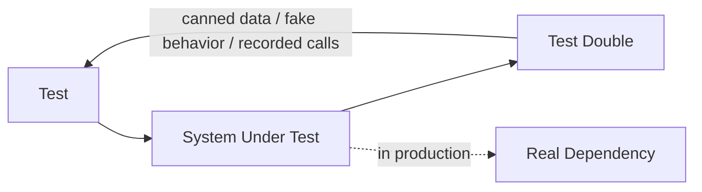

# Test doubles: mocks, stubs, fakes

> **Learning Path:** Testing, Quality & Observability Foundations
> **Section:** 22.1.3 — Testing strategy

**Test doubles: mocks, stubs, fakes**

### 1. The problem

You need tests that are fast, deterministic, and cheap to run. Real dependencies break that.

A unit under test often needs a database, payment gateway, message queue, external API, or time. Those dependencies are slow, non-deterministic, stateful, and expensive in CI. They also make tests flaky and order dependent.

The constraint is not "test everything with the real world". The constraint is: *give fast feedback on business logic while preserving confidence that the system works together*.

That creates a need for a controlled stand-in for dependencies during tests.

### 2. Mental model

A test double is a surrogate actor that plays the role of a dependency in a test.

Think of a dress rehearsal. You don't need the real orchestra to rehearse blocking. You need someone who can play the cues at the right time, with the right volume, and who can be asked to intentionally miss a cue.

The double's job is not to be realistic. Its job is to be *controllable* so the System Under Test can be observed in isolation.

### 3. How it works

Three useful kinds, defined by intent:

**Stub** - provides canned answers. It has no behavior, only data.
Problem: `PricingService` needs a tax rate. Stub returns 0.2 every time. You are testing that the service *uses* the rate, not how the rate is obtained.

**Fake** - a working in-memory implementation of the contract.
Fake implements the interface for real, just with cheap internals. An in-memory `UserRepository` with a dict, or a fake `Clock` that you can advance manually. It has real behavior, but simplified.

**Mock** - verifies interactions. It records calls and asserts expectations.
Mock is used when the *how* matters, not just the *what*. You assert that `emailSender.send` was called exactly once with a specific recipient. The mock doesn't care about the return value as much as the interaction.

`Dummy` is a placeholder to satisfy the compiler. `Spy` is a wrapper around a real or fake that records calls.

The test only talks to the double. Production talks to the real.

### 4. Architectural reasoning

Use doubles to isolate the unit you are reasoning about.

*When it helps:*
* Unit tests for pure business logic with external I/O
* Testing error paths that are hard to trigger in reality, e.g., timeout, 500 error, empty queue
* Keeping CI fast and hermetic. No network, no containers.
* Tests that must be deterministic and repeatable

*When it hurts:*
* When you need confidence about the contract with the real dependency. A fake DB may not enforce constraints the real DB does.
* When the interaction is complex and you mock too much, you end up testing the mock, not the system.

Decision rule: **Stub for data, Fake for behavior, Mock for interaction.** Prefer fakes over mocks. Prefer stubs over mocks.

If you can build a lightweight in-memory fake, you get real behavior without brittleness. Mocks couple tests to implementation details: rename a method call and 40 tests break even though behavior is correct.

### 5. Trade-offs and failure modes

**Brittle tests.** Over-mocked tests break on refactoring. They verify *how* not *what*.

**False confidence.** A stub that always returns happy path hides integration bugs. The test passes, production fails on the first real call.

**Leaky abstraction.** Mocks that replicate real side effects create maintenance burden. The mock drifts from reality.

**Test maintenance cost.** Doubles must be updated when the contract changes. If you mock an external API, you own the mock.

Architectural signal: if a test needs 5 mocks to run, your unit has too many responsibilities. The double is revealing a design smell.

### 6. Example

Order service with payment and inventory.

You want to test `Order.create(order)` which checks inventory, charges payment, emits event.

* Fake `Inventory` with in-memory stock map. You can set stock to 0 to test out-of-stock path without a real DB.
* Stub `TaxService` returning 0.2. You don't care how tax is calculated.
* Mock `EventBus.publish`. You assert an `OrderCreated` event was published with correct payload, but you don't need a real Kafka.

You are not testing that payment really charges a card. That is an integration test. You are testing that *given* a successful charge, the order is created and the event is emitted.

### 7. Reasoning challenge

You are designing tests for a pricing engine that calls a remote `PromoService` with 200ms latency and occasional 5xx errors.

Do you stub the service to always return 10% off, fake it with an in-memory rule set, or mock it to verify retry logic? What do you test in unit vs integration?

### 8. Key takeaway

* Test doubles exist to make tests fast, deterministic, and isolated, not to make testing easier at any cost.
* Stub = canned data. Fake = working simplified implementation. Mock = verify interactions. Prefer fakes > stubs > mocks.
* Over-mocking creates brittle tests that lock implementation and hide design problems.
* Use doubles for unit tests; use real or contract-tested dependencies for integration tests. The boundary between the two is an architectural decision.
