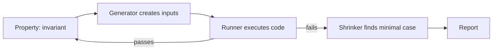

# Property-based testing

> **Learning Path:** Testing, Quality & Observability Foundations
> **Section:** 22.1.4 — Testing strategy

**Property-based testing**

### 1. The problem

Example-based tests answer: *does this code work for these inputs?*
You pick a few cases you think of and assert expected outputs.

The problem is you are testing your imagination, not the code. The input space is huge and bugs live where you didn't look: empty collections, max values, negative numbers, non-ASCII, concurrent interleavings, round-trip failures.

For an architect this is a coverage problem. You can write 100 examples and still miss the invariant that must hold for all valid inputs. The cost is production failures in edge cases you never anticipated, especially in parsers, serializers, math libraries, state machines, and distributed protocols.

### 2. Mental model

Instead of enumerating examples, state a property that must always be true and let the system search for a counterexample.

Example-based: `sort([3,1,2]) == [1,2,3]`
Property-based: `for all lists, sort(list) is sorted and is a permutation of list`

You describe the *what* must hold, not the *how* to test it. A generator explores the input space, often with bias toward boundaries, and a shrinker simplifies any failure to the minimal case.

### 3. How it works

The loop is:

* Property: a boolean predicate over inputs and outputs.
* Generator: produces valid and interesting inputs, including edge cases.
* Runner: executes many random cases, often hundreds to thousands.
* Shrinker: when a failure is found, reduces the input to the smallest reproducer.

You don't control which inputs are tried, you control what is considered correct.

### 4. Architectural reasoning

When it helps:
* **Invariants over large domains**: serialization round-trip, `decode(encode(x)) == x`; commutative/associative operations; idempotency.
* **Stateful protocols**: a state machine should never reach an illegal state regardless of command sequence.
* **Boundary sensitive code**: parsers, validators, financial calculations.
* **Distributed contracts**: e.g., merging, deduplication, eventual consistency invariants.

What it solves: systematic exploration of input space and documentation of intended invariants as executable specifications.

Alternatives:
* Example tests: cheap, deterministic, good for happy paths and regression.
* Fuzzing: finds crashes, no explicit property.
* Model checking / formal verification: exhaustive for small models, expensive.

Choose property-based when the cost of a missed edge case > cost of writing a good property, and when the property is clearer than a list of examples.

### 5. Trade-offs and failure modes

* **Properties are hard to write.** A vague property gives false confidence. You need to think about the contract, not just the implementation.
* **Non-determinism.** Tests can be flaky in CI unless you seed and record failing cases. Reproducibility requires saving the shrinking output.
* **Generator bias.** If the generator never produces realistic shapes, you miss bugs. For distributed systems you need generators for interleavings, not just values.
* **Shrinking can mislead.** The minimal counterexample may be unrepresentative of production.
* **Cost.** Property tests are slower and can be noisy. They belong in a separate suite or with limits.

Failure mode for architects: using property tests as a replacement for example tests. They complement, they don't replace.

### 6. Example

Payment idempotency service. Requirement: processing the same request twice must not double-charge.

Property:
`for all requests r and any number of duplicate submissions, total charged == amount(r)`

Instead of testing `r1, r2` manually, generate requests with varying amounts, timestamps, and retry counts. Also generate sequences where retries interleave with timeouts.

A property test found a bug where a retry after a partial network failure created two ledger entries because the idempotency key was scoped to request hash without tenant isolation. An example test with one happy path would never hit it.

The property became the contract for the service and for downstream consumers.

### 7. Reasoning challenge

You are designing a distributed rate limiter that allows 100 requests per minute per user, with a sliding window.

Would you use property-based testing for the limiter core? If yes, what property would you specify and what would you deliberately *not* try to property test?

### 8. Key takeaway

* Property-based testing finds bugs by searching for violations of invariants, not by checking examples.
* It turns a specification into an executable search problem: generator + runner + shrinker.
* Use it for invariants, state machines, and boundary-heavy code where example coverage is insufficient.
* It complements example tests; it is not a replacement, and good properties require architectural clarity about the contract.
