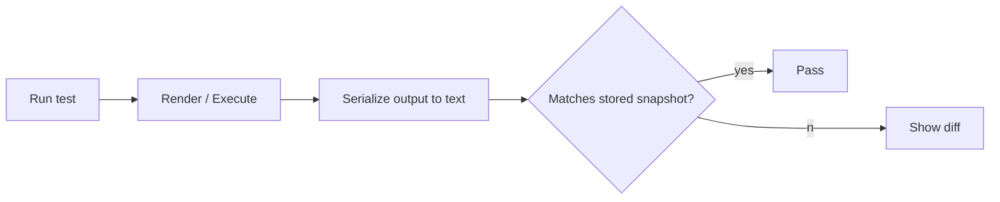

# Snapshot testing

> **Learning Path:** Testing, Quality & Observability Foundations
> **Section:** 22.1.5 — Testing strategy

**The problem**

You have code whose output is large, structured, and changes often in small, legitimate ways. A React component tree, a generated API client, a serialized config, an LLM prompt template.

Writing explicit assertions for every field is tedious and brittle. Miss one field and a regression slips through. Assert everything and tests break on every harmless formatting change.

The constraint is: you need fast feedback on *unexpected* change, not a manual contract for every byte.

**Mental model**

A snapshot is a photograph of output. First run: take the photo and store it. Next run: take a new photo and compare.

If the output changed intentionally, you update the photo. If it changed unintentionally, the test fails.

**How it works**

1. Execute the unit under test under controlled inputs.
2. Serialize the result to a deterministic string: rendered DOM, JSON response, file output.
3. Compare to a stored golden file in source control.
4. Mismatch = failure with diff. Match = pass.

The mechanism is trivial. The value is social: the snapshot becomes the agreed-upon baseline for “what correct looks like” without enumerating it.

**Architectural reasoning**

When it helps:
* Stable UI components with complex markup. The shape matters more than individual props.
* Code generation outputs, serializers, formatters. You want to catch drift.
* API contract snapshots for integration tests. Golden response files guard against accidental schema changes.
* AI systems: prompt templates, tool schemas, expected tool call shapes.

What it solves: regression detection at low authoring cost.

Alternatives and why you might not choose them:
* Explicit assertions: precise signal, high maintenance cost. Good for business invariants.
* Property-based tests: good for invariants, poor for “does this whole structure look right”.
* Visual regression: needed for pixel differences, overkill for DOM structure.
* Contract tests: better for cross-service guarantees, not for internal component shape.

Choose snapshot when the output is *mostly stable* and you care about *unexpected drift*, not when the output is *intentionally variable*.

**Trade-offs and failure modes**

* False positives and churn. Refactors break snapshots even when behavior is correct. Teams start running `update` blindly.
* Blind updates hide bugs. `npm test -- -u` is a one-line way to approve a regression.
* Low signal. A snapshot diff shows *what* changed, not *why* it matters. You still need human judgment.
* Non-determinism kills it. Timestamps, IDs, random ordering make snapshots flaky unless you normalize.
* Review burden. Snapshots are large files in PRs. Reviewers skim diffs.

The failure mode architects see most often: snapshots become a maintenance tax and then get disabled because “they always break”.

**Example**

Enterprise design system with 200 React components.

Each component has unit tests that render with different props and snapshot the output.

A developer changes spacing tokens globally. Tests fail in 80 components. The diff shows the exact markup delta. The team reviews, approves once, updates snapshots. Without snapshots they would need to manually verify each component or miss a regression.

Later a bug in a conditional renders an extra wrapper div. Snapshot test fails immediately, pointing to the exact line, before visual QA.

**Reasoning challenge**

You are adding snapshot tests to a service that generates personalized email HTML from a template engine. The output varies per user name, date, and locale.

Do you snapshot the full HTML, a normalized version, or skip snapshots entirely? What do you normalize and what is the risk of updating snapshots on every content tweak?

**Key takeaway**

* Snapshot testing trades explicit intent for cheap regression detection on large, stable outputs.
* It is a guardrail, not a specification. It tells you *something changed*, you still decide if it’s correct.
* Use it where output shape is important and stable, never where output is intentionally non-deterministic.
* Operationalize it: require human review of snapshot updates, normalize non-deterministic fields, and prune snapshots that never catch real bugs.
